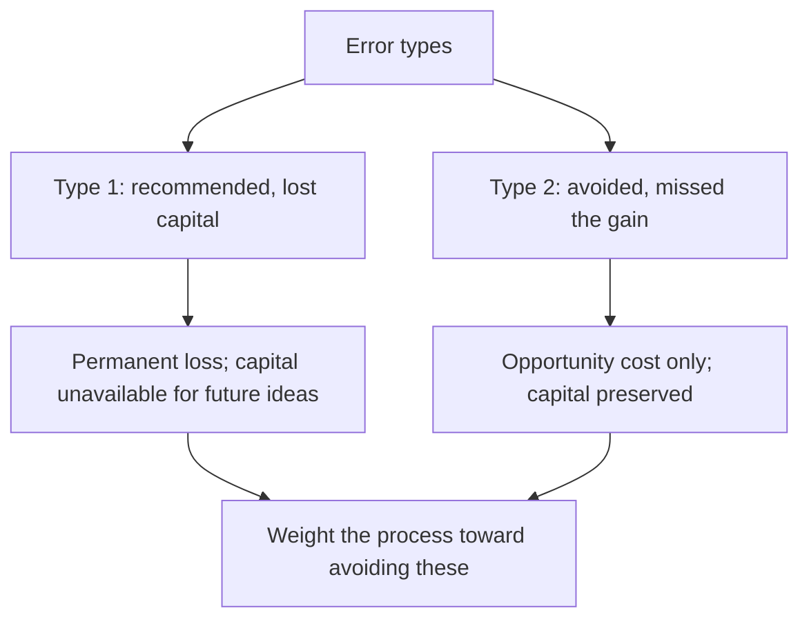

# The Cost of Being Wrong

## The Problem / Why this matters
Errors in equity research are not equally costly. A missed opportunity costs a forgone return; a permanent capital loss costs the capital. An analyst who treats all errors as equivalent will optimise for the wrong thing — usually for being right often rather than for avoiding the errors that matter, which are different objectives with different processes.

## Core Idea
Errors are **asymmetric**: those producing permanent capital loss cost far more than those producing forgone gains, so the process should be weighted toward avoiding the first even at the cost of more of the second.

## Why it works this way
A position that goes to zero cannot be recovered by being right subsequently; the capital is gone. A missed opportunity leaves the capital available for the next idea. Given a choice between a process that catches more opportunities and one that avoids more disasters, the second produces better outcomes over time even with a lower hit rate.

## Full technical content

### The error taxonomy

| Error | Cost | Frequency |
|---|---|---|
| **Recommended a fraud or governance failure** | Total or near-total loss | Rare, catastrophic |
| **Recommended a levered cyclical at the peak** | Severe loss, sometimes permanent | Recurring |
| **Missed a structural decline** | Large, slow loss | Recurring |
| **Wrong on timing, right on thesis** | Opportunity cost and carry | Common |
| **Too conservative, missed a good idea** | Forgone gain | Very common |
| **Right for the wrong reason** | No immediate cost; misleads the process | Common |

**The first two account for most of the capital destroyed** in equity portfolios, and both are detectable in advance by the checks these chapters describe — which is why the disqualifying screens are run first and why governance is treated as a precondition rather than a factor.

### What this implies for process

- **Run the disqualifying checks on everything**, since the cost of missing a governance failure vastly exceeds the cost of the twenty minutes spent.
- **Treat governance as binary** where extraction is ongoing, per the related-party and promoter chapters — no multiple compensates.
- **Never apply peak-cycle multiples to peak-cycle earnings**, per the cyclicals chapter, which is the single most repeated expensive error.
- **Check survival before recommending anything levered** — the combined-leverage point from the operating leverage chapter.
- **Build the bear case with the multiple moving**, per the stress-testing chapter, so the real downside is visible before the position is taken.
- **Size for the bear case**, per the sizing chapter.

**Accepting more missed opportunities as the price of fewer disasters is the correct trade**, and it should be stated explicitly rather than treated as excessive caution.

### The right-for-the-wrong-reason problem

Under-discussed and genuinely damaging:
- A call that works for reasons other than the thesis **reinforces a process that did not work**, per the luck-and-attribution chapter.
- **It is only detectable through post-mortems on successes**, which almost nobody conducts.
- **The consequence is delayed** — the flawed process persists until it produces a failure.

### The asymmetry in communication

- **A missed opportunity is invisible** to clients; a recommended loss is not.
- **This creates a bias toward action**, since a Buy that works is credited and a stock not recommended produces no record.
- **The defence is a written record** of what was considered and declined and why, which makes the avoided losses visible and is the only way the discipline gets credit.

### What not to conclude

The argument has limits worth stating:
- **This is not an argument for never taking risk.** An analyst who avoids everything uncertain produces nothing useful, and the no-view chapter's discipline is about genuine irreducibility rather than general caution.
- **Nor for uniform conservatism.** Where the evidence supports a high-conviction view, taking it is the job.
- **The asymmetry applies to the type of risk**, not to its presence: accept volatility and uncertainty, avoid permanent-loss situations.

**The distinction is between risk that is compensated and risk that is not.** A cyclical trough carries volatility and is compensated; a governance failure carries permanent loss and is not.

### The practical formulation

Before any recommendation:
- **What is the realistic worst case**, with the multiple moving?
- **Is permanent capital loss possible?** — governance, leverage, structural decline, binary outcome.
- **If so, is the upside enough to compensate**, and is the position sized accordingly?
- **What would I need to have missed** for this to go to zero, and have I checked it?

**That final question is the most useful single discipline in this chapter**, because it directs attention to the specific checks that prevent the expensive errors rather than to general caution.

## Common mistakes
- Treating all errors as **equally costly**.
- Optimising for **hit rate** rather than for avoiding permanent losses.
- Skipping the disqualifying checks because the company looks attractive.
- Applying a **multiple to peak-cycle earnings**.
- Not checking **survival** before recommending a levered name.
- Never post-morteming **successes**, so wrong-reason wins persist.
- Confusing the argument for asymmetric caution with **general timidity**.

## Interview angle
"What kind of mistake worries you most?" Permanent capital loss, because it is not recoverable — a position that goes to zero cannot be fixed by being right afterwards, while a missed opportunity leaves the capital available for the next idea. That asymmetry should shape the process: run the disqualifying checks on everything since twenty minutes is cheap against a governance failure, treat ongoing extraction as binary rather than as a discount, never apply a peak multiple to peak-cycle earnings, and check survival before recommending anything levered. Say plainly that accepting more missed opportunities in exchange for fewer disasters is the correct trade rather than excessive caution. Then add the distinction that keeps it from becoming timidity — the asymmetry applies to the type of risk rather than to its presence, so volatility and uncertainty are compensated and worth taking, while governance failure and unsurvivable leverage are not. And name the question I would ask before any recommendation: what would I have to have missed for this to go to zero, and have I actually checked it?
