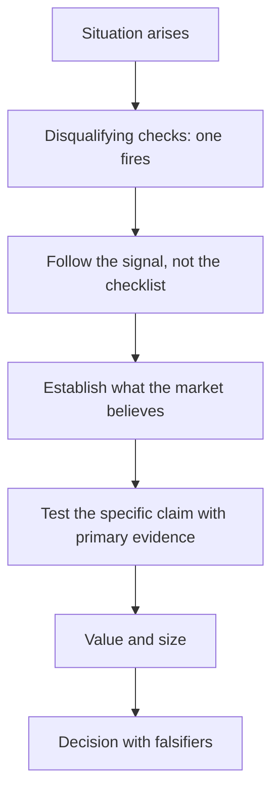

# Bringing It Together — A Worked Decision

## The Problem / Why this matters
The preceding chapters describe methods individually. In practice they are applied together, under time pressure, to a situation that does not announce which of them is relevant. This chapter works through a single decision end to end, showing which checks fired, which mattered and how the conclusion followed — the integration that a list of techniques does not convey.

## Core Idea
A real decision applies **a subset of the available methods, selected by what the situation is** — and knowing which to apply is the judgement the frameworks exist to support.

## Why it works this way
Most checks return nothing on most companies. The skill is running the cheap ones on everything, recognising which one has fired, and following it — which converts a large body of technique into a short, directed piece of work.

## Full technical content

*Illustrative. The reasoning chain is the point.*

### The situation

A mid-cap auto component manufacturer, ₹6,400cr market cap, covered by four analysts, trading at 21× forward earnings against a five-year range of 12–24×. Consensus expects 18% EPS growth. A screen flagged it on two items: receivables growing at 1.7× revenue growth, and capitalised development costs rising.

### Stage 1 — The disqualifying checks (twenty minutes)

- **Cash versus profit**: cumulative CFO 71% of cumulative PAT over five years. **A gap, but the company grew revenue 19% annually, so growth is a candidate explanation** — the test is whether working capital *days* are stable.
- **Working capital days**: receivable days rose from 58 to 79 over three years. **The growth explanation fails**; this is deterioration, not scale.
- **Auditor**: unmodified opinion, no resignation. KAM on revenue recognition timing and on capitalisation of development costs — **which points directly at the second screen flag**.
- **Promoter pledge**: nil.
- **Related party**: 3% of purchases, stable, arm's-length pricing evidenced.
- **Contingent liabilities**: 11% of net worth, routine.
- **Liquidity**: ₹41cr ADTV, adequate.

**Conclusion: no disqualifying issue, but two specific threads to pull** — receivables and capitalisation.

### Stage 2 — Following the receivables thread

The ageing note, per that chapter:
- Receivables beyond one year rose from 4% to 14% of the total.
- Provision against that bucket: 22%, against peers at 55–70%.
- **The shortfall is computable**: applying peer coverage would require an additional ₹63cr of provision, roughly 9% of last year's PAT.

**Then the cause.** Segment disclosure shows the growth came disproportionately from the aftermarket and export channels rather than from OEM supply. Channel checks with two distributors confirmed extended credit terms being offered to win aftermarket share — which is a deliberate competitive decision, not a collection failure.

**This changes the interpretation.** It is not a quality problem in the accounting sense; it is a margin-for-volume trade with an unrecognised cost, and the cost is quantifiable.

### Stage 3 — Following the capitalisation thread

Per the R&D and depreciation chapters:
- Development costs capitalised rose from ₹18cr to ₹67cr over three years.
- R&D cash outflow rose from ₹41cr to ₹79cr — so the capitalised proportion rose from 44% to 85%.
- Two listed peers expense the majority of development spend.
- **Normalising to peer policy reduces reported EBITDA by roughly 6% and reported PAT by more.**

**Conclusion: reported earnings are flattered relative to peers by policy, and the comparison that made the stock look reasonably valued was not like-for-like.**

### Stage 4 — What the market believes

- Consensus 18% EPS growth, and the multiple at 21× against a 12–24× range.
- **Reverse-DCF**: the price implies 15% revenue growth for seven years at a stable 16% EBITDA margin — plausible against history, which was 19% growth at 15–17% margins.
- **So consensus is not obviously wrong on the operating trajectory.** The differentiation is not about growth.

### Stage 5 — The differentiated insight

Assembled from the two threads:
- **On a peer-consistent accounting basis, adjusted for capitalisation and normalised provisioning, FY26 EPS is roughly 14% below reported.**
- **The stock is therefore trading at approximately 24× adjusted earnings, at the top of its historical range, not at 21× mid-range.**
- **The aftermarket growth carries a working capital and credit cost that consensus is not deducting.**

**The insight is not that the business is bad — it is that the earnings are not comparable to the peers against which it is being valued.**

### Stage 6 — Valuation and risk-reward

- **Peer-consistent multiple** of 19× on adjusted FY27 EPS gives ₹1,180 against a market price of ₹1,395.
- **Bear case**: if aftermarket receivables require full peer-level provisioning and growth slows to 12%, adjusted EPS falls further and the multiple compresses toward 15× — ₹840.
- **Bull case**: the aftermarket strategy works, credit normalises as relationships mature, and the accounting converges — ₹1,620.
- **Risk-reward from ₹1,395**: upside ₹225, downside ₹555. **Approximately 0.4:1.**

### Stage 7 — The decision

**Sell / Underperform. Target ₹1,180. Downside 15%.**

Not because the business is poor — the aftermarket strategy may well work — but because the earnings against which the multiple is applied are not comparable to the peer set, the working capital cost of the growth is unrecognised, and the risk-reward from the current price is unfavourable.

**Falsification conditions:**
- Receivable days falling below 65 for two consecutive quarters.
- Provision coverage on the over-one-year bucket rising above 50%.
- Capitalisation policy changed to expense the majority of development spend.
- Aftermarket revenue growth continuing above 20% with stable receivable days, which would validate the strategy.

**Monitorables**: quarterly receivable days and ageing, the capitalisation disclosure, and aftermarket segment growth.

### What this illustrates

- **Most checks returned nothing.** Governance, pledging, related parties, contingent liabilities and liquidity were all clean, and twenty minutes established that.
- **Two checks fired**, and the work followed them rather than the checklist.
- **The primary research was targeted** at the specific question the thesis rested on, per the initiation chapter's sequencing.
- **The insight was about comparability**, not about the business — which is a common and under-exploited form of differentiation.
- **The recommendation followed from risk-reward**, not from the quality assessment, per the good-company-good-stock chapter.

## Common mistakes
- Running the whole checklist mechanically rather than **following the signal**.
- Accepting "growth" as the explanation for a cash-profit gap without checking **days**.
- Comparing multiples across companies with **different capitalisation policies**.
- Concluding a business is poor when the finding is about **comparability**.
- Recommending on quality rather than on **risk-reward from the current price**.

## Interview angle
"Talk me through a piece of work end to end." The valuable version shows selection rather than completeness: the disqualifying checks took twenty minutes and returned nothing on governance, pledging, related parties or liquidity — but two fired, receivables growing well ahead of revenue and rising capitalisation of development costs, and the work followed those rather than continuing down a checklist. The receivables thread led to the ageing note, where the over-one-year bucket had tripled with provision coverage far below peers, and targeted channel checks established the cause was deliberately extended credit to win aftermarket share — a margin-for-volume trade with an unrecognised cost rather than an accounting problem. The capitalisation thread showed the company capitalising 85% of development spend where peers expense most of it. Together those meant the earnings being compared to peer multiples were not on a comparable basis, so the stock was at the top of its historical range rather than mid-range — and the recommendation followed from the resulting risk-reward, not from a judgement that the business was poor.
