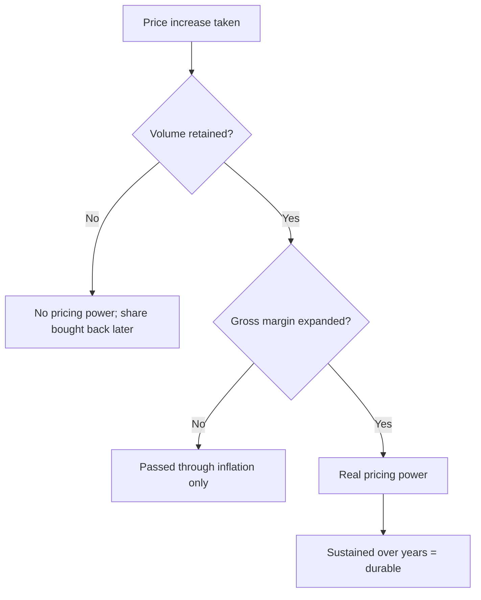

# Pricing Power Diagnostics

## The Problem / Why this matters
Pricing power is the most valuable attribute a business can have and the most loosely asserted. Almost every company claims it, and almost every analyst repeats the claim without testing it. But pricing power leaves a measurable trace in the financial statements, and the test takes minutes once you know what to look for.

## Core Idea
Pricing power is demonstrated by **real price increases sustained without volume loss** — which shows up as gross margin expanding over multiple years alongside stable or growing volumes, and nothing else proves it.

## Why it works this way
Raising prices in an inflationary period is not pricing power; everyone does it, and gross margin merely holds. Genuine pricing power means raising prices faster than input costs — capturing real price — and retaining customers while doing so. That combination expands gross margin over time and is visible in the accounts.

## Full technical content

### The three-part test

**1. Real price increase.** Realisation per unit rising faster than input cost per unit. Requires volume and value data separately, per the pricing chapter — where a company discloses only value growth, the claim cannot be tested and should be treated as unverified.

**2. Volume retained.** Volumes stable or growing through the price increases. A company raising prices while losing volume is harvesting, not exercising pricing power, and the harvest ends.

**3. Sustained over multiple years.** A single year of margin expansion can be input costs falling, mix, or a one-off. **Five years of gross margin expansion with stable volumes is the standard**, and very few companies meet it.

### What the trace looks like

| Pattern | Interpretation |
|---|---|
| **Gross margin expanding, volumes growing** | Genuine pricing power |
| **Gross margin flat, volumes growing** | Passing through costs; competitive but not powerful |
| **Gross margin expanding, volumes falling** | Harvesting; unsustainable |
| **Gross margin falling, volumes growing** | Buying share |
| **Gross margin volatile with input costs** | Commodity pass-through, no pricing power |

### The corroborating evidence

Beyond the financial trace:
- **Price premium to competitors** sustained over years, observable in channel checks and retail pricing.
- **Advertising intensity stable or falling** while share holds — rising A&P to hold volume indicates weakening brand pull, per the gross margin chapter.
- **Promotional depth and frequency**, which is where pricing power erodes first and most visibly.
- **Customer switching behaviour** at price increases, establishable through the channel.
- **The ability to take price ahead of competitors** rather than following them — the clearest single behavioural marker.

### Where it comes from

Per the franchise chapter, and worth being specific:
- **Brand**, where consumers pay a premium for a functionally similar product.
- **Switching costs**, where changing supplier is expensive or risky for the customer.
- **Qualification**, per the export chapter, where the customer must revalidate to switch.
- **Scarcity** — a genuinely constrained supply position, per the capacity chapter.
- **Regulatory position**, where alternatives are restricted.
- **Network effects**, subject to the multi-homing test.

**Naming the source is what makes the claim testable.** "Strong brand" is an assertion; "consumers pay a 22% premium over the private-label equivalent and have done for a decade" is evidence.

### Where it erodes

- **New channels** where the incumbent's advantage does not apply, per the distribution chapter — e-commerce price transparency is a specific and current pressure on consumer pricing power.
- **Private label** growing in modern trade.
- **A well-funded entrant** willing to subsidise price to buy share.
- **Commoditisation** of a previously differentiated product.
- **Regulatory intervention** on pricing.

**Erosion appears in promotional intensity before it appears in realisation**, which makes trade spend the leading indicator.

### The valuation consequence

- **Pricing power justifies a premium multiple**, because it protects margins through input cycles and supports a longer fade period, per the franchise chapter.
- **The premium should be sized to the evidence**, not to the assertion — a company meeting the three-part test over five years deserves more than one that claims it.
- **Test the durability**, since pricing power is not permanent and the erosion signals above are observable.
- **In a DCF**, pricing power is expressed through the terminal margin and the fade period, both of which should be stated explicitly.

## Common mistakes
- Accepting a **pricing power claim** without testing it.
- Confusing **passing through inflation** with real pricing.
- Testing over **one year** rather than five.
- Ignoring **volume**, so harvesting looks like pricing power.
- Not naming the **source** of the pricing power, making it untestable.
- Missing **rising promotional intensity** as the leading erosion signal.
- Applying a premium multiple to an untested claim.

## Interview angle
"The company says it has pricing power. How do you check?" A three-part test, all of which must hold: realisation per unit rising faster than input cost per unit, which requires volume and value disclosed separately — and where only value growth is given, the claim simply cannot be tested; volumes stable or growing through those increases, because raising price while losing volume is harvesting rather than power; and the pattern sustained over five years rather than one, since a single year of margin expansion can be falling input costs or mix. The financial trace is gross margin expanding over multiple years alongside stable volumes, and very few companies actually meet it. Then corroborate outside the accounts — a sustained price premium to competitors, promotional depth and frequency, and whether the company takes price ahead of competitors or follows them. And insist on naming the source, because "strong brand" is an assertion while "consumers pay a 22% premium over private label and have for a decade" is evidence that can be checked and monitored for erosion.
