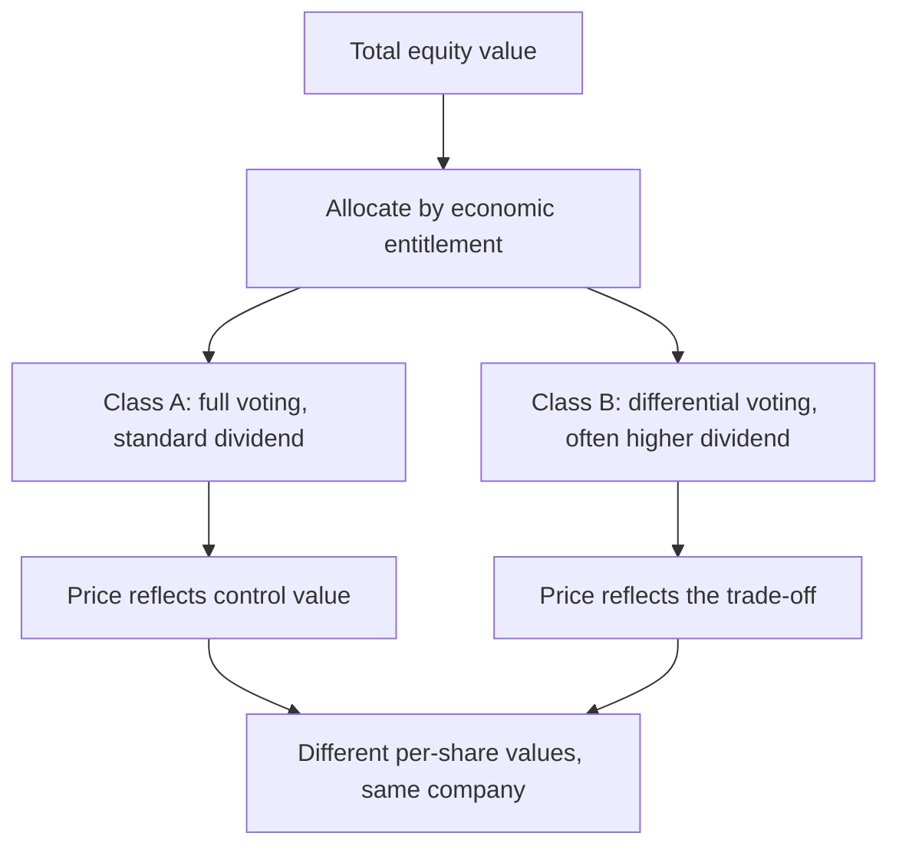

# Multiple Share Classes and Differential Rights

## The Problem / Why this matters
Where a company has more than one class of equity — differential voting rights, partly paid shares, or separate classes with different economic entitlements — the classes trade at different prices and carry different claims. Analysts frequently compute a single per-share value and apply it to whichever line the client holds, which is wrong in a way that is easy to avoid.

## Core Idea
Each share class is a **separate claim with its own economics and its own price** — so the valuation must be allocated across classes according to their entitlements, not divided by a single share count.

## Why it works this way
Value belongs to the holders of each class in proportion to their economic rights, which may differ from their proportion of the total share count. A class with reduced voting rights typically trades at a discount reflecting the lost control value, and a class with a superior dividend entitlement is worth more per share.

## Full technical content

### The structures

| Structure | Characteristics |
|---|---|
| **Differential voting rights (DVR)** | Reduced voting entitlement, frequently compensated with a higher dividend |
| **Partly paid shares** | Issued with part of the subscription outstanding; a further call is due |
| **Separate classes from a restructuring** | Arising from a scheme, with defined entitlements |
| **Preference shares** | Fixed dividend entitlement, ranking ahead of equity |
| **Convertible preference** | Converts on defined terms, per the convertibles chapter |

**Differential voting rights are the most commonly encountered in Indian markets**, and the DVR line typically trades at a persistent discount to the ordinary line.

### Analysing a DVR discount

**Compute it correctly first:**
- The DVR's dividend entitlement relative to the ordinary share.
- The voting entitlement.
- The relative liquidity of the two lines.
- The observed price ratio over time.

**Then explain it.** The discount reflects:
- **Lost control value** — the voting right has worth, principally in a takeover or contested situation.
- **Lower liquidity**, since the DVR line is usually much smaller.
- **Index exclusion** in many cases, removing passive demand.
- **Institutional mandate restrictions** on holding non-standard classes.
- **Partial compensation** through the higher dividend, which offsets some of it.

**The analytical question is whether the discount exceeds what those factors justify**, which is answered by comparing the discount to its own history and to comparable structures — the same approach as the holding-company discount, and with the same caution about mechanisms.

### When the discount narrows

- **Conversion or merger of the classes**, where permitted and where the company chooses to simplify.
- **Improved liquidity** in the DVR line.
- **Index inclusion**, where criteria change.
- **A control event**, where the voting differential becomes economically live — in a takeover the ordinary line captures the control premium and the DVR may not.

**The last point cuts both ways:** a DVR holder is exposed to a control event without participating in the control premium, which is precisely the risk the discount prices.

### Valuation treatment

1. **Value the enterprise and the total equity** as normal.
2. **Allocate across classes** by economic entitlement — dividend rights and any liquidation preference.
3. **Apply a discount to the non-voting or reduced-voting class** for the control and liquidity factors, stated and justified.
4. **State which class the target price applies to.** A note giving a single target without specifying the class is ambiguous and, for a client holding the other line, wrong.
5. **Handle partly paid shares** by adding the outstanding call to the effective cost and adjusting the share count and cash inflow accordingly.

### The share count question

Per the ESOP and convertibles chapters:
- **All classes count** in the fully diluted share count where they participate economically.
- **Convertible preference** converts at its stated ratio and should be included.
- **Partly paid shares** participate proportionately to the amount paid, until fully called.
- **Getting the count wrong** is a straightforward error that invalidates every per-share figure.

### The governance dimension

- **Differential voting structures concentrate control** with a smaller economic stake, which is the same structural concern as the holding-company arrangement.
- **Minority protections** matter more where control is entrenched by structure, per the boards chapter.
- **Regulatory attitudes to these structures have varied**, and changes affect both their permissibility and their valuation.
- **Assess the promoter's use of the structure** — whether it is a financing tool or a control-entrenchment device is answered by what has been done with it, per the promoter behaviour chapter.

## Common mistakes
- Computing one per-share value and applying it to **all classes**.
- Not stating **which class** a target price refers to.
- Ignoring the **dividend differential** that partly compensates a DVR.
- Treating the DVR discount as pure mispricing without the **liquidity and index** explanations.
- Forgetting that a DVR holder may not participate in a **control premium**.
- Excluding a class from the **diluted share count**.
- Mishandling **partly paid** shares in the count and the cash inflow.

## Interview angle
"The DVR trades at a 28% discount to the ordinary share. Is that an opportunity?" Compute what the discount should be before concluding it is one: the DVR usually carries a higher dividend entitlement that offsets part of the gap, and the rest reflects lost voting rights, materially lower liquidity, exclusion from indices in many cases, and institutional mandates that restrict holding non-standard classes. Compare the observed discount to its own history and to comparable structures rather than treating any discount as mispricing. Then name the risk that the discount is actually pricing — in a control event the ordinary line captures the control premium and the DVR may not, so the holder is exposed to the event without participating in its upside. And say what would narrow it: conversion or merger of the classes, improved liquidity, or index inclusion — which is the same mechanism question as a holding-company discount, and absent a mechanism the gap can persist indefinitely. Finish with the practical discipline: state explicitly which class a target price applies to, since a single number is ambiguous and wrong for whoever holds the other line.
