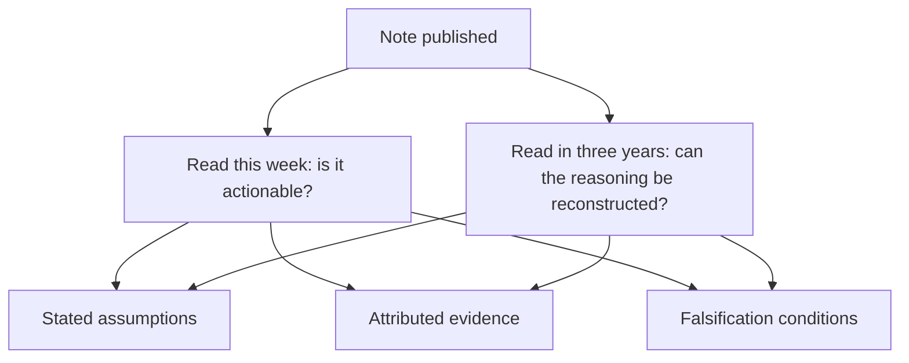

# The Research Note as a Durable Record

## The Problem / Why this matters
A research note is usually written for the week it is published. But it persists — in client files, in compliance archives, and as the record against which the analyst's judgement is later assessed. Writing with that permanence in mind changes what goes into a note, and the changes are the same ones that make it more useful immediately.

## Core Idea
Write every note so that **it can be read in three years and its reasoning reconstructed** — because a note whose basis cannot be recovered later is also one whose basis was never clear enough to be examined at the time.

## Why it works this way
The disciplines that make a note auditable — stating assumptions, attributing evidence, specifying falsification conditions — are the same ones that make it useful to a reader deciding whether to act. A note that hides its reasoning behind conclusions is unhelpful now and unreconstructable later, and both failures have the same cause.

## Full technical content

### What makes a note reconstructable

- **Assumptions stated explicitly** — growth, margin, multiple, cost of equity — with their basis, so a later reader knows what was believed rather than inferring it.
- **Evidence attributed** to its source, per the data-integrity chapter, so a claim can be traced.
- **The differentiated insight stated as a claim**, so it can later be judged true or false.
- **Falsification conditions**, which make the later assessment possible at all.
- **What was not known** at the time, stated — this is what protects the reasoning from hindsight, per the luck-and-attribution chapter.
- **The date and the price** at which the recommendation was made.

### Why it matters later

**For the post-mortem.** Per that chapter, assessing whether a decision was reasonable requires the contemporaneous reasoning. Without it, hindsight makes the outcome look inevitable and the assessment is worthless.

**For the calibration record.** Comparing estimates to actuals, per the quarterly update chapter, requires the estimates to be recorded with their basis.

**For compliance.** Firms are required to be able to demonstrate the basis of published recommendations, and a note that cannot be reproduced from a versioned model is a problem.

**For credibility.** A client who can see how a view was formed, and that it was updated when the stated conditions were met, trusts the next one differently.

### The archive as an asset

Beyond individual notes, the accumulated record is itself useful:
- **The company's own history through your coverage** — what you thought, when, and why.
- **What went wrong and what was learned**, classified.
- **The base rates**, per that chapter, built from your own record rather than from published averages.
- **Recurring patterns** in a sector that only become visible across years.

**An analyst with five years of properly recorded coverage has an asset that a new entrant cannot replicate**, which is the compounding point the first-year chapter makes about records generally.

### Practical disciplines

- **Version the model** at each publication, so numbers are reproducible.
- **Date and source every historical input.**
- **Keep primary research notes** with dates and what was asked.
- **Record the estimate** at publication for the calibration record.
- **Maintain the assumptions log** with reasons for each change.
- **Archive the note** with the model and the supporting material together.

### Writing for the future reader

A useful test: **would someone reading this in three years, without the market context of today, understand what was being claimed and why?**
- **Avoid unexplained references** to current market conditions.
- **State the base case explicitly** rather than assuming shared knowledge.
- **Explain the sector context** briefly where the argument depends on it.
- **Quantify** rather than relying on words that mean different things in different environments — "elevated" means nothing three years later.

### The uncomfortable use

The archive also records the errors, and that is its most valuable function:
- **It prevents the memory from editing them**, per the survivorship bias the attribution chapter identifies.
- **It shows the patterns** — whether the errors cluster in a type, a sector, or a market condition.
- **It makes the improvement measurable**, which is the difference between accumulating experience and developing judgement.

**Analysts who keep the record improve faster than those who do not**, and the reason is simply that they can see what happened rather than what they remember happening.

## Common mistakes
- Writing for the **week** rather than for the record.
- Not stating **assumptions**, so the reasoning cannot be reconstructed.
- Omitting **falsification conditions**, making later assessment impossible.
- Using language that depends on **current context** and expires.
- Not **versioning** the model, so published numbers cannot be reproduced.
- Failing to record **what was not known** at the time.
- Keeping no archive, so the memory edits the record.

## Interview angle
"Why does it matter how a note is written if the call is right?" Because the note is the record, and the disciplines that make it reconstructable later are the same ones that make it useful now. Stating assumptions explicitly with their basis, attributing evidence to sources, writing the differentiated insight as a claim that can later be judged true or false, and specifying falsification conditions — those make a reader able to disagree with a specific step this week, and they make an honest post-mortem possible in three years. Without the contemporaneous reasoning, hindsight makes the outcome look inevitable and the assessment is worthless. Add the compounding point: an analyst with several years of properly recorded coverage has base rates built from their own record, a classified error history, and visibility into recurring sector patterns — an asset a new entrant cannot replicate. And note the uncomfortable function, which is the valuable one: the archive records the errors and stops the memory from editing them, which is the difference between accumulating experience and actually developing judgement.
