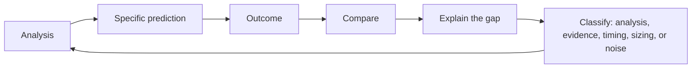

# Closing the Loop — From Analysis to Outcome

## The Problem / Why this matters
Analysis, recommendation, outcome, review — most analysts complete the first two and stop. The loop is only closed when the outcome is compared against what was predicted and the difference is explained. Without that step, experience accumulates without improving judgement, and the same errors repeat for years because nothing forces them to be seen.

## Core Idea
The loop closes when a **prediction made in advance is checked against what happened and the gap is explained** — which requires the prediction to have been specific enough to be checked.

## Why it works this way
Vague predictions cannot be wrong, so they teach nothing. A specific one — an estimate, a target, a falsification condition — can be compared to the outcome, and the comparison is where the learning is. That is why the disciplines of stating estimates, targets and falsifiers in advance are analytical tools rather than administrative ones.

## Full technical content

### The four loops

**1. The quarterly loop.** Compare actuals to your own estimate, line by line, per the quarterly update chapter. **Every quarter, on every covered name.** It takes minutes and builds the calibration record that nothing else provides.

**2. The thesis loop.** At each review, check the pre-committed falsification conditions and state whether the thesis is intact, per the conviction chapter.

**3. The call loop.** When a recommendation is closed — target reached, thesis broken, or coverage dropped — conduct the post-mortem regardless of outcome, per the attribution chapter.

**4. The annual loop.** Review the year's calls in aggregate: hit rate, attribution after stripping market and sector returns, error classification, and what changed in the process as a result.

### Classifying the gap

The classification matters because the response differs:

| Error type | Response |
|---|---|
| **Analytical** — the reasoning was flawed | Fix the framework or the check that was missed |
| **Evidential** — the facts were wrong or incomplete | Add a source or a verification step |
| **Timing** — right thesis, wrong horizon | Adjust catalyst assessment; consider entry triggers |
| **Sizing** — correct view, wrong position | Revisit the sizing discipline |
| **Noise** — the decision was sound, the outcome was random | **Change nothing** |

**The last category is the one most often mishandled.** A sound decision with a poor outcome should not produce a process change, and changing the process after every loss is how good processes get discarded, per the luck chapter.

### What the record enables

- **Personal base rates** — how often your estimates are within a range, how often catalysts occur on schedule, how often a differentiated view is vindicated.
- **Pattern recognition** — whether errors cluster in a sector, a company type, or a market condition.
- **Calibration** — whether stated conviction levels correspond to actual hit rates, which is directly measurable once the record exists.
- **Honest self-assessment**, which is the input to every other improvement.

**Calibration is the most useful of these and the least practised**: if the calls labelled high-conviction are right no more often than the marginal ones, the conviction signal is noise, and knowing that changes how it should be communicated.

### Making it happen

The obstacles are practical rather than conceptual:
- **It has no deadline**, so it loses to everything urgent, per the time allocation chapter.
- **It is uncomfortable**, particularly for the successes.
- **It requires the contemporaneous record**, which is why the note-as-record discipline matters.

**The fix is scheduling it** — the quarterly comparison as part of the results routine, the post-mortem as part of closing a call, and the annual review as a fixed calendar item. None of it works as an intention.

### What closing the loop produces

- **Faster improvement**, because errors become visible rather than being absorbed.
- **Better calibration**, so conviction means something.
- **Credibility**, since an analyst who reviews their record honestly and says so is trusted differently, per the standards chapter.
- **The base rates** that make future judgements better, per that chapter.

### The final connection

The ten things this book returns to — the five habits from the synthesis chapter and the five standards from the closing note — are all directed at the same end: making analysis testable so that it can improve. **Decomposing, checking cash against profit, benchmarking correctly, knowing what the market believes, and stating what would prove you wrong** make the analysis sound. **Verifying, stating falsifiers, changing views promptly, admitting uncertainty, and reporting outcomes honestly** make it improvable.

**Closing the loop is where those two sets meet.** Without it, the habits produce competent analysis that never gets better; with it, they compound.

## Common mistakes
- Completing the analysis and never checking the **outcome**.
- Predictions too **vague** to be checked.
- Post-morteming only the **failures**.
- **Changing the process** after a sound decision with a random outcome.
- Not stripping **market and sector** returns before attributing.
- Treating the loop as an intention rather than a **scheduled** task.
- Never measuring whether stated **conviction levels** correspond to hit rates.

## Interview angle
"How do you get better at this job?" By closing the loop, which most people do not: compare actuals to your own estimate line by line every quarter, check pre-committed falsification conditions at each review, post-mortem every closed call including the successes, and review the year in aggregate after stripping out market and sector returns. Then classify each gap, because the response differs — an analytical error means fixing the framework, an evidential one means adding a verification step, a timing error means reassessing how catalysts were judged, and a sound decision with a random outcome means changing nothing, which is the category most often mishandled since changing the process after every loss is how good processes get discarded. Add the measurement almost nobody does: check whether the calls you labelled high-conviction were right more often than the marginal ones, because if they were not, the conviction signal is noise. And be honest that the obstacle is practical rather than conceptual — this work has no deadline and is uncomfortable, so it only happens if it is scheduled.
