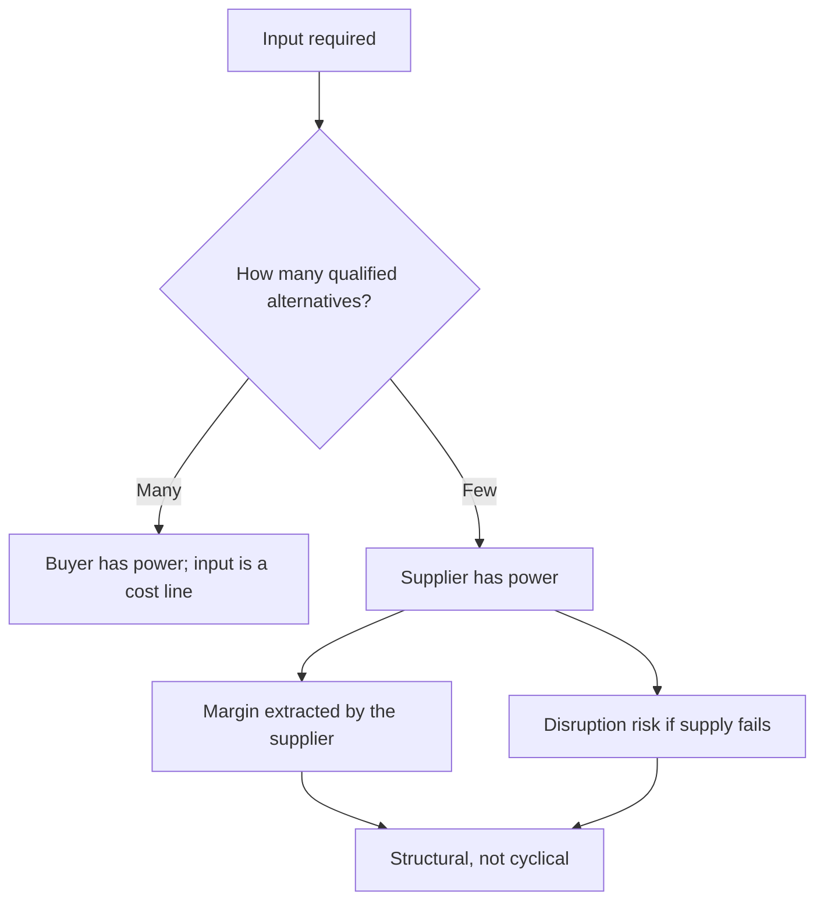

# Supplier Power and Input Security

## The Problem / Why this matters
Analysts examine customer concentration routinely and supplier concentration rarely, yet dependence on a single supplier, a single geography or a scarce input can be as existential. Supply disruptions have shut down production lines, and a supplier with pricing power extracts margin from its customers permanently. The exposure is disclosed or establishable, and it belongs in the analysis alongside the demand side.

## Core Idea
Supplier power is determined by **the availability of alternatives and the cost of switching to them** — and where an input is scarce, qualified or geographically concentrated, the supplier captures margin that the customer's own competitive position cannot protect.

## Why it works this way
Margin accrues where alternatives are fewest, per the value chain chapter. A company buying from a concentrated supplier base faces the same dynamic its own customers face when buying from it — and being strong in your own market does not protect you from a supplier who is stronger in theirs.

## Full technical content

### Assessing the exposure

| Question | Where to find it |
|---|---|
| **Supplier concentration** | Disclosed by some companies; establishable through the industry |
| **Are alternatives qualified?** | Qualification cycles, per the export chapter |
| **Geographic concentration** of supply | Import data by origin; company disclosure |
| **Is the input substitutable?** | Technical, not financial — requires industry understanding |
| **Contract structure** | Long-term agreements, formula pricing, or spot |
| **Inventory held** | Days of cover against a disruption |
| **Backward integration** by the company | Reduces the exposure structurally |

**Qualification is the key concept on the supply side as on the customer side.** A component qualified into a product cannot be swapped for an alternative without revalidation, which may take a year or more — so the number of *qualified* suppliers matters, not the number of potential ones.

### The two distinct risks

**1. Margin risk.** A powerful supplier raises prices and the customer cannot pass them through, per the pass-through chapter. The margin transfer is permanent rather than cyclical.

**2. Continuity risk.** Supply is interrupted — by a plant failure, a natural event, a trade restriction, or the supplier's own distress. **Production stops, and the cost is far larger than the input's share of the cost base suggests**, because fixed costs continue while revenue does not.

**The second is under-weighted** because it is rare and its cost is disproportionate. A supplier representing 3% of the cost base can halt 100% of production.

### The signals

- **Rising input cost per unit** without a corresponding move in the underlying commodity, indicating supplier pricing rather than market pricing.
- **Inventory days rising** on a specific input, which may be deliberate security-building.
- **Long-term supply agreements signed**, disclosed in filings, which indicate the company sees the risk.
- **Backward integration announced**, which is the strongest signal that supplier power is being felt — and should be assessed on its own returns, per the build-versus-buy chapter.
- **Qualification of a second source** announced, which reduces the exposure and takes time.
- **Supplier financial distress**, assessable where the supplier is listed or files accounts, per the read-across chapter.

### The structural responses

Companies address supplier power through:
- **Dual sourcing**, which costs qualification effort and volume leverage but removes the single point of failure.
- **Backward integration**, which converts a purchase into an internal transfer — evaluate on incremental returns, not on strategic rationale.
- **Long-term contracts** with formula pricing, which fix the relationship but may lock in unfavourable terms.
- **Inventory buffers**, which cost working capital, per that chapter.
- **Substitution** through product redesign, which is slow and may compromise performance.

**Each has a cost, and the analytical question is whether the company is paying it** — a company with a known single-source dependency and no mitigation is carrying an unpriced risk.

### Where it matters most

- **Auto components and electronics**, where qualification cycles are long and single-sourcing is common.
- **Pharmaceuticals**, where active ingredient sourcing is frequently geographically concentrated.
- **Speciality chemicals**, where intermediates may have few qualified producers.
- **Any business dependent on a single plant** for a critical input, including its own.
- **Companies dependent on imports** from a single country, which adds trade policy risk, per that chapter.

### In the analysis

- **Identify the critical inputs** and the qualified supplier count for each.
- **Assess the disruption scenario** — what happens to revenue and to fixed cost absorption if supply stops for a quarter.
- **Include it in the bear case** rather than in a risk list, per the stress-testing chapter.
- **Assess the mitigation** the company has actually put in place, not what it says it could do.
- **Watch the input cost trend** relative to the underlying commodity for evidence of supplier pricing.

## Common mistakes
- Examining **customer** concentration and ignoring supplier concentration.
- Counting **potential** suppliers rather than qualified ones.
- Underweighting **continuity risk** because the input is a small share of cost.
- Missing **geographic concentration** of supply as a trade policy exposure.
- Treating **backward integration** as strategically justified without checking returns.
- Ignoring supplier **financial distress** as a supply risk.
- Leaving the disruption scenario in a risk list rather than in the bear case.

## Interview angle
"What supply-side risks would you check?" Two distinct ones. Margin risk, where a concentrated supplier base extracts price the company cannot pass through — visible as input cost per unit rising faster than the underlying commodity, which distinguishes supplier pricing from market pricing. And continuity risk, which is under-weighted because it is rare and its cost is disproportionate: a supplier representing 3% of the cost base can halt all production, and fixed costs continue while revenue does not. Say that the key concept is qualification, so what matters is the number of *qualified* alternatives rather than potential ones, since a component validated into a product cannot be swapped without revalidation that may take a year. Then check what mitigation actually exists rather than what the company says it could do — dual sourcing completed, inventory cover, long-term agreements signed, or backward integration, which should be assessed on incremental returns rather than accepted as strategically justified. And put the disruption scenario in the bear case rather than in a risk list.
