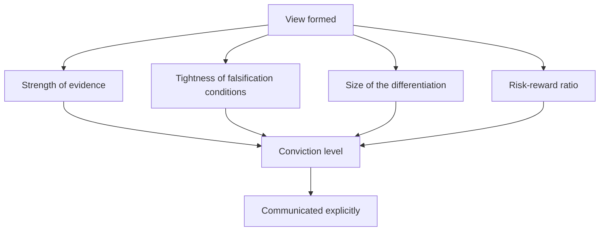

# Measuring and Communicating Conviction

## The Problem / Why this matters
Analysts publish views at a uniform apparent confidence, which gives clients and the sales desk no basis for prioritising among them. Yet conviction genuinely varies — some calls rest on strong evidence and tight falsification conditions, others on a plausible interpretation of ambiguous data. Signalling that difference honestly is what makes the strong calls credible and is among the least-practised disciplines in research.

## Core Idea
Conviction should be **assessed against stated criteria and communicated explicitly**, because a signal that is never varied carries no information.

## Why it works this way
A client sizing positions needs to know how confident you are, not just what you think. If every note reads the same, they must infer confidence from tone, which is unreliable. An analyst who differentiates honestly gives clients a usable input and gets their strong calls acted on.

## Full technical content

### The criteria

Assess conviction against these rather than by feel:

| Criterion | High conviction | Low conviction |
|---|---|---|
| **Evidence** | Primary, multi-source, corroborated | Inference from public data alone |
| **Differentiation** | Large and specific gap to consensus | Marginal or unquantified |
| **Falsifiers** | Tight, specific, observable soon | Vague or distant |
| **Risk-reward** | 3:1 or better | Close to symmetric |
| **Catalyst** | Dated and identified | Absent or indefinite |
| **Base rate** | The situation type usually resolves this way | Against the base rate |
| **Edge** | Identifiable, per that chapter | None articulated |

**Where several are weak, the honest label is low conviction** — and publishing a low-conviction view labelled as such is more useful than either inflating it or withholding it.

### Communicating it

- **State it explicitly** rather than implying it through tone.
- **Use consistent language** so the signal is interpretable — the same phrases meaning the same things across notes.
- **Give the basis**: "high conviction, based on channel evidence from eleven distributors across four regions and a 2.8:1 risk-reward" tells a client both the level and why.
- **Vary the position-size recommendation** with it, per the sizing chapter, which is the concrete expression.
- **Tell the sales desk**, per the morning meeting chapter — they need to know which calls to push.

### The calibration test

Per the closing-the-loop chapter, this is measurable:
- **Track the hit rate by conviction level** over time.
- **If high-conviction calls are right no more often than marginal ones**, the signal is noise and should be recalibrated.
- **If they are right substantially more often**, the signal is valuable and clients should be told to weight it.

**Almost nobody measures this**, and it is the only way to know whether the conviction signal means anything.

### The failure modes

- **Uniform high confidence**, which destroys the signal entirely and is the most common failure.
- **Inflating conviction** to get attention, which works once.
- **Withholding a low-conviction view** where it is still useful — a client can act on "we think this is modestly attractive but the evidence is thin" if you say so.
- **Confusing conviction with certainty.** High conviction still carries falsification conditions and can be wrong; it means the evidence is strong, not that the outcome is assured.
- **Letting conviction rise with the position's performance**, which is the behavioural trap — a stock going up is not new evidence, per the conviction chapter.

### Conviction and position size

The concrete link:
- **Risk-reward is the primary sizing input**, per the sizing chapter, and conviction is the second.
- **A 3:1 risk-reward at low conviction** supports a smaller position than the same ratio at high conviction.
- **Liquidity constrains both**, and frequently binds first in smaller names.
- **State the resulting size implication**, which is what a buy-side reader actually needs.

### Where conviction is legitimately low

- **A situation with a wide but favourable distribution** — worth owning small, per the low-visibility chapter.
- **An early-stage thesis** where the evidence is developing and the falsifiers will resolve soon.
- **A valuation call** with no differentiated operating view, which is legitimate and should be labelled as such.
- **Against the base rate**, where the specific evidence is good but the situation type usually resolves the other way, per that chapter.

**Publishing these honestly labelled is a service.** The alternative — either inflating them or publishing nothing — leaves the client worse off in both cases.

## Common mistakes
- Publishing everything at **uniform confidence**.
- Implying conviction through **tone** rather than stating it.
- **Inflating** conviction to attract attention.
- Withholding a **low-conviction** view that would still be useful.
- Confusing conviction with **certainty**, and dropping the falsifiers.
- Letting conviction rise with the **price**.
- Never **measuring** whether the conviction signal predicts anything.

## Interview angle
"How do you communicate how confident you are?" Explicitly and against stated criteria rather than through tone — the strength and independence of the evidence, how tight and observable the falsification conditions are, the size of the quantified gap to consensus, the risk-reward ratio, whether there is a dated catalyst, and whether the situation runs with or against the base rate. Give the level and its basis together, so "high conviction on channel evidence from eleven distributors across four regions with a 2.8:1 risk-reward" tells a client both things. Say why it matters: a signal that never varies carries no information, so publishing everything at uniform confidence means clients must infer it from tone, and the analyst's genuinely strong calls get no more weight than the marginal ones. Add the measurement almost nobody does — track the hit rate by conviction level, because if the high-conviction calls are right no more often than the marginal ones then the signal is noise and needs recalibrating. And note that low conviction honestly labelled is still useful; withholding it or inflating it both leave the client worse off.
