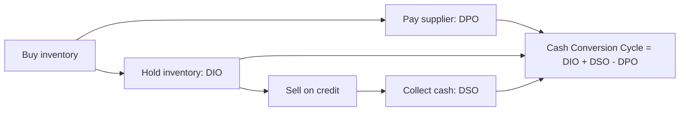

# Working Capital and Cash Conversion Analysis

## The Problem / Why this matters
Two companies can report identical revenue growth and identical EBITDA margins, and one can be generating cash while the other is consuming it. The difference is working capital — and it determines whether growth creates value or destroys it. For any business selling on credit or holding inventory, working capital is where growth is funded, where quality shows up, and where the earliest signs of demand weakness or channel stress appear.

## Core Idea
Working capital is the cash tied up in running the business day to day: **receivables + inventory − payables**. The **cash conversion cycle** measures how many days of cash are locked up in that loop. A shortening cycle releases cash; a lengthening cycle absorbs it — and a lengthening cycle during revenue growth is one of the most reliable early warnings in fundamental analysis.

## Why it works this way
Revenue is recognised at sale; cash arrives at collection. Between those two points the company has funded production and given the customer credit. The faster that loop turns, the less capital the business needs to grow, the higher its return on capital, and the less it depends on external funding — which is precisely why working-capital-light businesses command premium multiples.

## Full technical content

### The three components

| Metric | Formula | Meaning | Direction that helps |
|---|---|---|---|
| **DIO** — Days Inventory Outstanding | (Inventory ÷ COGS) × 365 | Days of stock held | Lower |
| **DSO** — Days Sales Outstanding | (Receivables ÷ Revenue) × 365 | Days to collect from customers | Lower |
| **DPO** — Days Payable Outstanding | (Payables ÷ COGS) × 365 | Days taken to pay suppliers | Higher |

**Cash Conversion Cycle (CCC) = DIO + DSO − DPO**

A CCC of 60 means roughly 60 days of operating cash is permanently tied up in the business; grow revenue and that tied-up amount grows proportionally.

**Negative working capital** — where DPO exceeds DIO + DSO — means suppliers and customers are funding the business. This is the structural advantage of quick-service restaurants, some retail, and subscription businesses collecting in advance: **growth generates cash rather than consuming it**. It is a genuine, durable competitive and valuation advantage.

### The growth-funding arithmetic

The cash a company must fund for each rupee of incremental revenue is roughly **CCC ÷ 365**. A business with a 90-day CCC growing revenue by ₹100 crore must fund about ₹25 crore of additional working capital to do so. This is why:

- A high-CCC business growing fast will show **profit without cash flow**, and will need debt or equity to fund the gap.
- **Return on capital employed** is mechanically depressed by a long CCC, because working capital sits in the capital-employed denominator.
- A company that improves CCC while growing releases a one-time slug of cash — genuinely valuable, but **non-recurring**, and should not be extrapolated into the forecast as sustainable cash generation.

### Reading the trend — what each movement signals

**Rising DSO (collections slowing):**
- Demand weakening, so the company is extending credit to hold volumes — an early demand-stress signal, visible before revenue falls.
- A shift in customer mix toward weaker or larger, more powerful buyers.
- Aggressive revenue recognition on sales unlikely to collect (see the accounting-quality chapter).
- Genuine one-off: a large customer's payment cycle straddling the period end.

**Rising DIO (inventory building):**
- Demand slowing while production continued — the classic pre-downturn signal in manufacturing.
- Deliberate build ahead of a launch, a price increase, or a seasonal peak (benign — check management commentary).
- Obsolescence risk not yet written down.

**Rising DPO (paying suppliers slower):**
- Improved negotiating power (benign, and genuinely value-creating).
- **Or liquidity stress** — stretching creditors because cash is tight. Distinguish these by checking whether cash balances and debt are simultaneously deteriorating. Stretching payables to flatter reported CFO is a real and common tactic.

### The critical discipline: decompose before concluding

CCC moving is not itself informative — *which component moved* is. A CCC improvement driven entirely by stretching payables (rising DPO) while DSO and DIO also deteriorate is not an improvement at all; it is deterioration masked by supplier financing. Always report the three components separately.

### Sector context

Working-capital norms vary enormously, so **always benchmark against sector peers, not an absolute standard**:

| Business type | Typical CCC character |
|---|---|
| FMCG / quick-service | Low or negative — fast turns, cash sales, supplier credit |
| IT services | Moderate — no inventory, but receivables from enterprise clients |
| Pharma (generics/US) | Long — extended channel receivables, regulatory inventory |
| Capital goods / EPC | Very long — project cycles, retention money, unbilled revenue |
| Retail | Varies — inventory-heavy but often strong payables terms |
| Banks / NBFC | Not applicable — the balance sheet *is* the product |

### Linking to valuation

Working capital enters valuation directly: in a DCF, **change in working capital** is subtracted in deriving free cash flow. A forecast that grows revenue aggressively while holding working capital days flat is implicitly assuming an efficiency improvement — make that assumption explicit and defensible, because it is a common way DCFs are quietly inflated.

Also note the **RoCE linkage**: RoCE = EBIT ÷ (Fixed assets + Working capital). Two companies with identical EBIT margins will show materially different RoCE if their working-capital intensity differs — and RoCE, not margin, is what drives sustainable multiple differences between them.

## Common mistakes
- Reporting CCC as a single number without decomposing into DIO/DSO/DPO, hiding offsetting moves.
- Reading rising DPO as improved bargaining power when it is liquidity stress.
- Comparing CCC across sectors rather than against relevant peers.
- Extrapolating a one-time working-capital release as recurring cash generation.
- Forecasting revenue growth in a DCF without funding the corresponding working-capital build.
- Ignoring seasonality — comparing a peak-season quarter-end to an off-season one and calling the difference a trend.

## Interview angle
"A company's profit is growing but its operating cash flow is falling. What's happening?" The structured answer: working capital is absorbing the cash, so decompose it — receivables rising faster than revenue (collections slowing, possibly demand stress or aggressive revenue recognition), inventory building (demand slowing or obsolescence unprovided), or payables normalising after having been stretched. Then check whether it is seasonal, one-off, or a genuine trend by looking at the multi-period series and peer comparison. Being able to name the three components and what each movement implies is the whole answer.
