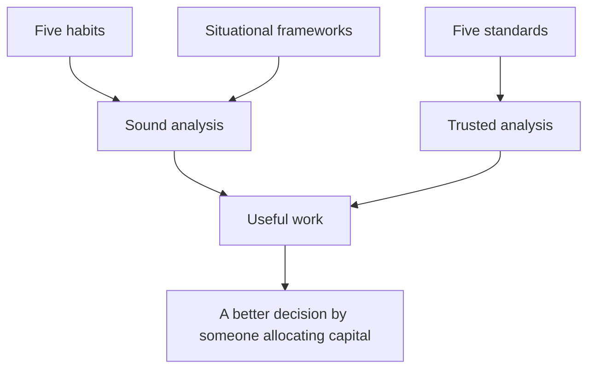

# The Complete Summary

## The Problem / Why this matters
This subject now runs to a substantial body of material. A reader who has worked through it needs a single place where the whole structure is visible — what the parts are, how they connect, and what to return to. This chapter is that map.

## Core Idea
Everything here reduces to **five analytical habits, five professional standards, and their application to particular situations** — and the situations are numerous while the habits and standards are not.

## Why it works this way
The specific frameworks are sector- and situation-dependent: a bank is analysed differently from a cement company, a demerger differently from an IPO. What generalises is the underlying method, which is why an analyst who has the habits can construct an approach to a situation no chapter covers.

## Full technical content

### The five habits

1. **Decompose before concluding.** Aggregates conceal; revenue splits into volume and price, growth into organic and acquired, margin into price, cost, mix and leverage.
2. **Check cash against profit.** Cumulative CFO against cumulative PAT over five years is the most efficient integrity test available.
3. **Compare against the right benchmark.** The company's own history, the correct peer set, and the theoretical standard — RoCE against cost of capital, terminal growth against nominal GDP.
4. **Know what the market believes and why.** Reverse-DCF converts a vague disagreement into a specific, testable one.
5. **State what would prove you wrong.** Pre-committed falsification conditions prevent confirmation bias, enable honest conviction management, and make post-mortems meaningful.

### The five standards

1. **Verify every number** against a primary filing.
2. **Publish the falsification conditions** with the call.
3. **Change the view promptly** when they are met, and say what was wrong.
4. **Say when you do not know**, and what would resolve it.
5. **Report outcomes honestly**, including the successes that were lucky.

### The structural map

| Group | Chapters cover |
|---|---|
| **Process** | Idea generation, screening, coverage universe, initiation sequence, quarterly updates, time allocation |
| **Financial analysis** | Cash flow, working capital, margins, returns, ROIIC, asset turnover, earnings quality, forensic screening |
| **Accounting** | Depreciation, leases, goodwill, provisions, deferred tax, segments, consolidation, equity method, restatements |
| **Valuation** | DCF, multiples, SOTP, triangulation, cost of equity, sensitivity, negative earnings, cyclicals, real options |
| **Sectors** | Twenty-plus deep dives, each with its own driver set |
| **Corporate events** | IPOs, demergers, mergers, buybacks, rights issues, takeovers, restructurings, insolvency |
| **Market structure** | Index flows, derivatives data, surveillance, settlement, liquidity, shareholding, institutional flows |
| **Governance** | Related parties, boards, promoters, disclosure quality, audit reports, insider trading |
| **Craft** | Writing, morning meetings, previews, sector outlooks, client management, interviews |
| **Judgement** | Conviction, disagreement, base rates, attribution, edge, cost of being wrong, closing the loop |

### What to return to

- **Before any new company**: the disqualifying checks and the initiation sequence.
- **Before any valuation**: which method fits this business type, and the triangulation cross-checks.
- **Before any recommendation**: the bear case with the multiple moving, the risk-reward, and the falsification conditions.
- **Every quarter**: the update routine and the calibration comparison.
- **Every year**: the review of last year's calls, classified.
- **When stuck**: the five habits, which usually identify what has not been done.

### The honest scope

- **This covers the analytical craft**, not the whole job — relationships, institutional dynamics and market experience are learned by doing.
- **The judgements that matter most remain irreducible**: cyclical versus structural, durable versus temporarily strong, honest versus plausible, early versus wrong.
- **The frameworks narrow where judgement operates** and make it improvable through the record; they do not replace it.
- **Nothing here substitutes for cycles observed and errors reviewed.**

### The single sentence

If the whole subject compressed to one line: **decompose the numbers, verify them against cash, know what the price already assumes, take a position with the risk quantified, say what would prove you wrong, and check afterwards whether it did.**

## Common mistakes
- Treating the frameworks as a **substitute** for judgement.
- Learning situations without the **habits**, so unfamiliar cases cannot be handled.
- Having the habits without the **standards**, producing sound analysis nobody trusts.
- Never **closing the loop**, so none of it improves.

## Interview angle
"You've studied this extensively. What's the summary?" Five habits and five standards, applied to a large number of particular situations. The habits make the analysis sound: decompose aggregates before concluding, check cumulative cash against cumulative profit, compare every number against the right benchmark rather than an available one, establish what the market already assumes before disagreeing with it, and state in advance what would prove you wrong. The standards make it trusted: verify every number against a primary filing, publish the falsifiers, change the view promptly when they are met, admit uncertainty where it is genuine, and report outcomes honestly including the successes that were lucky. Everything else — the sector frameworks, the accounting adjustments, the valuation methods, the corporate event mechanics — is the application of those ten things to specific circumstances. And be honest about the limits: the judgements that matter most are still irreducible, cyclical versus structural above all, and the frameworks narrow where judgement operates rather than replacing it.
