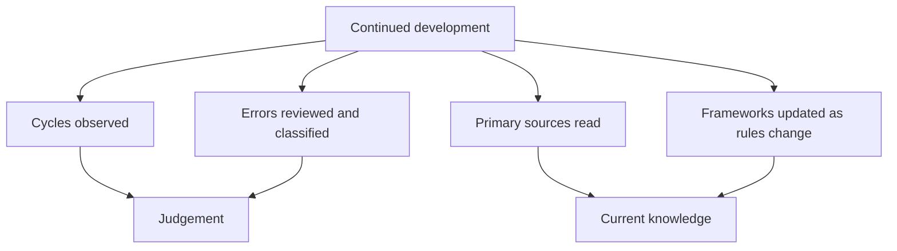

# Further Development and Continued Learning

## The Problem / Why this matters
Finishing a body of study is the beginning rather than the end. The frameworks here are static; markets, accounting standards, regulations and industries are not. An analyst who stops learning after the initial preparation will be applying an increasingly stale framework, and the decay is gradual enough to be invisible from inside.

## Core Idea
Continued development comes from **cycles observed, errors reviewed, and primary sources read** — not from more frameworks, of which most analysts already have enough.

## Why it works this way
The binding constraint on an experienced analyst is rarely technique. It is judgement about situations that technique cannot resolve, and judgement improves through exposure to outcomes with the reasoning recorded — which is why the record-keeping disciplines matter more than any further framework.

## Full technical content

### What actually develops judgement

**1. Observing a full cycle in a sector.** The cyclical-versus-structural judgement, which the synthesis chapter identifies as the hardest, is learned by watching a downturn and a recovery in the same industry. There is no substitute, and it takes years.

**2. Reviewing errors with the contemporaneous reasoning.** Per the closing-the-loop chapter — this is the mechanism by which experience becomes judgement rather than accumulating as anecdote.

**3. Reading primary sources continuously.** Annual reports, transcripts, regulatory orders, rating rationales. **Reading commentary about disclosures is not the same as reading them**, and the difference compounds.

**4. Working through unfamiliar situations.** A restructuring, an insolvency, a cross-border transaction — each teaches something no framework conveys.

**5. Talking to people who have watched more cycles**, which the first-90-days chapter identifies as disproportionately valuable and which most analysts under-use out of reluctance to ask.

### What needs periodic updating

Because the rules change:
- **Accounting standards** — leases, revenue recognition, financial instruments and expected credit loss have all changed materially, and each changed what the reported numbers mean.
- **Tax regimes**, per that chapter — the dividend and buyback treatment has shifted more than once, and stating a superseded rule confidently is a visible error.
- **Market regulations** — settlement cycles, margin frameworks, surveillance measures, disclosure requirements.
- **Listing and takeover rules**, which affect corporate event analysis directly.
- **Sustainability reporting requirements**, which have made new data comparable.

**The discipline: check the current position rather than relying on memory** for anything rule-based, which the tax and settlement chapters both emphasise.

### The reading that pays

- **Annual reports outside your coverage**, particularly of companies in adjacent industries, which builds pattern recognition.
- **Rating agency rationales**, per the credit chapter — free, analytical and rarely read by equity analysts.
- **Regulatory orders and consultation papers**, per the policy chapter, which reveal the framework being applied.
- **Global peers' filings**, which show what business models earn at maturity.
- **Accounting standard texts** for the areas where judgement concentrates.
- **Post-mortems of corporate failures**, which are the highest-yield form of case study and are usually available in regulatory findings and investigative journalism.

### What does not develop judgement

Worth stating, since effort goes there:
- **More frameworks** without more situations to apply them to.
- **Market commentary**, which is abundant, repetitive and rarely evidenced.
- **Following prices** rather than businesses.
- **Reading summaries** rather than sources, per the AI chapter.
- **Accumulating certifications** without the practice they describe.

### The specific gaps to close deliberately

An honest self-assessment usually identifies:
- **A sector never covered**, where the frameworks are unfamiliar.
- **An accounting area avoided** — actuarial assumptions, hedge accounting, percentage-of-completion.
- **A situation type not yet encountered** — insolvency, a contested takeover, a cross-border merger.
- **A skill under-practised** — primary research, modelling, writing, or speaking to clients.

**Closing these deliberately, one at a time, is more productive than general study**, because the gap is identifiable and the improvement is measurable.

### The realistic horizon

- **The first year builds the framework**, per that chapter.
- **The first cycle observed changes the judgement** materially, and it takes several years.
- **Calibration improves measurably** once the record exists, and not before.
- **The craft continues developing indefinitely**, which is what makes the work sustainable as a career rather than a technique to be mastered and then repeated.

## Common mistakes
- Treating the initial study as **completion**.
- Accumulating **frameworks** rather than situations.
- Relying on **memory** for rule-based matters that have changed.
- Reading **commentary** rather than primary sources.
- Not identifying and closing specific gaps **deliberately**.
- Expecting judgement to develop without the **record** that makes errors visible.

## Interview angle
"How would you keep developing in this role?" Through cycles observed, errors reviewed and primary sources read, rather than through more frameworks — because the binding constraint on an experienced analyst is judgement about situations technique cannot resolve, and that improves only through exposure to outcomes with the reasoning recorded. Be specific about what needs periodic updating rather than remembering: accounting standards on leases, revenue and expected credit loss have all changed what reported numbers mean; tax treatment of dividends and buybacks has shifted more than once; and settlement, margin and surveillance frameworks change too — so anything rule-based gets checked against the current position rather than recalled. Name the reading that actually pays: rating agency rationales, which are free and analytical and rarely read by equity analysts; regulatory consultation papers, which reveal the framework being applied; global peers' filings for what a business model earns at maturity; and post-mortems of corporate failures, which are the highest-yield case studies available. And say that closing a specific identified gap — a sector never covered, an accounting area avoided, a situation type not yet encountered — beats general study, because the improvement is measurable.
