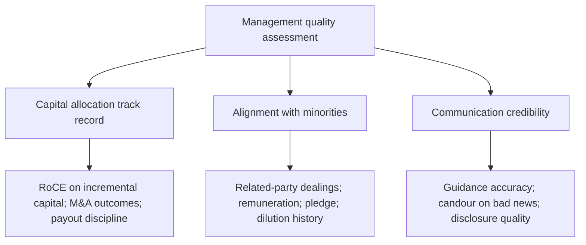

# Management Quality and Corporate Governance Assessment

## The Problem / Why this matters
Over a long holding period, the quality of the people allocating a company's capital matters as much as the business economics they started with. Two companies with identical assets and identical market positions will diverge enormously depending on whether management reinvests well, treats minority shareholders fairly, and tells the truth about setbacks. Governance failure is also the fastest destroyer of equity value in Indian markets — and unlike a valuation error, it is rarely recoverable.

## Core Idea
Management quality is assessable, not merely intuitive. Judge it on three dimensions with evidence: **capital allocation track record**, **alignment with minority shareholders**, and **credibility of communication** — each measurable against what management previously said and what they actually did.

## Why it works this way
Talk is free and universally optimistic; every management team says they are focused on shareholder value. The evidence is in the historical record: what returns did their past investments earn, who benefited when value was created, and did their previous guidance prove accurate? Because that record is public and cumulative, management quality is one of the few "soft" factors that can be assessed rigorously.

## Full technical content

### Dimension 1 — Capital allocation

This is the CEO's primary job: deciding what to do with the cash the business generates. There are only five options — reinvest in the core business, acquire, pay down debt, pay dividends, or buy back stock — and the historical record of those choices is fully visible.

**Assessment tools:**

- **Incremental RoCE** — the return earned on capital deployed over the last 5–10 years, calculated as the change in EBIT divided by the change in capital employed over the period. This is far more informative than the reported RoCE level, which is dominated by legacy assets. Management deploying fresh capital at returns below the cost of capital is destroying value however profitable the legacy business looks.
- **Acquisition track record** — for each material acquisition: what was paid, what was promised, and what the acquired business actually delivered. Then check whether goodwill from those deals has ever been impaired. Serial acquirers who never impair goodwill despite underperforming acquisitions are not being straight with you.
- **Capex discipline through the cycle** — did they expand capacity at the top of the cycle (value-destructive, and extremely common in commodities and cyclicals) or counter-cyclically?
- **Returning cash** — is the dividend/buyback policy consistent and rational, or does the company hoard cash on the balance sheet earning treasury returns while claiming reinvestment opportunities it never funds?

### Dimension 2 — Alignment with minority shareholders

In promoter-driven markets, the central governance question is whether value created accrues to *all* shareholders or is diverted to the promoter group.

**What to examine, all of it publicly disclosed:**

- **Related-party transactions** — read the full note every year. Sales to, purchases from, loans to, and guarantees given to promoter-group entities. Look at scale relative to revenue and net worth, and at whether the terms appear arm's-length.
- **Promoter remuneration** — as a share of profit, and its trend versus profit. Remuneration rising while profit falls is a direct alignment failure.
- **Promoter pledge** — a high or rising pledge means the promoter's personal financial position is levered to the share price, which creates pressure on reported results and forced-selling risk (covered in the technical-signal material).
- **Dilution history** — repeated equity raises at prices unfavourable to existing minorities, or preferential allotments/warrants to promoter entities at advantageous prices.
- **Royalty and brand-fee payments** to promoter entities — a legitimate structure, but check quantum and trend; escalating royalty as a share of profit is a classic value-transfer route.
- **Group-company entanglement** — loans, cross-guarantees, and receivables from group entities that sit outside the listed vehicle.

### Dimension 3 — Communication credibility

The most efficiently assessable dimension, because it self-scores over time.

- **Guidance accuracy** — build a simple historical table: what did management guide to, and what did they deliver? Chronic over-promising is a durable trait, not a series of unlucky quarters.
- **Candour on bad news** — does management flag a problem early and explain it, or does the problem only surface once it is undeniable? Managements that disclose early are systematically more reliable on everything else.
- **Consistency of narrative** — compare the strategy described three years ago to today's. Frequent strategic pivots described each time as a long-held plan is a credibility signal.
- **Disclosure quality** — segmental detail, volume/realisation splits, and clear reconciliation of exceptional items. Reducing disclosure granularity (e.g. ceasing to report a segment separately just as it weakens) is a meaningful negative signal.
- **Concall behaviour** — willingness to take hard questions directly, versus deflection (covered in the earnings-call material).

### Board and structural governance

- **Board independence** — genuinely independent directors, or long-tenured associates of the promoter? Check tenure and other directorships.
- **Audit committee composition and auditor tenure**; any auditor resignation or qualification (a severe signal, per the accounting-quality material).
- **Separation of Chairman and CEO roles.**
- **Independent director resignations**, especially with a stated reason.
- **Succession planning** in promoter-led businesses — a genuine long-horizon risk that is rarely disclosed proactively.

### Turning it into a research output

Do not write "management is good." Write an evidence-based assessment: *"Incremental RoCE of 18% over FY19–24 versus a ~12% cost of capital; two acquisitions in the period, both delivering above the stated revenue case; related-party transactions immaterial at under 1% of revenue; promoter pledge nil; guidance met or exceeded in 9 of the last 12 quarters."* That is a defensible assessment. Its opposite is equally defensible and far more valuable to a client.

Management quality legitimately affects the **multiple** you apply and the **discount rate**, and it belongs explicitly in the risk section of a note — but it must be argued from the record, not asserted from impression.

## Common mistakes
- Confusing a charismatic, articulate CEO with a good capital allocator — they are uncorrelated.
- Assessing management on the reported RoCE level rather than **incremental** RoCE on capital they actually deployed.
- Skipping the related-party transactions note because it is dense.
- Treating governance as a binary compliance checkbox rather than a spectrum affecting valuation.
- Being reluctant to write a negative governance assessment for a company with a strong stock price — the market repricing that gap is precisely where research adds value.
- Assuming large size or index membership implies governance quality.

## Interview angle
"How would you assess management quality?" Give the three-dimension structure with the specific evidence under each: capital allocation (incremental RoCE, M&A track record versus what was promised, capex timing through the cycle, cash-return discipline); alignment (related-party transactions, remuneration versus profit, pledge, dilution history, royalty payments); credibility (guidance accuracy tracked over time, candour on bad news, disclosure consistency). Close with the key point that all of it is assessable from public disclosure — this is analysis, not impression.
