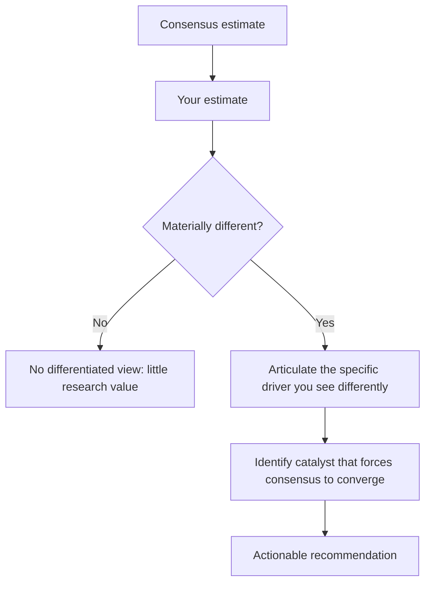

# Consensus Estimates, Surprise and Revision Analysis

## The Problem / Why this matters
A stock's price already contains the market's collective forecast. An analyst who does not know what that forecast is cannot know whether their own view is differentiated — and a view that merely agrees with consensus, however well-researched, generates no alpha and no reason for a client to read the note. Understanding consensus, how it forms, how it moves, and where it is likely wrong is the mechanism by which research becomes actionable.

## Core Idea
**Consensus** is the aggregated estimate of covering analysts. Value is created by being **differentiated and right** — holding a forecast materially away from consensus for an articulable reason, and being correct. Estimate *revisions* are themselves one of the more durable equity signals, because the market systematically under-reacts to genuine changes in the earnings trajectory.

## Why it works this way
Price ≈ earnings expectation × multiple. If your earnings forecast matches consensus and your multiple matches the market's, your target price will match the current price — you have produced a Hold with no informational content. Alpha requires disagreeing with the market on one of those two inputs, with evidence.

## Full technical content

### What consensus actually is

Consensus is compiled by data providers (Bloomberg, Refinitiv, FactSet, and in India also broker polls) from the published estimates of covering sell-side analysts. Key characteristics an analyst must understand:

- It is typically a **mean or median** of contributing analysts, so it hides dispersion. Always look at the **high/low range and the standard deviation**, not just the point estimate. Wide dispersion means the market itself is unsure — genuine uncertainty and therefore genuine opportunity.
- It is **stale to varying degrees** — some contributors update within hours of a result, others weeks later. Immediately after an event, the "consensus" may not reflect the event at all.
- **Coverage count matters.** A stock with 30 analysts has an efficiently-formed consensus; a stock with 3 has a fragile one, and under-covered mid-caps are where differentiated work is most likely to pay.
- Providers vary in whether estimates are **adjusted or reported** earnings, which can create apparent surprises that are purely definitional. Know which basis you are comparing against.

### The whisper number

Beyond published consensus, an informal **"whisper number"** often circulates — the buy side's actual working expectation, which can differ from published consensus, especially when the print is anticipated to be strong or weak. This is why a company can "beat consensus" and still fall: it missed the number the market was actually positioned for. Gauge this from recent price action into the print, positioning data, and buy-side conversations.

### Earnings surprise

**Surprise % = (Actual − Consensus) ÷ |Consensus|**

The academically robust finding is **post-earnings-announcement drift (PEAD)**: stocks that deliver a large positive surprise tend to continue drifting in that direction for weeks afterward, and negative-surprise stocks likewise — implying the market under-reacts initially to genuinely new earnings information. This is one of the most replicated anomalies in equity markets, and it is why the *quality* assessment of a surprise (from the earnings-season material) matters: drift follows surprises reflecting genuine operational change, not one-off tax or other-income effects.

### Estimate revisions — the more powerful signal

More durable than a single surprise is the **trend and breadth of estimate revisions**:

| Signal | Construction | Interpretation |
|---|---|---|
| **Revision direction** | Change in mean EPS estimate over 1/3/6 months | Rising = improving earnings trajectory |
| **Revision breadth** | (# analysts raising − # cutting) ÷ total | Broad-based revisions are more reliable than one outlier |
| **Revision magnitude** | % change in consensus EPS | Larger changes carry more information |
| **Dispersion trend** | Narrowing or widening spread of estimates | Narrowing = converging conviction |

Upward-revision momentum tends to persist, because analysts revise incrementally and conservatively rather than jumping straight to a new view — so a first upgrade is often followed by more. Being **early** in that revision cycle is where sell-side research most directly creates client value.

### Building and defending a differentiated estimate

The practical workflow:

1. **Decompose consensus.** Do not just note that consensus EPS is ₹42; work out what revenue growth, margin and tax rate that implies. Consensus is a set of assumptions, and you can only disagree usefully with a specific assumption.
2. **Identify your point of difference.** Typically one or two drivers — you think volume growth is 4% not 8%, or that gross margin holds where the market expects compression.
3. **Evidence it.** Channel checks, industry data, capacity data, management commentary, competitor disclosures.
4. **Quantify the earnings gap.** "We are 12% below FY26 consensus EPS, driven entirely by our lower realisation assumption."
5. **Identify the catalyst.** A differentiated view only becomes a return when the market converges to it. What forces convergence, and when? A quarterly print, a capacity announcement, a price-hike attempt failing?
6. **State the falsification condition.** What would prove you wrong — because the analysts who state this in advance are the ones clients trust.

### Where consensus is most often wrong

- **Turning points** — consensus extrapolates recent trends and is systematically late at cycle inflections, both up and down.
- **Under-covered mid- and small-caps** — fewer analysts, weaker consensus formation.
- **Structural change** versus cyclical change — the market frequently misreads a permanent margin shift as a temporary one, or vice versa.
- **Second-order effects** — a raw-material move's impact on a customer's customer.
- **Post-event staleness** — the days immediately after a major announcement, before contributors update.

## Common mistakes
- Comparing your **adjusted** EPS to a **reported**-basis consensus and declaring a surprise that is purely definitional.
- Quoting consensus as a single number without checking dispersion or the number of contributors.
- Building a model that lands on consensus and calling it research.
- Having a differentiated estimate but no **catalyst** — being right eventually is not an investable recommendation.
- Ignoring that consensus immediately post-event may be stale and not yet reflect the event.
- Treating any beat as bullish without assessing whether the beat was operational or one-off.

## Interview angle
"How do you add value if the market already knows everything you know?" The answer is the three sources of edge, applied through consensus: **informational** (you did work others did not — channel checks, primary data), **analytical** (you interpret the same public facts differently, usually by decomposing consensus assumptions and finding one that is wrong), and **behavioural/time-horizon** (you are willing to hold a view through a period the market is discounting). Then make it concrete: state where you differ from consensus, on which specific driver, by how much on EPS, and what catalyst forces convergence.
