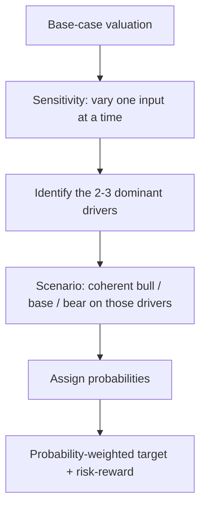

# Scenario Analysis, Sensitivity and Probability-Weighted Targets

## The Problem / Why this matters
A single-point target price implies a precision no forecast possesses. Every valuation rests on assumptions that could reasonably be otherwise, and a client's real question is not "what is it worth?" but "what do I make if I'm right, what do I lose if I'm wrong, and how likely is each?" Presenting a range with explicit drivers, rather than one number, is what distinguishes a senior analyst's output from a junior's.

## Core Idea
Test the valuation against the assumptions that actually move it. **Sensitivity analysis** varies one input at a time to find which matter; **scenario analysis** varies a coherent set of inputs together to describe genuinely different futures; **probability weighting** combines those into an expected value and, more usefully, into an explicit risk-reward.

## Why it works this way
Not all assumptions matter equally. In most DCFs, a handful of inputs — revenue growth, terminal margin, WACC, terminal growth — dominate the output, while a dozen others barely move it. Finding which few dominate tells you where to concentrate your research effort, and tells the client which specific things to watch.

## Full technical content

### Sensitivity analysis — finding what matters

Vary one input, hold everything else constant, record the change in value. The standard presentation is a **two-way data table** — the classic being WACC against terminal growth rate in a DCF:

| Value per share | g = 3.0% | g = 3.5% | g = 4.0% | g = 4.5% |
|---|---|---|---|---|
| **WACC 10.5%** | 892 | 968 | 1,062 | 1,182 |
| **WACC 11.0%** | 812 | 874 | 949 | 1,042 |
| **WACC 11.5%** | 743 | 794 | 855 | 929 |
| **WACC 12.0%** | 683 | 726 | 776 | 836 |

This table is doing real analytical work: it shows immediately that a 150bp WACC range and a 150bp terminal-growth range together span roughly ₹683 to ₹1,182 — a 73% spread on inputs that are all individually defensible. That is an honest statement about the precision of a DCF, and presenting it prevents the false confidence a single number creates.

**Which inputs to test** (in typical order of impact):
1. Revenue growth rate (near-term and terminal)
2. Terminal/steady-state EBIT margin
3. WACC (via cost of equity, beta, or equity risk premium)
4. Terminal growth rate
5. Capex and working-capital intensity
6. Tax rate

**The elasticity view:** express sensitivity as "a 100bp change in terminal margin moves value by 9%" — more useful to a client than a raw table, because it directly tells them how much a given piece of news matters.

### Scenario analysis — coherent alternative futures

Sensitivity's weakness is that it varies inputs independently, which is often unrealistic — in a genuine downturn, volume growth, margin and multiple all deteriorate *together*. Scenario analysis fixes this by defining internally consistent states of the world.

**Constructing scenarios properly:**

| | Bear | Base | Bull |
|---|---|---|---|
| **Narrative** | Demand slows, competitive pricing | Guidance broadly met | Capacity ramps, mix improves |
| Revenue CAGR (3yr) | 4% | 9% | 14% |
| Terminal EBIT margin | 13% | 16% | 18.5% |
| Exit multiple / WACC | 11.5% WACC | 11.0% | 10.75% |
| **Value per share** | **620** | **950** | **1,290** |
| Probability | 25% | 55% | 20% |

Three disciplines make this genuinely useful rather than decorative:

1. **Each scenario must have a narrative**, not just different numbers. "Bear" should describe a specific, plausible world — not simply "base minus 20%."
2. **Assumptions must move coherently.** A bear case with lower volumes but *unchanged* margins is usually incoherent, because operating leverage works in both directions.
3. **The multiple should move too.** In a genuine bear case the market applies a lower multiple to lower earnings — the double effect is precisely why drawdowns exceed earnings declines. A scenario analysis that flexes earnings but holds the multiple constant systematically understates downside.

### Probability weighting and the expected value

**Expected value = Σ (probability × scenario value)**

Using the table above: (0.25 × 620) + (0.55 × 950) + (0.20 × 1,290) = 155 + 522.5 + 258 = **₹935.5**

Note that the probability-weighted value (₹935) sits below the base case (₹950) — because the bear case is closer to base than the bull case is, and carries higher probability. That asymmetry is itself the finding, and it is invisible without doing this arithmetic.

**Where probabilities come from:** they are judgements and should be stated as such. Anchor them to something — historical frequency of similar outcomes, the implied probability in options markets, or the dispersion of consensus estimates. State them explicitly so a client who disagrees can substitute their own and recompute.

### Risk-reward — usually the most useful output

More decision-relevant than the expected value is the **risk-reward ratio**:

- Upside to bull = (1,290 − 800) ÷ 800 = **+61%** (assuming current price ₹800)
- Downside to bear = (620 − 800) ÷ 800 = **−22.5%**
- **Risk-reward ≈ 2.7 : 1**

A common professional convention is that a Buy requires a risk-reward of at least roughly 2:1 or 3:1 — a threshold that forces discipline, because it means a stock with 20% upside and 20% downside is not a Buy regardless of how attractive the base case narrative sounds. It also explains why a recommendation can change without the base case changing at all: if the stock rallies to ₹1,100, the base case may be unchanged but the risk-reward has collapsed to roughly 0.9:1, and the correct rating is now Hold or Sell.

### Presenting it in a note

The professional format states: base-case target and its key assumptions; the bull and bear values with their one-line narratives; the resulting risk-reward; and the **two or three variables** the whole thesis actually hinges on, each with its sensitivity quantified. That last element is what a portfolio manager actually uses — it tells them what to monitor.

## Common mistakes
- Publishing a **single target price** with no range, implying false precision.
- Building scenarios by mechanically applying ±20% rather than from coherent narratives.
- Flexing earnings across scenarios while holding the **multiple constant**, understating true downside.
- Assigning probabilities without stating them, or assigning them to make the expected value support a predetermined recommendation.
- Running sensitivity on inputs that barely move value while ignoring the dominant ones.
- Confusing sensitivity (one input at a time) with scenario analysis (coherent joint moves) and presenting one as the other.

## Interview angle
"How confident are you in your target price?" The strong answer never claims precision: explain that the base case is ₹950 but the DCF spans roughly ₹680–1,180 across a defensible WACC and terminal-growth range; that the thesis hinges primarily on terminal margin and volume growth, where a 100bp margin change moves value ~9%; that the bear/bull scenarios give ₹620/₹1,290 for specific narrative reasons; and that at the current price the risk-reward is 2.7:1, which is what actually supports the Buy. Showing you know *which* assumptions carry the valuation is the point of the question.
