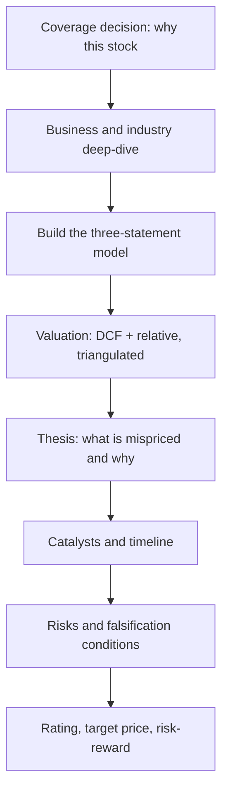

# Initiating Coverage — The Full Initiation Note

## The Problem / Why this matters
An initiation note is the single largest deliverable in a sell-side analyst's year — typically 40–100 pages, establishing a company as part of your covered universe and, more importantly, establishing *you* as the analyst clients call about that stock. Unlike a results update, it must build the entire investment case from zero: the business, the industry, the model, the valuation, the thesis, and the risks. Being asked "how would you initiate on a company you've never covered?" is a standard senior interview question precisely because it tests whether a candidate can structure a complete analytical project rather than react to a print.

## Core Idea
An initiation is a **complete, self-contained investment case** that a reader with no prior knowledge of the company can follow from business model to recommendation. Its distinguishing feature versus every other note type is that it must justify the *coverage decision* itself — why this stock is worth a client's attention at all.

## Why it works this way
Clients allocate scarce attention. An initiation competes against every other name in a portfolio manager's universe, so it must answer not just "is it cheap?" but "why should I care about this company, and what do you know that the market doesn't?" That is why initiations lead with a differentiated thesis rather than a company description — the description supports the thesis, not the reverse.

## Full technical content

### The standard structure of an initiation note

**1. Front page / summary (the most-read page by far)**
- Rating, target price, current price, implied upside
- A three-to-five-line **investment summary** stating the thesis in plain language
- Key financial table: revenue, EBITDA, EBITDA margin, PAT, EPS, growth, and valuation multiples for the last two actuals and next two-to-three forecast years
- The two or three bullet points that carry the entire argument

Most institutional readers read only this page. If the thesis is not clear and differentiated here, the remaining 60 pages will not be read.

**2. Investment thesis (3–5 pages)**
The core argument, typically structured as three or four distinct pillars, each with evidence. A strong thesis is:
- **Differentiated** — states explicitly where you differ from consensus and by how much on EPS
- **Specific** — names the driver, not a generality ("capacity utilisation rises from 68% to 84% as the new line ramps," not "operational improvements")
- **Falsifiable** — you can state what would prove it wrong

**3. Company and business model (5–10 pages)**
What it does, how it earns, segment-wise revenue and margin split, geographic mix, customer concentration, manufacturing/delivery footprint, and its position in the value chain. Include the history that matters — past capital allocation, prior cycles survived, promoter background.

**4. Industry analysis (8–15 pages)**
Market size and growth, structure and concentration, competitive dynamics, regulation, and the sector's own economics (drawing on the sector-framework material). Where does industry profit pool sit, and is it shifting? A frequent weakness in junior initiations is treating this as a data dump rather than answering "what does this industry structure mean for *this* company's returns?"

**5. Competitive positioning (3–6 pages)**
Market share and its trend, the specific source of any moat (cost, brand, distribution, switching costs, regulatory), and evidence for it — sustained above-peer RoCE and margins are the empirical test of a claimed moat.

**6. Financial analysis and forecast (8–15 pages)**
Historical performance decomposed (volume/price, mix, margin bridge), then the forecast with **every material driver stated explicitly**. The reader must be able to see and disagree with your assumptions. Include RoCE/RoE decomposition and working-capital analysis.

**7. Valuation (4–8 pages)**
DCF with full assumptions disclosed, relative valuation versus domestic and global peers, a triangulated fair-value range, and the sensitivity/scenario tables. State clearly which method you weight most and why.

**8. Risks (2–4 pages)**
Specific and quantified, not boilerplate. "A 5% adverse move in the rupee reduces our FY26 EPS by 4%" beats "currency risk." Include the governance assessment.

**9. Appendices** — financial statements in full, management profiles, shareholding pattern, glossary.

### The workflow — roughly 4–8 weeks

| Phase | Work |
|---|---|
| **1. Scoping** | Read 3–5 years of annual reports, all recent concall transcripts, existing broker notes, industry reports. Build the question list. |
| **2. Primary work** | Management meeting, plant/store visits, channel checks with distributors and customers, competitor and supplier conversations, expert calls |
| **3. Modelling** | Build the three-statement model from historicals; construct the driver-based forecast |
| **4. Valuation** | DCF, comps, scenarios, sensitivities |
| **5. Thesis formation** | Reconcile the work into a differentiated view; test it against the bear case |
| **6. Writing and review** | Draft, internal review, compliance and legal review, publication |

**The management meeting** deserves specific attention: it is not for extracting guidance (which is public) but for understanding how management thinks about capital allocation, competition and risk — the qualitative inputs behind the governance assessment. Prepare specific questions from the model's uncertainties; generic questions get generic answers.

### What makes an initiation good rather than merely complete

- It has a **view**, not just information. A comprehensive, well-researched note with no differentiated conclusion has no value to a client.
- It states **where consensus is wrong** and quantifies the gap.
- It identifies **catalysts with timing** — a mispricing with no mechanism for correction is not actionable.
- It is **honest about the bear case**, presenting it strongly enough that a reader who disagrees still respects the work.
- It provides **monitorables** — the specific two or three data points a client should watch to know whether the thesis is tracking.

### Initiating with a Sell or Hold

A common misconception is that initiations are always Buys. Initiating with a Sell is the highest-conviction, highest-risk act in sell-side research — it invites management hostility and loses corporate access — but a well-argued Sell initiation builds enormous credibility with the buy side, who are structurally short of genuine negative research. Initiating with a Hold is legitimate when the work concludes the stock is fairly valued, though it must still contain a view: what would make it a Buy, and at what price.

## Common mistakes
- **Description without a thesis** — 60 pages that tell the reader what the company does but not what to do about it.
- Burying the differentiated point on page 30 instead of the front page.
- Industry sections that are data dumps disconnected from the company's returns.
- Forecast assumptions that are not visible, so the reader cannot disagree with them.
- **Boilerplate risk sections** that mention "competition" and "regulation" without quantifying anything.
- No catalyst, so the thesis has no timeline.
- Anchoring the target price to the current price rather than to the analysis.

## Interview angle
"How would you initiate coverage on a company you don't know?" Structure the answer as the workflow: scoping (annual reports, transcripts, existing research, building a question list) → primary research (management, channel checks, competitors) → three-statement model with explicit drivers → valuation via DCF and comps, triangulated with scenarios → thesis formation stating where you differ from consensus and why → catalysts and risks → rating with risk-reward. Then add the point that distinguishes a senior answer: the note's job is to state a differentiated, falsifiable view with monitorables — not to be comprehensive.
