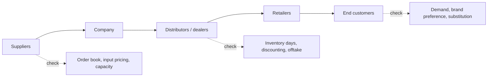

# Channel Checks and Primary Research for Equity Analysts

## The Problem / Why this matters
Every analyst covering a stock reads the same annual report, hears the same concall, and sees the same consensus. Public information is, by definition, already in the price. The one reliable source of **informational edge** in equity research is primary work — talking to distributors, customers, suppliers, former employees and industry experts to learn something before it appears in a filing. It is also the area where compliance risk is highest, which is why the methodology and its boundaries must both be understood precisely.

## Core Idea
A **channel check** is structured primary research along a company's value chain — upstream (suppliers), midstream (distributors, dealers, retailers) and downstream (customers) — designed to verify or challenge what management has said and to detect changes before they appear in reported numbers.

## Why it works this way
Reported financials are a lagging, quarterly, aggregated summary. The underlying business generates signals continuously and locally: a distributor's inventory building, a dealer offering unusual discounts, a supplier's order book thinning. These are observable weeks or months before they show up in a P&L — and they are observable to anyone willing to do the work.

## Full technical content

### Who to talk to, and what each reveals

| Source | What they know | Typical question |
|---|---|---|
| **Distributors / dealers** | Primary vs secondary sales, inventory, scheme intensity | "How many days of stock are you carrying versus normal?" |
| **Retailers** | Consumer offtake, shelf movement, competitor activity | "Which brand is moving fastest in this category now?" |
| **Suppliers** | Order volumes, payment behaviour, capacity plans | "Have order volumes changed in the last two months?" |
| **Customers (B2B)** | Vendor share, pricing, satisfaction, switching intent | "Has your allocation to this vendor changed?" |
| **Former employees** | Process, culture, historic issues | Structural and historical, never current confidential data |
| **Industry experts / consultants** | Technology shifts, regulation, structural change | Context and framing |

### The discipline that makes checks reliable

**1. Sample properly.** Three distributors in one city is an anecdote. Checks should span geography (metro/tier-2/rural), channel type (modern trade/general trade/e-commerce), and size of counterparty. A finding that holds across a diverse sample is a signal; one that appears in a single location is local noise.

**2. Ask about behaviour, not opinion.** "How many days of inventory are you holding?" produces a fact. "Do you think the company is doing well?" produces a pleasantry. This is the same stated-versus-revealed principle that governs consumer research.

**3. Establish a baseline.** A datapoint without a comparison is uninterpretable. Always anchor: "versus three months ago," "versus this time last year," "versus the competing brand."

**4. Check consistency across the chain.** If the company reports strong primary sales but distributors report inventory building and retailers report flat offtake, you have detected channel stuffing — a finding no single source could have given you.

**5. Track the same sources over time.** A panel of the same distributors contacted each quarter produces far more reliable trend data than a fresh sample each time, because it removes sample-composition change from the signal.

**6. Triangulate against hard data.** Where available, cross-check qualitative findings against monthly volume disclosures, GST/e-way bill data, import-export data, satellite/footfall data, app-download rankings, or job postings.

### Interpreting what you hear

Channel participants have their own incentives, and a professional analyst adjusts for them:
- **Distributors** may understate stock to protect their relationship with the company, or overstate pressure to justify seeking better terms.
- **Competitors** will characterise the subject company unfavourably.
- **Former employees** may carry grievance or nostalgia.
- **Management-arranged** channel visits are a curated sample by construction — useful, but never treat them as an independent check.

The correction is not to distrust everything but to weight sources by incentive and to require corroboration across independent parties before acting on a finding.

### The compliance boundary — this matters more than the technique

Primary research is legitimate and central to the profession. It becomes illegal when it involves **unpublished price-sensitive information (UPSI)** obtained from someone with a duty of confidentiality.

**The bright lines:**
- Never seek or accept **pre-release financial results, guidance, or specific order wins** from anyone inside the company or its counterparties.
- The **mosaic theory** is the governing principle: assembling many pieces of individually non-material public and non-confidential information into a material conclusion is legitimate research. Receiving one piece of material non-public information is not, regardless of how it was obtained.
- **Expert networks** must be used through compliance-approved channels, with the expert confirming they are not sharing confidential employer information, and typically with call chaperoning or recording per firm policy.
- Never speak to a **current employee of a company you cover** about that company's current performance outside official investor-relations channels.
- If a source begins to disclose something material and non-public, **stop the conversation** and report it to compliance. The obligation is affirmative, not passive.

For a SEBI-registered Research Analyst in India, this sits alongside the disclosure obligations covered elsewhere: holdings, conflicts, and the firm's relationship with the covered company must be disclosed in the note itself.

### Documenting and using the work

Record for each check: date, source type (never the individual's name in the published note), geography, the specific questions asked, and the answers. In the published research, findings appear as *"our checks across 14 distributors in five states indicate inventory of 25–30 days versus a normal 18–20"* — specific about method and scale, anonymous about individuals, and clearly labelled as the analyst's own primary work rather than company-provided data.

This labelling matters commercially as well as ethically: primary work is the part of a note a client cannot get elsewhere, and it should be visibly identified as such.

## Common mistakes
- Generalising from a **tiny or geographically concentrated sample**.
- Asking opinion questions and receiving polite, uninformative answers.
- Taking a **management-arranged** channel visit as an independent check.
- Failing to establish a baseline, so a datapoint cannot be interpreted.
- Not adjusting for the **incentive** of the person speaking.
- Continuing a conversation after a source begins disclosing material non-public information.
- Presenting channel findings without disclosing the method and sample size, which makes them unverifiable and therefore less credible.

## Interview angle
"How would you check whether a consumer company's reported growth is real?" A strong answer moves down the chain: compare **primary sales** (company to distributor, which is what gets reported) against **secondary sales** (distributor to retailer) and retail offtake; check distributor inventory days versus normal; ask about scheme/discount intensity, since growth bought with promotions is different from growth from demand; sample across geographies and channel types; and corroborate against hard data such as GST/e-way-bill volumes or retail-audit data. Then close on the compliance frame — mosaic theory, and never soliciting UPSI.
