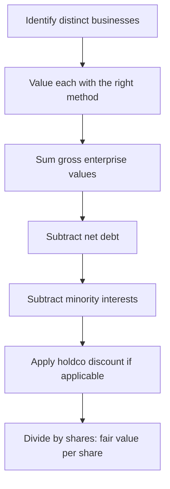

# Sum-of-the-Parts and Holding-Company Valuation

## The Problem / Why this matters
A single multiple applied to a conglomerate's consolidated earnings is almost always wrong. A company running a high-growth digital business, a mature manufacturing business and a stake in a listed subsidiary has three different sets of economics that the market will never value at one multiple. Getting this right matters enormously in Indian markets specifically, where conglomerate and holding-company structures are common and where holding-company discounts of 30–70% are routine and frequently misunderstood.

## Core Idea
**Sum-of-the-parts (SOTP)** values each business separately using the method appropriate to *that* business, then aggregates and adjusts for net debt, minority interests and any holding-company discount. The output is a fair value that a single blended multiple cannot produce.

## Why it works this way
Multiples encode growth, risk and capital intensity. Combining a 25% growth business and a 4% growth business into one earnings number and applying an average multiple systematically misvalues both — it understates the growth business and overstates the mature one. Because the market prices the parts separately when it can observe them, the analyst must too.



## Full technical content

### When to use SOTP

- **Conglomerates** with genuinely unrelated segments (different growth, margins, capital intensity, risk).
- **Holding companies** whose main assets are stakes in other listed or unlisted companies.
- Companies with a **large, separately-valuable asset** — surplus land, a treasury portfolio, a stake in an associate.
- Businesses containing a **loss-making but valuable** segment (a scaling digital arm) that drags consolidated earnings and makes P/E meaningless.
- Ahead of an anticipated **demerger**, where the market will shortly value the parts separately anyway.

### Step 1 — Segment properly

Use the company's reported segments as a starting point, but interrogate them. Two tests: do the segments have genuinely different economics, and is there enough disclosure (segment revenue, EBIT, and ideally capital employed) to value them separately? Where disclosure is inadequate, you must estimate — and disclose that you have.

### Step 2 — Choose the right method per segment

| Segment type | Appropriate method | Reasoning |
|---|---|---|
| Mature manufacturing | EV/EBITDA on peer multiple | Capital-intensive, depreciation-heavy |
| High-growth consumer | EV/Sales or DCF | Margins not yet at steady state |
| Financial services arm | P/B on RoE | Balance-sheet business |
| Listed subsidiary stake | **Market value** of the stake | Directly observable |
| Unlisted associate | Peer multiple or last transaction price | No market price |
| Surplus land / real estate | Independent valuation or circle rate | Non-operating asset |
| Treasury / investment book | Marked-to-market value | Directly observable |
| Loss-making scaling business | EV/Sales, or DCF, or last funding round | Earnings are meaningless |

The critical discipline: **value listed stakes at their observable market price**, not at your own estimate of their fair value. Mixing "what I think the subsidiary is worth" into a SOTP double-counts your view and makes the output uninterpretable. If you disagree with the subsidiary's market price, say so separately.

### Step 3 — Aggregate and adjust

```
Σ Segment enterprise values
+ Value of listed stakes (at market)
+ Surplus non-operating assets (land, treasury)
− Net debt (consolidated, at parent level)
− Minority interest (value of what you don't own in consolidated subsidiaries)
− Present value of unallocated corporate costs
= Equity value
÷ Diluted shares outstanding
= SOTP fair value per share
```

**Unallocated corporate cost** is frequently forgotten and materially matters: a conglomerate's head-office cost is real, recurring, and belongs nowhere in the segments. Capitalise it (divide by an appropriate rate, or run it as a perpetuity) and subtract it.

**Minority interest** must be handled consistently: if you have valued a subsidiary's full enterprise value but own only 60% of it, subtract the 40% you do not own.

### The holding-company discount

Holding companies — whose principal assets are stakes in other companies — routinely trade well below the market value of those stakes. Discounts of **30–70%** are common in India and persist for structural reasons:

1. **Tax on realisation** — monetising a stake triggers capital gains tax, so the after-tax value to shareholders is genuinely below the gross market value.
2. **No control over cash flows** — the holdco's shareholders cannot compel the operating companies to distribute cash.
3. **Double taxation of dividends** flowing through the structure in some cases.
4. **Governance and capital-allocation risk** — the holdco may reinvest realisations rather than distribute them, and minority shareholders cannot force otherwise.
5. **Low liquidity** in the holdco stock itself.
6. **No catalyst** — absent a demerger, buyback, or distribution policy, there is no mechanism by which the gap closes.

**How to handle the discount analytically:** do not apply a round number by convention. Estimate the company's **own historical discount range** over several years and use that as the base, then adjust for anything that has changed — a newly announced distribution policy, a demerger proposal, an improvement in governance, or a change in liquidity. A note that says "we apply a 45% holdco discount, versus this company's five-year average of 52%, reflecting the newly announced dividend policy" is doing analysis; one that says "we apply a standard 50% discount" is not.

**The trap:** a holdco trading at a wide discount looks perpetually cheap, and inexperienced analysts repeatedly recommend it on that basis. The discount is only an opportunity if there is a specific, identifiable catalyst for it to narrow. Without one, the discount is a permanent feature and the stock is fairly valued *with* it.

### Worked illustration

A conglomerate with three parts:

| Component | Basis | Value (₹ cr) |
|---|---|---|
| Manufacturing EBITDA ₹800cr | 9× EV/EBITDA | 7,200 |
| Consumer EBITDA ₹300cr | 22× EV/EBITDA | 6,600 |
| 55% stake in listed subsidiary (subsidiary m-cap ₹12,000cr) | Market value × 55% | 6,600 |
| Surplus land | Independent valuation | 900 |
| **Gross value** | | **21,300** |
| Less: net debt | | (3,400) |
| Less: capitalised corporate cost (₹120cr ÷ 11%) | | (1,090) |
| **Equity value before discount** | | **16,810** |
| Less: holdco discount @ 35% applied to the stake component only | | (2,310) |
| **SOTP equity value** | | **14,500** |
| Shares outstanding | 50 cr | |
| **Fair value per share** | | **₹290** |

Note the judgement embedded here: the discount is applied **only to the listed-stake component**, not to the wholly-owned operating businesses — because the discount's rationale (tax on realisation, no control over cash flows) applies to holdings in other companies, not to businesses the company operates directly. Applying a blanket discount to the entire SOTP is a common and material error.

## Common mistakes
- Applying **one multiple** to a genuinely diversified consolidated business.
- Valuing a listed subsidiary stake at your own fair value rather than **market value**, double-counting your view.
- Forgetting **unallocated corporate costs**, overstating value by a material margin.
- Mishandling **minority interest**, valuing 100% of a subsidiary the parent owns 60% of.
- Applying a **conventional round-number holdco discount** rather than deriving it from the company's own history and current catalysts.
- Applying the holdco discount to **wholly-owned operating businesses** as well as to stakes.
- Recommending a holdco purely because the discount is wide, with **no catalyst** for it to narrow.
- Double-counting: including a subsidiary's earnings in consolidated EBITDA *and* adding the stake's market value separately.

## Interview angle
"How would you value a conglomerate?" Structure it: identify genuinely distinct businesses; value each with the method matching its economics (EV/EBITDA for mature manufacturing, EV/Sales or DCF for a scaling business, P/B for a financial arm, market value for listed stakes); sum; subtract net debt, minority interest and capitalised unallocated corporate costs; apply a holding-company discount **only where warranted and derived from the company's own historical range**; divide by diluted shares. Then add the senior point: a wide holdco discount is only an opportunity with a specific catalyst — otherwise it is a permanent structural feature, and the stock is fairly priced with it.
