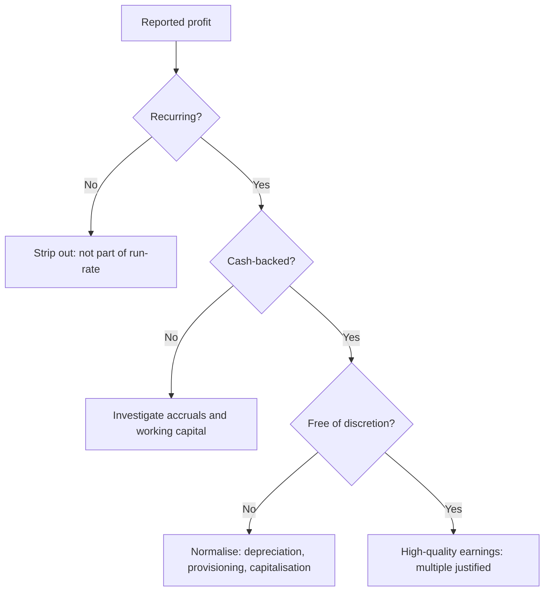

# Quality of Earnings and Adjusted Metrics

## The Problem / Why this matters
Companies increasingly report two sets of numbers: statutory results and "adjusted", "normalised", "underlying" or "pro-forma" figures excluding items management considers non-representative. Sometimes those adjustments genuinely clarify the run-rate; sometimes they systematically remove every bad item and retain every good one. An analyst who accepts adjusted numbers uncritically is being handed management's preferred narrative; one who rejects them entirely misses real economic signal. The skill is knowing which adjustments to accept.

## Core Idea
**Quality of earnings** asks whether reported profit reflects **repeatable, cash-backed operating performance**. Assess it by testing three properties: is the profit **recurring**, is it **cash-converting**, and is it **free of accounting discretion**?

## Why it works this way
Valuation multiplies an earnings figure by a multiple. That multiple implicitly assumes the earnings persist. If a substantial part of reported profit will not recur — a one-time land sale, an unusually low tax rate, a favourable raw-material window — then applying a persistence-assuming multiple to it overvalues the company by exactly that amount, compounded.

## Full technical content

### Test 1 — Is it recurring?

Identify and separate items that will not repeat:

**Genuinely non-recurring (strip out for run-rate purposes):**
- Asset or land sale gains
- One-time litigation settlements (received or paid)
- Restructuring charges from a discrete, completed programme
- Insurance claim receipts
- Gain or loss on sale of a business
- Impairment of a specific asset

**Frequently mislabelled as non-recurring (usually should NOT be stripped):**
- **"Restructuring charges" that appear every single year** — if a company restructures annually, restructuring is an operating cost of that business, not an exception.
- **Share-based compensation** — a real economic cost of employing people, and excluding it (common in "adjusted EBITDA") systematically overstates profitability. It is non-cash but it is not non-economic; it dilutes shareholders.
- **Recurring impairments** — a company impairing goodwill every other year has a capital-allocation problem, not a series of unrelated exceptions.
- **Forex losses** in a company with structural foreign-currency exposure — that exposure is part of the business model.
- **"One-time" marketing spend** for a launch, in a company that launches continuously.

The diagnostic test: **plot "exceptional items" over 5–7 years**. If exceptionals appear in most years, they are not exceptional, and the adjusted figure is systematically flattering.

### Test 2 — Is it cash-backed?

The accrual-based checks (developed in the working-capital and forensic-accounting material) applied to earnings quality:

- **Cumulative CFO vs cumulative PAT** over 3–5 years — the single most robust test.
- **Cash conversion** = CFO ÷ EBITDA — persistently low without a structural reason is a warning.
- **Accruals ratio** = (Net income − CFO) ÷ average total assets — high accruals mean profit is largely non-cash and, empirically, mean-reverts.
- Check whether **CFO itself has been flattered** by stretching payables or by classifying items favourably between operating, investing and financing.

### Test 3 — Is it free of accounting discretion?

Compare against peers and against the company's own history:
- **Depreciation rate / useful-life assumptions** — a change that boosts profit
- **Capitalisation policy** for R&D, software, or interest
- **Provisioning levels** for doubtful debts, inventory, warranties
- **Revenue recognition timing**, especially percentage-of-completion
- **Tax rate** — an unusually low effective rate needs explanation and is usually temporary

### Building your own adjusted number

The professional approach is to construct an **analyst-adjusted earnings figure** rather than accepting either the statutory or the company-adjusted number:

1. Start with statutory PAT.
2. **Add back** genuinely non-recurring charges.
3. **Strip out** genuinely non-recurring gains.
4. **Do not strip** share-based compensation, recurring restructuring, or structural forex.
5. **Normalise the tax rate** to the sustainable rate.
6. **Normalise for accounting policy** differences versus peers where material (e.g. adjust for a peer-divergent capitalisation policy).
7. Disclose every adjustment made, so a reader can reverse any they disagree with.

That final point matters: an analyst's adjustments are also judgements. Presenting them transparently — a visible bridge from statutory to adjusted — is what makes the number credible rather than merely another narrative.

### The EBITDA warning

**Adjusted EBITDA** is the most manipulated metric in public markets. It excludes interest (a real cost of the capital structure), tax (a real cash outflow), depreciation (the consumption of assets that must eventually be replaced), *and* whatever else management designates as adjustable. For a capital-intensive business, EBITDA can look robust while the company never generates a rupee of free cash flow, because maintenance capex consumes it all.

The corrective: always pair EBITDA with **free cash flow** and with **EBITDA less maintenance capex**, and be especially sceptical where "adjusted EBITDA" differs materially from statutory EBITDA.

### Quality-of-earnings scoring in practice

A practical summary an analyst can include in a note:

| Dimension | Strong | Weak |
|---|---|---|
| Exceptionals frequency | Rare, genuinely discrete | Present most years |
| CFO/PAT (3-yr cumulative) | ~1.0 or above | Persistently below 0.7 |
| Cash conversion (CFO/EBITDA) | Above peer median | Below, with no structural reason |
| Tax rate | At or near statutory | Persistently low, unexplained |
| Capitalisation vs peers | In line | More aggressive |
| Company-adjusted vs statutory gap | Small, well-explained | Large, one-directional |

## Common mistakes
- Accepting **company-adjusted** figures uncritically because they are the ones in the press release headline.
- Excluding **share-based compensation** from earnings — it is a genuine cost to shareholders.
- Treating a recurring "exceptional" as exceptional because that is what it is labelled.
- Valuing on **EBITDA alone** for a capital-intensive business without checking free cash flow.
- Extrapolating a **low tax rate** that resulted from a one-off credit.
- Making adjustments without disclosing them, so the reader cannot evaluate the judgement.
- Assuming all adjustments are illegitimate — some genuinely do clarify the underlying run-rate, and rejecting them wholesale is as unanalytical as accepting them wholesale.

## Interview angle
"A company reports adjusted EPS well above statutory EPS. How do you respond?" Work through it: identify what the adjustments are; test each for whether it is genuinely non-recurring (checking whether similar items appear in prior years); flag adjustments that should not be made — share-based compensation, recurring restructuring, structural forex; check whether the earnings are cash-backed via cumulative CFO versus PAT; normalise the tax rate; then build your own adjusted figure with a transparent bridge from statutory. Close on the principle: the multiple you apply assumes persistence, so the earnings you apply it to must be the persistent ones.
