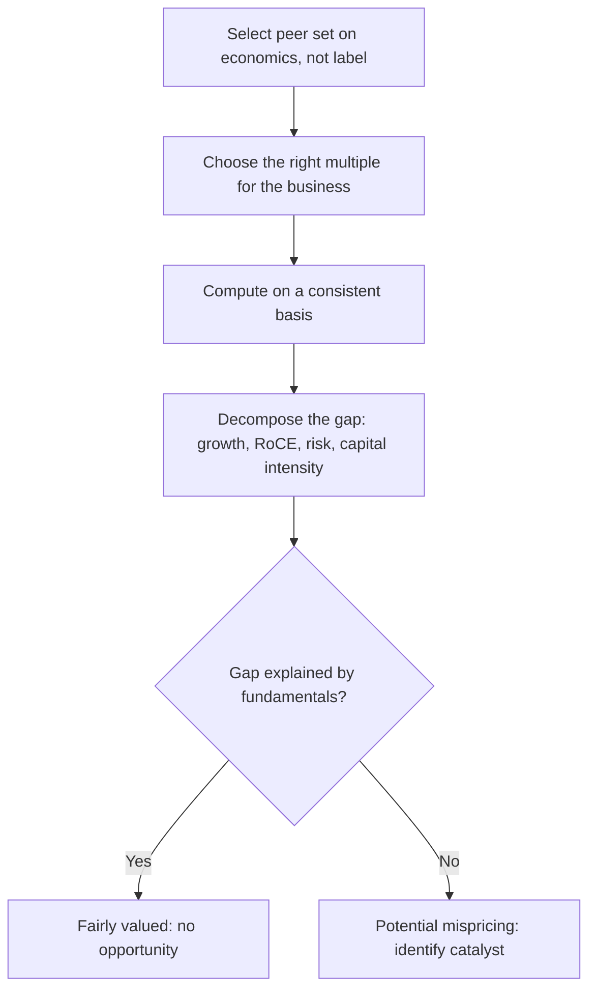

# Relative Valuation and Peer-Set Construction

## The Problem / Why this matters
"It trades at 18x versus the sector at 24x, so it's cheap" is the most common sentence in bad equity research. A multiple is meaningless without a defensible peer set and without understanding *why* the gap exists. Most apparent valuation gaps are not mispricings at all — they are the market correctly pricing differences in growth, returns, risk or capital intensity. The analytical work is separating the gaps that are justified from the ones that are not.

## Core Idea
Relative valuation compares a company to peers on a standardised multiple. Its validity rests entirely on two things: a **genuinely comparable peer set**, and an explicit account of **what drives any multiple differential** between the company and that set.

## Why it works this way
A multiple is a compressed summary of a DCF. P/E embeds growth, risk and payout; EV/EBITDA embeds growth, capital intensity and risk. Two companies deserve the same multiple only if those underlying variables match. When they don't, the multiple gap is *information*, not opportunity — and the analyst's job is to decompose it.

## Full technical content

### Constructing a defensible peer set

Peers should share **economics**, not merely an industry label. Screen on:

| Criterion | Why it matters |
|---|---|
| Business model | A branded pharma company is not comparable to an API manufacturer |
| Growth profile | A 20% grower and a 5% grower deserve different multiples |
| Margin and RoCE | Return profile is the single biggest multiple driver |
| Capital intensity | Determines how much growth costs |
| Scale | Larger companies typically command a liquidity/stability premium |
| Geography and regulation | Different risk premia and tax regimes |
| Customer concentration / cyclicality | Risk affects the multiple directly |

**Include global peers when the domestic set is thin**, but adjust for country risk premium, tax rate differences, and accounting-standard differences (IND-AS vs IFRS vs US GAAP). A common error is comparing an Indian IT company's P/E directly to a US-listed peer without noting the different growth, currency and tax context.

**Peer-set size:** 5–10 is usually right. Too few and one outlier dominates; too many and you have diluted the set with companies that aren't truly comparable, which pulls the "sector average" toward meaninglessness.

**Always show median alongside mean** — a single extreme multiple (often a company with near-zero earnings producing a huge P/E) distorts the mean severely.

### Choosing the right multiple

| Multiple | Use when | Avoid when |
|---|---|---|
| **P/E** | Stable, profitable, comparable capital structures | Cyclicals at extremes; loss-makers; different leverage |
| **EV/EBITDA** | Different leverage; capital-intensive; cyclicals | Very different capex intensity within the set |
| **EV/EBIT** | Depreciation policies differ materially | — |
| **EV/Sales** | Loss-making or early-stage; margins not normalised | Mature businesses where margins are comparable |
| **P/B** | Banks, financials, asset-heavy businesses | Asset-light service businesses |
| **P/B vs RoE** | Financials — the correct paired view | — |
| **EV/Capacity** (per tonne, per MW, per room) | Commodity/infrastructure with homogeneous assets | Differentiated products |
| **PEG** | Comparing across different growth rates | Low-growth or negative-growth companies |

**Consistency discipline:** an equity multiple (P/E, P/B) uses an equity numerator and equity denominator; an enterprise multiple (EV/EBITDA) uses enterprise value over a pre-interest metric. Mixing them — EV/PAT, or P/EBITDA — is a definitional error that produces a meaningless number.

### Computing multiples correctly

**Enterprise Value** = Market cap + Total debt − Cash and cash equivalents + Minority interest + Preference capital. Common errors: forgetting minority interest (which overstates value for companies with large partly-owned subsidiaries), and netting off cash that isn't genuinely surplus.

**Which period:** trailing (last 12 months, factual but backward-looking) or forward (next 12 months or FY+1/FY+2, more relevant but estimate-dependent). Markets price forward. **The critical discipline is comparing like with like** — a forward P/E for your company against a trailing P/E for peers is a systematic, and very common, error that makes a growing company look artificially cheap.

**Diluted share count**, including outstanding ESOPs, warrants and convertibles — not the basic count.

### Decomposing the multiple gap — the actual analysis

This is what separates real relative valuation from multiple-quoting. Suppose your company trades at 18x forward P/E versus a peer median of 24x. Work through:

1. **Growth.** Is your company's forecast EPS CAGR below the peer median? A company growing 8% versus peers at 16% *should* trade at a discount. Compute PEG for both to normalise.
2. **Returns.** Compare RoCE and RoE. Sustainably lower returns justify a lower multiple — this is the most fundamental driver of multiple differences and the most frequently ignored.
3. **Capital intensity.** Higher capex/sales means less of the earnings converts to distributable cash, justifying a lower multiple on the same earnings.
4. **Risk.** Customer concentration, cyclicality, leverage, regulatory exposure, governance quality — each justifies a discount.
5. **Cash conversion.** Lower CFO/EBITDA means lower-quality earnings, justifying a lower multiple.
6. **Free float and liquidity.** Genuinely affects the multiple, especially for smaller companies.

Only after accounting for these can you claim a residual, unexplained gap — and *that* residual is the potential opportunity.

### The historical-band cross-check

A second, independent reference: where does the multiple sit versus the **company's own history**? Compute the 5-year and 10-year average, and the percentile of the current multiple within that range. Then ask the essential question: **has anything structurally changed** to justify a permanent re-rating or de-rating? A stock at the bottom decile of its own historical band is cheap only if its fundamentals are unchanged; if growth has structurally slowed or returns have permanently fallen, the low multiple is correct and the "cheapness" is a value trap.

### Common structural traps

- **The cyclical trap** — a cyclical looks cheapest on P/E at the earnings peak and dearest at the trough. Use mid-cycle earnings or EV/EBITDA through the cycle.
- **The value trap** — persistently cheap because the business is in structural decline. The multiple is not a mistake.
- **Averaging away the outliers** — a "sector P/E" including one 200x company is not a benchmark.
- **The conglomerate error** — applying one multiple to a diversified business rather than SOTP.
- **Ignoring accounting differences** — capitalisation policies, lease treatment, and share-based-comp treatment all distort cross-company multiples.

## Common mistakes
- Building a peer set from an **industry classification code** rather than from economics.
- Quoting a sector mean without the median, letting one outlier set the benchmark.
- Comparing **forward** multiples for one company against **trailing** for peers.
- Using basic rather than **diluted** share count.
- Forgetting **minority interest** in enterprise value.
- Concluding "cheap versus peers" without decomposing growth, returns and risk.
- Treating a discount to the historical band as opportunity without asking what has structurally changed.

## Interview angle
"This stock trades at 18x versus its sector at 24x. Is it cheap?" The expected answer refuses the premise until the work is done: first, is the peer set genuinely comparable on business model, growth, returns and capital intensity? Second, decompose the gap — lower growth, lower RoCE, higher cyclicality, weaker cash conversion, governance discount, lower liquidity all *justify* a discount. Third, compare against the company's own historical band and ask whether anything has structurally changed. Only a residual gap unexplained by fundamentals is an opportunity, and even then it needs a catalyst to close.
