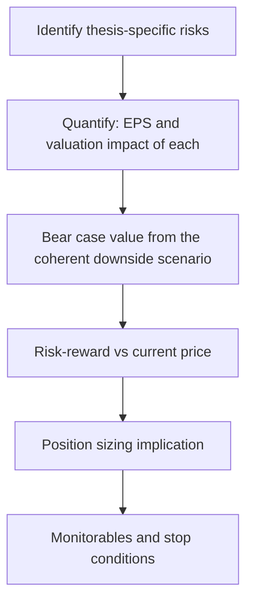

# Risk Assessment and Position Sizing for Research Analysts

## The Problem / Why this matters
A recommendation without a risk assessment is a half-finished piece of work. Clients do not act on conviction alone — a portfolio manager needs to know what can go wrong, how much they can lose, and therefore how much of the portfolio the idea deserves. An analyst who says "Buy, target ₹1,200" without quantifying downside has given the PM a number but not a decision. This is also the dimension where sell-side and buy-side analysts differ most: the buy side must size, and thinking like they do makes sell-side research far more useful.

## Core Idea
Risk work has three layers: **identify** the specific risks to *this* thesis, **quantify** their earnings and valuation impact, and translate that into **risk-reward** that supports a sizing decision. Boilerplate risk sections fail all three.

## Why it works this way
Investment outcomes are distributions, not points. The expected return of a position is meaningful only alongside its dispersion — a 20% expected return with a possible 50% drawdown is a different proposition from a 15% expected return with a possible 10% drawdown, and a portfolio manager will size them very differently.

## Full technical content

### Layer 1 — Identifying the right risks

Generic risk sections list "competition, regulation, currency." Useful risk sections identify what would specifically break **this thesis**. Start from the thesis pillars and invert each one:

If the thesis is *"margin expands from 14% to 18% as the new plant ramps and mix improves"*, the risks are: the ramp is delayed; utilisation disappoints; the mix shift doesn't happen because the premium segment slows; a competitor adds capacity simultaneously and pricing breaks.

**A taxonomy to work through systematically:**

| Category | Examples |
|---|---|
| **Business** | Demand slowdown, market-share loss, customer concentration, key-person dependence |
| **Operational** | Project delay, plant shutdown, supply-chain disruption, quality/recall |
| **Financial** | Refinancing risk, covenant breach, forex exposure, receivable default |
| **Regulatory** | Price control, licence/approval risk, tax change, environmental compliance |
| **Governance** | Related-party dealings, promoter pledge, auditor issues, minority-shareholder treatment |
| **Valuation** | Multiple de-rating independent of earnings; sector-wide re-rating reversal |
| **Thesis-specific** | Whatever your particular argument requires to be true |

### Layer 2 — Quantifying

Every material risk should carry a number. The professional format:

> *"A 200bp shortfall versus our 18% terminal EBITDA margin assumption reduces our FY27 EPS by 11% and our DCF value by 14%, taking fair value to ₹820."*

Build a **risk sensitivity table** in the note:

| Risk | Trigger | EPS impact | Value impact |
|---|---|---|---|
| Plant ramp delayed 2 quarters | Commissioning slips | −7% FY26 | −5% |
| Terminal margin 16% not 18% | Mix shift fails | −11% FY27 | −14% |
| Key customer (18% of revenue) loss | Contract not renewed | −15% | −17% |
| INR appreciates 5% | Currency move | −6% | −6% |

This is directly usable by a PM in a way that prose is not.

### Layer 3 — Risk-reward and sizing

From the scenario work: bull, base and bear values, and therefore upside/downside from the current price.

**Risk-reward = upside to bull ÷ downside to bear.**

Conventional thresholds: a Buy generally requires **at least 2:1, often 3:1**. This discipline forces a rating change when the price moves even if the fundamental view has not — a stock that rallies into the target has a deteriorating risk-reward and eventually stops being a Buy regardless of how much you like the business.

**Sizing frameworks a PM applies** (worth understanding even on the sell side):

- **Conviction-weighted** — larger positions in higher-conviction, better risk-reward ideas.
- **Volatility-adjusted** — size inversely to expected volatility so each position contributes comparable risk to the portfolio.
- **Fixed fractional risk** — risk a fixed percentage of the portfolio per idea, so position size = (portfolio risk budget) ÷ (distance to the stop/bear case). A wider bear-case gap mechanically means a smaller position.
- **Correlation-aware** — an idea highly correlated with existing holdings adds less diversification and deserves less size even at equal conviction.

The link that matters: **the wider your bear case, the smaller the position that same conviction justifies.** This is why quantifying downside is not pessimism — it directly determines how much capital the idea should receive.

### Monitorables and falsification

The most valuable closing element of a note. Specify:

- **What to watch** — the two or three data points that will confirm or break the thesis (monthly volumes, quarterly margin, the plant commissioning announcement, a specific regulatory decision).
- **What would prove you wrong** — stated in advance. An analyst who has pre-committed to a falsification condition is dramatically more credible than one who rationalises after the fact.
- **When to revisit** — the specific event or date at which the thesis gets re-tested.

### Portfolio-level risks the analyst should flag

Even a single-stock note should note where the idea sits in a portfolio context: sector concentration if the PM already owns peers, factor exposure (is this simply a leveraged bet on a commodity price or the rupee?), liquidity (days-to-exit at a reasonable share of ADV — critical for mid- and small-caps), and event risk (an upcoming binary regulatory or legal decision).

**Liquidity deserves specific mention:** a mid-cap with ₹8 crore average daily volume cannot absorb a ₹200 crore position without material impact, and a genuinely correct recommendation that cannot be implemented at size is of limited use to a large fund. Stating days-to-build and days-to-exit at, say, 20% of ADV is a professional courtesy that many notes omit.

## Common mistakes
- **Boilerplate risk sections** that would apply to any company in any sector.
- Risks listed without **quantification** — no EPS or valuation impact.
- Bear cases constructed by mechanically cutting the base case rather than from a coherent narrative, and holding the **multiple constant** while cutting earnings (which understates real downside).
- No stated **falsification condition**, so the thesis can never be wrong.
- Maintaining a Buy after the stock has rallied into the target and risk-reward has collapsed.
- Ignoring **liquidity**, recommending a position size the stock cannot absorb.
- Treating risk analysis as a compliance section at the back rather than as part of the investment case.

## Interview angle
"You're bullish on a stock. What could go wrong?" A weak answer lists generic risks. A strong answer inverts the thesis pillars specifically — for each thing that must be true for the call to work, state what happens if it isn't, and quantify the EPS and value impact. Then give the bear-case value, the resulting risk-reward from the current price, the specific monitorables that would tell you early that the thesis is breaking, and what would make you change the rating. Naming the falsification condition unprompted is what marks a senior candidate.
