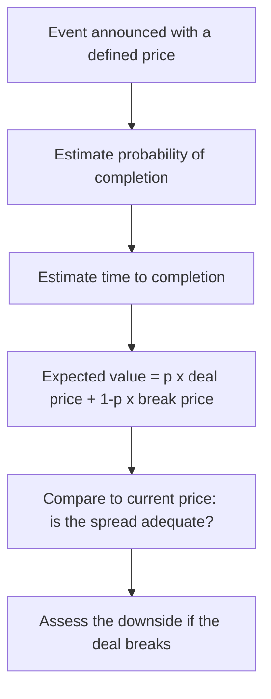

# Special Situations and Event-Driven Analysis

## The Problem / Why this matters
Most equity research values a company as an ongoing business. But a meaningful share of returns comes from **corporate events** — mergers, demergers, open offers, delistings, buybacks, rights issues, insolvency resolutions — where the value driver is not next year's earnings but the mechanics, probability and timing of a specific transaction. This requires a genuinely different analytical toolkit, and it is where an analyst who understands corporate-action mechanics precisely can add value that a pure fundamental modeller cannot.

## Core Idea
In a special situation, price is driven by **the expected value of a defined outcome** — the deal price, weighted by the probability of completion, discounted for the time to completion — rather than by an ongoing DCF. The analysis is therefore about probability, timeline, and downside if the event fails.

## Why it works this way
Once a transaction is announced with a defined price, the stock's future is largely determined by whether that transaction completes. The market prices the probability-weighted outcome, and the residual spread between the current price and the deal price compensates for completion risk and time. Analysing the situation means analysing that risk, not the company's long-term prospects.

## Full technical content

### The core arithmetic — merger arbitrage

For an announced acquisition at a fixed cash price:

**Gross spread** = (Deal price − Current price) ÷ Current price
**Annualised return** = Gross spread × (365 ÷ days to expected close)

But the honest calculation must include the break scenario:

**Expected value = p × Deal price + (1 − p) × Estimated break price**

The **break price** is typically the undisturbed price before the announcement, often adjusted downward — a failed deal frequently leaves the stock below where it started, because the failure itself signals something (a regulator's objection, due-diligence findings, or a deteriorating business).

*Worked example:* stock at ₹470, cash offer at ₹500, expected close in 5 months, pre-announcement price ₹400.
- Gross spread = 6.4%; annualised ≈ 15.3%
- If p(completion) = 85%: EV = 0.85 × 500 + 0.15 × 400 = 425 + 60 = **₹485**
- Current price ₹470 is below EV ₹485 — a positive, but the downside on a break is −15%, so risk-reward is roughly 1:5 against on the raw numbers. This spread is only attractive if you assess completion probability meaningfully above 85%.

That inversion is the entire point of the arithmetic: merger arb is a **negative-skew** strategy — many small gains, occasional large losses — so the probability estimate has to be genuinely rigorous, not a comfortable assumption.

### Assessing completion probability

| Factor | Raises probability | Lowers probability |
|---|---|---|
| **Financing** | Cash on hand, committed facility | Contingent on raising finance |
| **Regulatory** | No overlap, small share | Antitrust/CCI concerns, sectoral caps, foreign-investment approval |
| **Shareholder approval** | Acquirer already holds a large stake; board unanimous | Contested; large dissenting holders |
| **Due diligence** | Completed | Still open, or MAC clause broad |
| **Strategic logic** | Clear synergy, adjacent business | Diversification with weak rationale |
| **Acquirer's position** | Strong balance sheet, prior deal record | Stretched leverage, hostile approach |
| **Board stance** | Recommended | Hostile / rejected |

Watch also for **competing bids**, which change the calculation entirely — the downside becomes much shallower and the upside opens up.

### Open offers under the takeover framework

When an acquirer crosses the substantial-acquisition threshold, a **mandatory open offer** follows at a regulator-prescribed minimum price. The analytical work:

- Compute the **open-offer price** from the prescribed formula (highest of: negotiated price, volume-weighted average of the acquirer's own purchases over a defined lookback, and market VWAP over a defined period). This is a calculable, regulator-anchored floor.
- Estimate the **acceptance ratio** — the offer is for a fixed quantity, so if tendering exceeds it, shareholders receive only a proportion. The stock typically trades below the offer price by roughly the amount reflecting the expected acceptance ratio.
- The residual (unaccepted) shares return to the shareholder at the post-offer market price — so the blended outcome is (accepted portion × offer price) + (unaccepted portion × expected post-offer price).

### Demerger and spin-off situations

Value here comes from the market re-rating the parts separately (drawing on the SOTP material). The analysis:
- SOTP value of the parts versus the current consolidated market price.
- The **when-issued** market, if operating, as real-time price discovery of the implied split.
- Post-listing technical dynamics: forced selling by index funds that cannot hold the demerged entity, and by shareholders who wanted only the parent business — which often creates temporary, mechanical pressure unrelated to fundamentals and is a recurring source of opportunity.

### Delisting situations

Under reverse book-building, the exit price is discovered from shareholder bids and the acquirer may **accept or reject** the discovered price. The stock trading below the floor price signals genuine market scepticism about completion. The asymmetry to note: a successful delisting caps the upside at the accepted price, while a failed one returns the stock to fundamental value, which may be materially lower after the speculative bid premium unwinds.

### Insolvency and restructuring

Once a company enters insolvency proceedings, ordinary technical and fundamental frameworks largely stop applying. The critical point for equity: in the resolution waterfall, **equity holders rank last**, and in most resolved cases existing equity is heavily diluted or extinguished entirely. A stock trading at a small fraction of its pre-admission price is not necessarily cheap — the residual equity claim may genuinely be near zero, and the trading price often reflects speculation rather than any recoverable value.

### Index inclusion and exclusion events

Covered mechanically elsewhere; from an event-driven view the key points are that the flow is **predictable and dated** (index funds must trade at the effective date, concentrated in the closing window), and therefore substantially **anticipated and pre-priced** — meaning the return is usually captured before the announcement, not after.

### What makes event-driven analysis distinctive

- **Defined outcomes and timelines**, unlike open-ended fundamental theses.
- **Probability is the main variable**, not growth or margin.
- **Negative skew** in most deal situations — size accordingly.
- **Legal and regulatory documents are primary sources** — the scheme of arrangement, the offer document, the merger agreement's MAC and break-fee clauses. Reading the actual document is the work; most of the edge is there.
- **Time decay matters** — a spread that doesn't close erodes annualised returns even if the deal eventually completes.

## Common mistakes
- Quoting the **gross spread** without the probability-weighted expected value or the break-price downside.
- Assuming a deal announced is a deal completed.
- Ignoring the **acceptance ratio** in an open offer and modelling full tendering at the offer price.
- Treating a stock in insolvency as cheap because it has fallen 95% — equity ranks last.
- Not reading the actual transaction documents, where the conditions precedent and MAC clauses live.
- Sizing a merger-arb position as if it were symmetric when the payoff is sharply negative-skewed.

## Interview angle
"A company announces an all-cash acquisition of a target at ₹500. The target trades at ₹470. What do you do?" Structure: compute the gross spread and annualise it over the expected close; estimate completion probability from financing certainty, regulatory overlap, board stance and shareholder approval; estimate the break price (usually near or below the undisturbed pre-announcement price); compute the probability-weighted expected value and compare to ₹470; then assess the asymmetry — the downside on a break is typically several times the upside on completion, so the position only makes sense with high completion confidence and modest size. Mentioning that the payoff is negative-skewed is what signals genuine familiarity.
