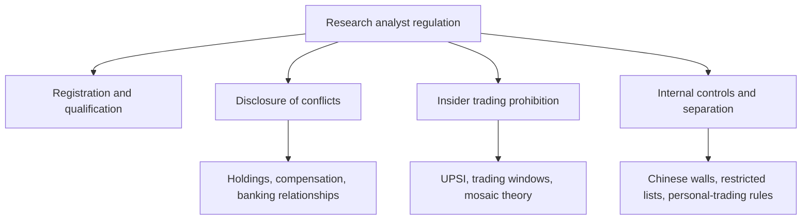

# The Regulatory Framework for Research Analysts

## The Problem / Why this matters
Equity research is a regulated activity. An analyst publishing recommendations to clients operates under a specific legal framework governing registration, disclosure, conflicts of interest, and the handling of price-sensitive information. Breaching it carries personal consequences — penalties, debarment, and in serious cases criminal liability — quite apart from the reputational damage to the firm. Interviewers ask about this because a candidate who cannot articulate the disclosure obligations is a compliance liability regardless of their analytical skill.

## Core Idea
The regulatory architecture exists to address one structural problem: research is produced by firms with **many other commercial relationships** with the companies being researched, and consumed by clients who cannot see those relationships. Regulation forces disclosure of conflicts and prohibits trading on information the market does not have.

## Why it works this way
Research recommendations move prices, so they can be used to profit at clients' expense — by front-running the recommendation, by publishing favourably to win investment-banking business, or by selectively disclosing to preferred clients first. Each of these is addressed by a specific rule, and understanding *why* each rule exists makes the rules themselves easy to remember.

## Full technical content

### Registration and qualification

In India, an individual or entity providing research recommendations to clients must be registered with SEBI as a **Research Analyst** under the Research Analyst Regulations. Requirements include prescribed **qualifications** (a relevant postgraduate degree or professional qualification), mandatory **certification** — in practice the **NISM Series-XV: Research Analyst** certification — minimum net worth, and compliance infrastructure.

The registration requirement applies to the act of making a **buy/sell/hold recommendation or target price to clients**, which is why the boundary between "research" and "general market commentary" matters, and why unregistered stock tipping on social media falls foul of the framework.

### Mandatory disclosures in a research report

Every published report must disclose:

| Disclosure | Purpose |
|---|---|
| **Analyst's own holdings** in the subject company | The analyst may benefit from the recommendation |
| **Holdings of the analyst's relatives / associates** | Indirect benefit |
| **The firm's holdings** (usually above a threshold, e.g. 1%) | Firm-level interest |
| **Investment-banking relationship** — past 12 months and anticipated | The strongest conflict: the firm may be paid by the company |
| **Compensation received** from the subject company for any service | Any commercial relationship |
| **Whether the analyst or firm acts as market maker** | Trading interest |
| **Whether the analyst served as an officer/director/employee** of the subject | Personal entanglement |
| **The rating distribution** across the firm's coverage | Reveals systemic optimism — if 95% are Buys, ratings are uninformative |
| **Definitions of rating terms** and the target-price horizon | Prevents ambiguity |
| **Whether the report was shared with the company** before publication | Should be for factual accuracy only, never for the view |

### The insider-trading prohibition

Governed in India by the **Prohibition of Insider Trading (PIT) Regulations**. The central concept is **Unpublished Price-Sensitive Information (UPSI)** — information relating to a company, not generally available, which upon becoming available would materially affect the price.

Typical UPSI: financial results before publication, dividend declarations, M&A, capital restructuring, changes in key management, and material regulatory or legal outcomes.

**Core prohibitions:** trading while in possession of UPSI; communicating UPSI to anyone except for legitimate purposes; and procuring UPSI.

**The mosaic theory** — the analyst's protection and the professional standard: assembling many pieces of individually non-material public and non-confidential information into a material conclusion is **legitimate research**, even where the conclusion itself is price-sensitive. What is prohibited is receiving one piece of material non-public information from someone with a duty of confidentiality. This is the principle that makes channel checks and expert calls lawful — and it defines exactly where they stop.

**Practical obligations for an analyst:** never solicit pre-release results or guidance; stop a conversation immediately if a source begins disclosing UPSI and escalate to compliance; use expert networks only through approved channels with the appropriate attestations; and maintain records demonstrating the mosaic — that is, evidence of how a conclusion was assembled from permissible sources.

### Internal controls at the firm level

- **Chinese walls / information barriers** — physical and systems separation between research and investment banking, so the deal side cannot influence or preview the research side.
- **Restricted and watch lists** — securities on which the firm has material non-public information, where research publication and personal trading are curtailed.
- **Quiet periods** — restrictions on publishing research around a transaction the firm is involved in (e.g. an IPO the firm is underwriting).
- **Personal-trading rules** — pre-clearance requirements, minimum holding periods, and a prohibition on trading ahead of one's own published recommendation.
- **Distribution fairness** — research must be distributed to entitled clients simultaneously; selectively giving a favoured client an advance look is a serious breach.
- **Supervisory review** — reports reviewed by a supervisory analyst and by compliance before release.

### Conflicts of interest specific to sell-side research

The structural tension: research is a cost centre funded by trading commissions and, historically, by proximity to investment banking. This creates pressure toward optimism — negative research risks losing corporate access, banking mandates, and management goodwill. The regulatory response is disclosure plus separation, but analysts should understand that **the rating distribution disclosure is the clearest evidence of whether a firm has resisted that pressure**. A research house whose ratings are 95% Buy has, in effect, informed clients that its ratings carry little information.

**MiFID II** in Europe changed this economics by requiring research to be **unbundled** — paid for explicitly rather than through trading commissions — which reduced research budgets industry-wide but strengthened the independence of what remains. Analysts working with global clients should understand the concept.

### Analyst behaviour and professional standards

Beyond the regulations, professional bodies (notably the CFA Institute's Code and Standards) impose obligations that frequently arise in interviews: independence and objectivity, reasonable basis for recommendations, fair dealing among clients, preservation of confidentiality, and — importantly — a duty to distinguish clearly between **fact, estimate and opinion** in published work.

## Common mistakes
- Assuming disclosure obligations apply only to the firm and not to the **individual analyst's** own holdings.
- Believing that if information came from a "third party" it cannot be UPSI — the test is the nature of the information and the source's duty of confidentiality, not the number of hops.
- Continuing an expert call after the expert begins describing their current employer's unpublished performance.
- Sharing a draft report's **conclusions or target price** with company management before publication (factual verification only is acceptable; the view is not).
- Giving a favoured client advance notice of a rating change.
- Trading personally ahead of publishing one's own recommendation.
- Treating compliance as an obstacle to research rather than as the framework that makes published research credible.

## Interview angle
"What must a research analyst disclose, and why does it matter?" Cover the specific items — personal and firm holdings, investment-banking relationships in the past 12 months and anticipated, any compensation from the company, market-making status, and the firm's rating distribution — then give the reason that shows genuine understanding: disclosure exists so clients can correctly *weight* the recommendation knowing the incentives behind it. Credibility is the only asset research has, and undisclosed conflicts destroy it. Adding the mosaic-theory distinction — how legitimate primary research differs from receiving UPSI — signals that you understand where the line actually sits in daily practice.
