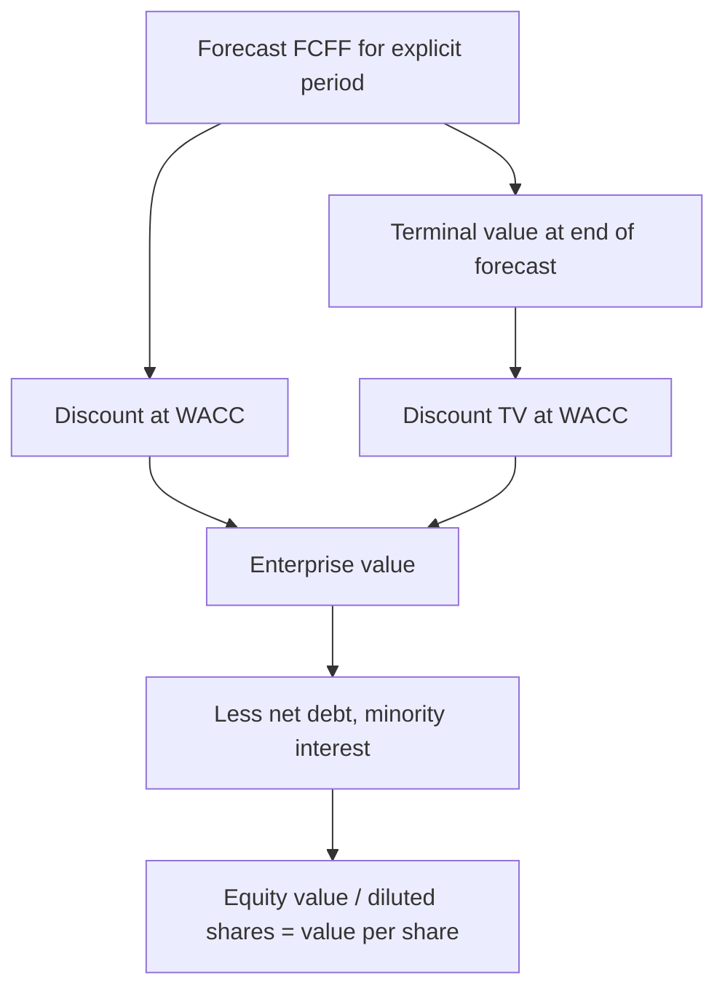

# DCF Deep Dive — WACC, Terminal Value and the Assumptions That Matter

## The Problem / Why this matters
Most of a DCF's output is determined by two inputs that receive the least scrutiny: the discount rate and the terminal value. In a typical model, **60–80% of the computed value sits in the terminal value** — meaning the explicit five-year forecast an analyst spends weeks building often drives less than a third of the answer. Understanding where the value actually comes from, and how to defend those inputs, is what separates a DCF that survives challenge from one that collapses under the first question.

## Core Idea
A DCF discounts projected free cash flows at a rate reflecting their risk. Its integrity depends on three things being internally consistent: the **cash flow definition**, the **discount rate applied to it**, and the **terminal value method** — and on the terminal assumptions being economically defensible rather than reverse-engineered.

## Why it works this way
Value is the present value of cash available to capital providers. Because a going concern generates cash indefinitely, and no analyst can forecast indefinitely, the model splits into an explicit forecast period and a terminal value capturing everything after. The discount rate converts future rupees into present ones at a rate reflecting the risk of not receiving them.



## Full technical content

### Getting the consistency right

The single most common structural error is mismatching cash flow and discount rate:

| Cash flow | Discount at | Gives | Then |
|---|---|---|---|
| **FCFF** (free cash flow to firm — pre-financing) | **WACC** | Enterprise value | Subtract net debt to get equity |
| **FCFE** (free cash flow to equity — post-interest, post-debt-flows) | **Cost of equity** | Equity value directly | No further subtraction |

Discounting FCFF at the cost of equity, or FCFE at WACC, is a definitional error that produces a meaningless number. Most equity research uses the FCFF/WACC route.

**FCFF build:**
```
EBIT
× (1 − tax rate)              = NOPAT
+ Depreciation & amortisation
− Capital expenditure
− Increase in working capital
= FCFF
```

### The discount rate — WACC

**WACC = (E/V × Cost of equity) + (D/V × Cost of debt × (1 − tax rate))**

**Cost of equity** via CAPM: **Rf + β × ERP** (+ any size or specific-risk premium).

Each input carries judgement:

- **Risk-free rate (Rf)** — the 10-year government bond yield, matched to the currency of the cash flows. Use a **current** yield, but be aware that using a cyclically depressed yield embeds an aggressive assumption into a perpetual valuation; some practitioners normalise.
- **Equity risk premium (ERP)** — the excess return demanded over the risk-free rate. For India typically in the region of 6–8%, drawn from published country-risk-premium work. State your source; this is a genuinely contested number and a 100bp change moves value materially.
- **Beta (β)** — sensitivity to the market. Practical guidance: raw regression betas are noisy and period-dependent, so use an **adjusted beta** (the common Blume adjustment shrinks toward 1: `0.67 × raw + 0.33 × 1`) or, better, a **peer-median unlevered beta re-levered to the target capital structure**. That approach removes single-stock estimation noise and is more defensible under challenge.

  *Unlever:* βu = βL ÷ [1 + (1 − t) × D/E]  → take the peer median → *re-lever* at the subject's capital structure.

- **Cost of debt** — the company's actual marginal borrowing cost (from the interest-rate disclosure or its credit rating's spread over the risk-free rate), not the historical average rate on legacy debt. Applied after tax, because interest is deductible.
- **Capital-structure weights** — use **market values**, not book, and use a **target/sustainable** structure rather than a temporarily distorted current one.

### Terminal value — where most of the value lives

Two accepted methods, and best practice is to compute both and cross-check.

**1. Perpetuity growth (Gordon) method:**

**TV = FCFF₍ₙ₊₁₎ ÷ (WACC − g)**

The critical discipline on **g**: the terminal growth rate is a *perpetual* rate. A company cannot grow faster than the economy forever, so **g must not exceed long-run nominal GDP growth** — for India, realistically in the 4–6% nominal range, and for a global business closer to 2–3%. A model using g = 8% is asserting the company eventually becomes the entire economy. This is the single most abused input in equity research.

Note the extreme sensitivity: with WACC 11% and g 4%, the denominator is 7%. Moving g to 5% makes it 6% — increasing TV by roughly 17% from a 100bp change in one assumption. This is precisely why the WACC-versus-g sensitivity table is mandatory rather than decorative.

**2. Exit multiple method:**

**TV = Terminal-year EBITDA × Exit EV/EBITDA multiple**

The exit multiple should reflect a **mature-business** multiple — typically at or below the current sector multiple, because a company growing more slowly at the end of the forecast should command a lower multiple than it does today. Using today's multiple for a business that will be mature and slower-growing is a common way of quietly inflating value.

**The cross-check that professionalises the model:** compute TV both ways and back out the implied other variable. If your exit multiple implies a perpetual growth rate of 9%, the multiple is too high. If your perpetuity growth implies an exit multiple of 4x for a quality business, it is too low. Disclosing both, and the implied cross-check, is standard in good research.

### Terminal-year normalisation

The terminal year must represent a **steady state**, not the last year of an unusual forecast:
- **Capex should approximate depreciation** in perpetuity — a business cannot grow forever while spending less on assets than it consumes. A terminal year with capex well below depreciation overstates FCFF permanently.
- **Working capital change** should reflect only the growth rate, not a one-off release.
- **Margins** should be at a sustainable, competitively-plausible level — not a cyclical peak.
- **Tax rate** at the statutory/sustainable rate, not a temporarily concessional one.

### Mid-year convention

Cash flows arrive through the year, not on the final day. Discounting at t = 0.5, 1.5, 2.5 rather than 1, 2, 3 raises value by roughly (1 + WACC)^0.5 — typically 4–6%. Either convention is acceptable; applying it inconsistently between the explicit period and the terminal value is not.

### From enterprise value to value per share

```
Enterprise value
− Net debt (debt − surplus cash)
− Minority interest (market or book value of what you don't own)
− Underfunded pension / other debt-like items
+ Value of non-operating assets (surplus land, investments, associates)
= Equity value
÷ Diluted shares (incl. ESOPs, warrants, convertibles)
= Value per share
```

### Honest use of the output

A DCF produces a *range*, not a point. Best practice is to present the sensitivity table (WACC × g), state the two or three assumptions carrying the value, and triangulate the DCF output against relative valuation rather than presenting it as an independently precise answer. Where a DCF and comps diverge materially, that divergence is itself the finding worth investigating — usually it means the market is assuming something structurally different about growth or returns than your model is.

## Common mistakes
- **Mismatching** FCFF with cost of equity or FCFE with WACC.
- Terminal **g above long-run nominal GDP growth** — economically impossible in perpetuity.
- Terminal-year **capex below depreciation**, permanently overstating cash flow.
- Using an exit multiple equal to today's multiple for a business that will then be mature.
- Using **book-value** capital-structure weights instead of market values.
- Using a **raw regression beta** without adjustment or peer cross-check.
- Forgetting **minority interest** or using basic rather than diluted shares.
- Reverse-engineering WACC or g to reach a target price that was decided first — the most damaging error, because it makes the entire model an exercise in justification rather than analysis.

## Interview angle
"Walk me through a DCF, and tell me which assumption matters most." Cover the mechanics — forecast FCFF, discount at WACC, terminal value, bridge to equity value per share — then demonstrate seniority by going to where the value actually sits: 60–80% is typically in the terminal value, so terminal growth and the WACC spread over it dominate, and terminal g must be capped at long-run nominal GDP growth. Add that you'd compute terminal value both ways and check the implied cross-consistency, and that you'd present a WACC-versus-g sensitivity table rather than a single number, because a defensible range of inputs can easily span ±30% of value.
