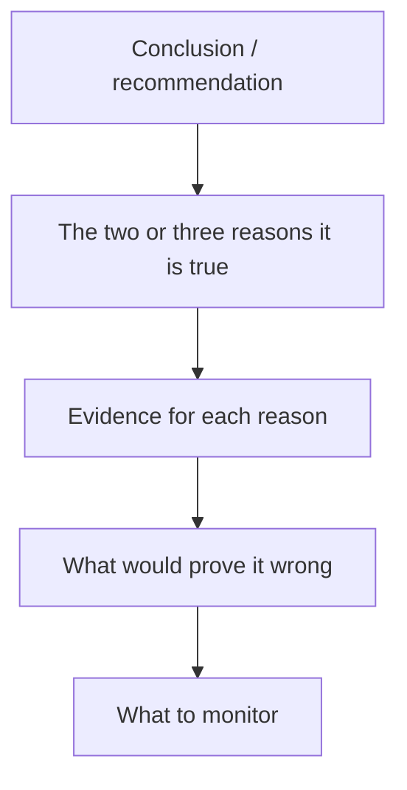

# Writing for Impact — Research Communication Craft

## The Problem / Why this matters
Research that is not read has no value, and research that is read but misunderstood has negative value. Institutional clients receive hundreds of notes a week and read a fraction of them. The analyst's analytical work is only half the job; converting it into something a portfolio manager can absorb in ninety seconds and act on is the other half — and it is the half most junior analysts underestimate.

## Core Idea
Professional research writing is **conclusion-first, evidence-second**, quantified wherever possible, and explicit about the distinction between fact, estimate and opinion. Its structure serves a reader who may stop after the first paragraph.

## Why it works this way
A portfolio manager's scarcest resource is attention. Academic writing builds to a conclusion because the reader is committed to finishing; research writing leads with the conclusion because the reader is not. Every structural convention in research writing follows from that single asymmetry.

## Full technical content

### The BLUF principle — bottom line up front

Open with the conclusion and the action, not with background. Compare:

> ❌ *"The Indian speciality chemicals sector has seen significant capacity additions over the past three years, driven by the China+1 supply-chain diversification theme. Against this backdrop, Company X has been expanding its Dahej facility..."*

> ✅ *"We initiate on Company X with a Buy and a ₹1,150 target (34% upside). We are 14% above FY27 consensus EPS because we believe the market is under-modelling the Dahej ramp: our checks indicate commissioning is running a quarter ahead of guidance."*

The second version tells a PM in one sentence what the call is, what makes it differentiated, and what evidence supports it. Everything after that is elaboration for those who want it.

### The inverted pyramid

Structure information in descending order of importance, because readers stop at different depths:

1. **Recommendation, target, upside, and the differentiated point** (everyone reads)
2. **The two or three thesis pillars** with the key number under each (most read)
3. **Evidence and analysis** supporting each pillar (interested readers)
4. **Model detail, methodology, appendices** (the few who dig)

A note that buries its differentiated insight on page 30 has structurally failed regardless of how good that insight is.

### Quantify everything

Vague language is the most common weakness in junior research. Every qualitative claim should carry a number:

| Weak | Strong |
|---|---|
| "Margins should improve" | "We model EBITDA margin at 18.2% in FY27 vs 14.6% in FY25, driven 250bp by mix and 110bp by operating leverage" |
| "The company faces competitive pressure" | "Two competitors are adding 400kt of capacity by FY27, ~18% of current industry supply; we model realisations down 6%" |
| "Valuations are attractive" | "At 14x FY27E EPS versus a 5-year average of 21x and peers at 19x, with unchanged RoCE" |
| "Management is confident" | "Management guided to 15–17% revenue growth, up from 12–14% last quarter" |

### Distinguish fact, estimate and opinion

A professional standard and, in most codes of conduct, an explicit obligation. The reader must always know which is which:

- **Fact:** "Revenue grew 18.4% YoY in Q2FY26." (reported)
- **Estimate:** "We forecast FY27 revenue of ₹4,820cr, 14% above consensus."
- **Opinion:** "We believe the market is underestimating the durability of the pricing gain."

Blurring these — presenting an estimate in the grammar of a fact — is the most damaging habit in research writing, because it destroys the reader's ability to calibrate how much of what they are reading is verified.

### Note types and their conventions

| Type | Length | Purpose | Turnaround |
|---|---|---|---|
| **Initiation** | 40–100 pp | Establish the full investment case | Weeks |
| **Results update** | 2–6 pp | Beat/miss, what changed, revised estimates | Same day |
| **Event note** | 1–3 pp | Reaction to a specific announcement | Hours |
| **Thematic / sector** | 15–40 pp | A cross-company idea or structural shift | Weeks |
| **Model update** | 1–2 pp | Estimate revision without a view change | Same day |
| **Flash / first take** | <1 pp | Immediate reaction, pre-full-analysis | Minutes |

Each has an expected shape, and violating it wastes the reader's time — a six-page results update that buries the EPS revision is a failure of format, not just of style.

### Charts and tables

- **One message per chart.** If a chart needs a paragraph to explain, it is doing too much.
- **Title the chart with the conclusion**, not the contents: "Margin has expanded 400bp as mix shifted to premium" beats "EBITDA margin trend."
- Always label **axes, units and source**, and state clearly whether figures are actuals or estimates.
- Tables should have the **comparison built in** — YoY, versus consensus, versus your prior estimate — because a reader should not have to compute a delta themselves.

### Language discipline

- **Active voice, short sentences.** "We cut FY27 EPS 8%" not "FY27 EPS estimates have been revised downwards by 8%."
- **Avoid hedging stacks.** "We believe it is possible that margins may potentially improve somewhat" communicates nothing. Take a position or say you are uncertain and why.
- **Define jargon on first use**, especially sector-specific terms — your reader may be a generalist PM.
- **Consistent units and periods** throughout. Mixing ₹cr and ₹mn, or FY and CY, within one note is a common and confusing error.
- **Say what changed.** In any update, the reader's first question is "what's different from last time?" Answer it in the first line.

### The rating-change note

The highest-stakes writing an analyst does. It must explicitly address: what changed (fundamentals, price, or your view), why you were previously wrong if you were, the revised numbers, and what would need to happen for you to change back. Analysts who acknowledge an error plainly build far more credibility than those who present a downgrade as though it were always foreseen — and buy-side readers notice which kind of analyst they are dealing with.

## Common mistakes
- Burying the conclusion under background context.
- Qualitative claims with **no numbers attached**.
- Failing to separate **fact from estimate from opinion**.
- Charts titled with contents rather than conclusions.
- Not answering "**what changed?**" in an update note's opening line.
- Hedging so heavily that no view is discernible.
- Writing for another analyst rather than for a **generalist portfolio manager**.
- Length as a proxy for effort — a 60-page note with no differentiated view is worse than a 2-page note with one.

## Interview angle
"How would you structure a research note?" Answer with the reader in mind: conclusion first — rating, target, upside, and the one differentiated point in the opening lines; then the two or three thesis pillars each with a supporting number; then evidence; then risks with quantified impact; then monitorables and what would falsify the view. Add the professional standards: quantify every claim, keep fact/estimate/opinion clearly separated, and in an update lead with what changed. The underlying principle to state explicitly is that a PM may only read the first paragraph, so the first paragraph must contain the entire investable idea.
