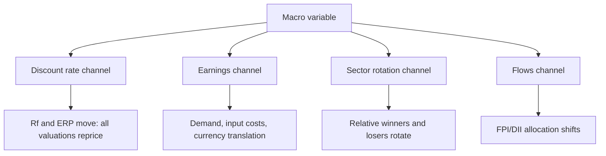

# Macro Linkages for Equity Analysts

## The Problem / Why this matters
A bottom-up analyst can build a flawless company model and still be wrong because rates rose, the rupee moved, or commodity prices reversed. Macro variables enter equity valuation through specific, traceable channels — the discount rate, input costs, demand, and translation effects — and an analyst who cannot articulate those channels will be blindsided by moves that were, in principle, analysable. "How do rising interest rates affect your stock?" is a routine interview question that separates candidates who understand transmission from those who have memorised a directional rule.

## Core Idea
Macro affects equities through **four transmission channels**: the discount rate, corporate earnings, sector rotation, and flows. Every macro variable acts through one or more of these, and the analyst's job is to identify which channel dominates for *their* specific company.

## Why it works this way
A stock's value is discounted future cash flows. Macro can move the discount rate (rates, risk premium), the cash flows (demand, costs, currency), or the relative attractiveness of equities versus other assets (flows). Because different companies have different sensitivities to each channel, the same macro event produces genuinely different outcomes across a coverage universe.

## Full technical content

### Interest rates

**Channel 1 — the discount rate.** A higher risk-free rate raises WACC, mechanically reducing present value. Critically, this hits **long-duration equities hardest** — companies whose value sits mostly in distant cash flows (high-growth, low current earnings) fall more than mature cash-generative businesses for the same rate move. This is the equity analogue of bond duration and explains why growth stocks de-rate sharply in rate-rising cycles while value/cyclical stocks hold up better.

**Channel 2 — earnings.** Higher rates raise interest cost for leveraged companies (direct P&L hit), and suppress demand in rate-sensitive sectors — housing, autos, consumer durables, anything bought on credit.

**Channel 3 — sector rotation.** Rate rises are generally positive for **banks** (asset repricing typically faster than liability repricing, so NIM expands in the near term) and negative for rate-sensitive consumption and for high-duration growth names.

**The analyst's task:** compute your company's actual sensitivity. Quantify: what does a 100bp WACC increase do to your DCF value? What does 100bp on the borrowing cost do to EPS given the floating-rate debt balance? Those two numbers are the answer to the interview question.

### Currency (USD/INR)

Direction of impact depends entirely on where the company sits in the trade flow:

| Company type | Rupee depreciates | Mechanism |
|---|---|---|
| **IT services, pharma exporters** | **Positive** | Revenue in USD, costs in INR — margin expands |
| **Oil marketing, importers of raw materials** | **Negative** | Input costs rise in INR terms |
| **Companies with USD debt** | **Negative** | Translation loss and higher servicing cost in INR |
| **Domestic-only businesses** | **Mostly neutral directly** | Indirect via inflation and rates |

Quantify with an explicit sensitivity: *"every 1% INR depreciation adds ~25bp to EBIT margin"* for a typical Indian IT services company. Note also the distinction between **transaction exposure** (cash flows), **translation exposure** (reporting of foreign subsidiaries), and **hedging** — many exporters hedge 6–12 months forward, which delays rather than eliminates the impact and means a currency move shows up in earnings with a lag.

### Inflation and commodity prices

- **Input-cost inflation** compresses gross margin unless passed through. The key analytical question is **pricing power** — can the company raise prices without losing volume? Test it empirically: look at what happened in the last input-cost spike.
- **Pass-through lag** — even companies with pricing power raise prices with a delay, so margins compress temporarily then recover. Distinguishing a timing effect from a structural one is often the whole call.
- **Commodity producers** benefit from the same move that hurts commodity consumers — within one coverage universe, a steel price rise is positive for steel producers and negative for autos and appliances.
- **Inflation also raises the risk-free rate**, so it hits through the discount-rate channel simultaneously.

### GDP growth and the demand channel

Map your company's revenue to its actual macro driver rather than headline GDP: consumer staples track nominal consumption and rural income; autos track disposable income and credit availability; capital goods track the private capex cycle and government infrastructure spend; banks track credit growth, itself roughly a multiple of nominal GDP growth.

**Beta to the cycle** varies enormously — staples might grow at 0.7× nominal GDP with low variance; capital goods might grow at 2× in an upcycle and contract outright in a downturn. Knowing your company's historical elasticity to its driver is a genuinely useful, computable number.

### Flows — FPI and DII

Indian equities are meaningfully driven by **foreign portfolio investor** flows, which respond to global risk appetite, the US dollar, US rates, and relative emerging-market valuations — factors entirely outside any Indian company's control. **Domestic institutional investor** flows (mutual funds via SIPs, insurance) have grown into a substantial stabilising counterweight, which is why sustained FPI selling has, in recent cycles, produced smaller index drawdowns than it once did.

For a stock-level analyst the practical relevance is: high-FPI-ownership stocks are more exposed to global risk-off episodes regardless of fundamentals, and this is checkable from the quarterly shareholding pattern.

### Building a macro sensitivity table for your coverage

The professional output is a table making your macro exposures explicit and quantified:

| Variable | Move | EPS impact | Value impact |
|---|---|---|---|
| USD/INR | +1% depreciation | +2.1% | +2.4% |
| Interest rates | +100bp | −1.8% (interest cost) | −9% (WACC) |
| Key raw material | +10% | −4.5% | −5% |
| Volume growth | −200bp | −6% | −8% |

This is far more useful to a client than prose, and it is what allows a PM to overlay their own macro view on your bottom-up work — which is precisely how sell-side research gets used in practice.

### The honest boundary

An equity analyst is not a macro forecaster and should not pretend to be. The professional position is: **do not forecast macro; quantify sensitivity to it.** State your base-case assumptions explicitly (the rate path, the currency level, the commodity price you have assumed), make them easy to find, and show what changes if the client disagrees. A note that hides its macro assumptions inside the model is unusable for anyone with a different macro view — which is most of your readership.

## Common mistakes
- Directional rules without transmission logic — "rate hikes are bad for stocks" without knowing which channel and how much.
- Forgetting that rate moves hit **long-duration growth stocks** disproportionately.
- Ignoring **hedging**, so currency impact is modelled immediately when it will actually arrive with a lag.
- Treating raw-material-driven margin expansion as **structural** when it will mean-revert.
- Using headline GDP as the demand driver when the company's actual driver is rural income or the capex cycle.
- Hiding macro assumptions in the model rather than stating them prominently.
- Attempting to forecast macro rather than quantifying sensitivity to it.

## Interview angle
"Rates are rising 200bp. What happens to your coverage?" Answer through the channels rather than directionally: discount rate — WACC rises, hitting long-duration growth names hardest, quantified as X% of DCF value per 100bp; earnings — interest cost rises for leveraged names (quantify from floating-rate debt), demand falls in credit-sensitive sectors; rotation — banks typically benefit near-term via faster asset repricing, rate-sensitive consumption suffers; flows — higher global rates can pressure FPI allocation to emerging markets. Then close with the professional boundary: you don't forecast the rate path, you publish the sensitivity so the client can apply their own.
