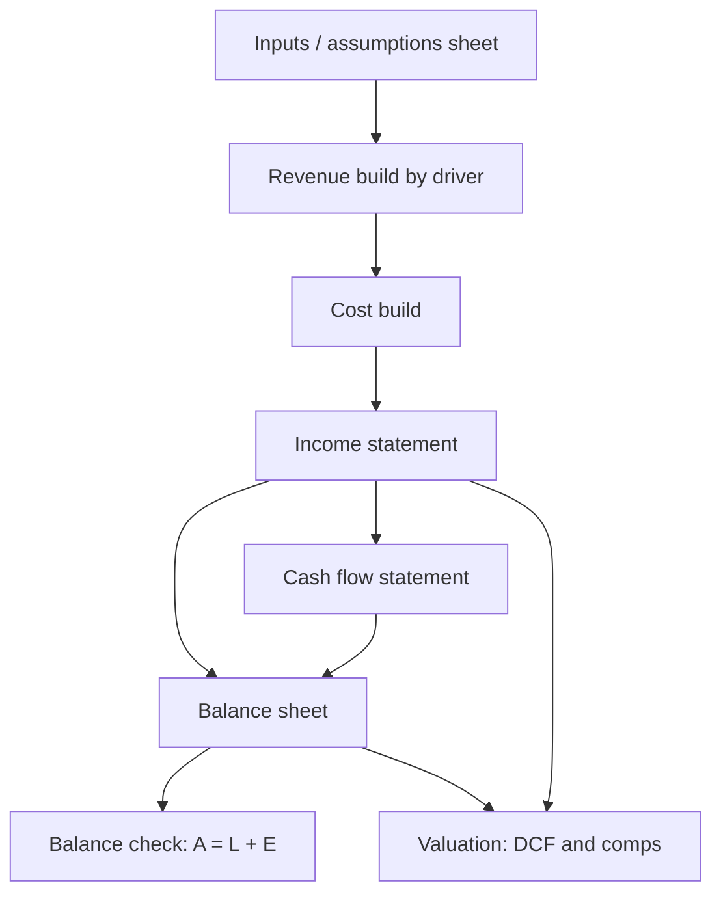

# Building and Auditing the Financial Model

## The Problem / Why this matters
The model is the analyst's core working tool, and a model that is wrong, opaque, or impossible to update is worse than useless — it produces confident, precise, incorrect numbers and it cannot be handed to anyone else. Equity research interviews frequently include a modelling test, and the assessment is rarely about whether the candidate knows the formulas; it is about structure, transparency, and whether the model can be audited by someone who did not build it.

## Core Idea
A good model is **driver-based, transparent, internally consistent, and auditable**. Every number is either a clearly-flagged input or a formula traceable to inputs — never a hardcoded number buried inside a calculation.

## Why it works this way
A model's purpose is not to produce one answer but to let you and your reader ask "what if?" That requires assumptions to be visible and changeable in one place. The moment a growth rate is typed inside a revenue formula, the model has stopped being an analytical tool and become a calculator with hidden settings.

## Full technical content

### Structural conventions

**Separate sheets by function:** Assumptions → Historicals → Revenue build → P&L → Balance sheet → Cash flow → Valuation → Output/summary. Never mix inputs and calculations on the same sheet.

**Colour convention** (near-universal in finance, and interviewers look for it):
- **Blue** — hardcoded inputs and assumptions
- **Black** — formulas within the same sheet
- **Green** — links from another sheet
- **Red** — links to an external file (to be minimised)

**One row, one formula.** A formula should copy consistently across the entire forecast period. If a row needs different logic in different years, that is a signal to restructure rather than to write a bespoke formula in one cell — inconsistent rows are the single most common source of undetected model error.

**No hardcodes inside formulas.** `=B12*1.08` is a defect; `=B12*(1+Assumptions!$C$5)` is correct. Every driver lives on the assumptions sheet where it can be seen and flexed.

**Consistent time axis** across all sheets — same columns, same periods, clearly labelled actual (A) versus estimate (E).

### The driver-based revenue build

The distinguishing feature of a research-quality model. Rather than growing revenue at an assumed percentage, decompose it into the quantities that actually drive it:

| Business | Revenue build |
|---|---|
| Manufacturing | Capacity × utilisation × realisation per unit |
| Retail | Stores × sales per store (or per sq ft) × footfall × conversion |
| Bank | Advances × yield, and deposits × cost |
| Subscription | Subscribers × ARPU × (1 − churn) |
| IT services | Billable headcount × utilisation × realisation |

This matters because it makes the forecast **challengeable and updatable** — when the company announces a new plant, you change capacity, not a growth percentage; when a competitor cuts price, you change realisation. It also forces the analyst to understand the business rather than extrapolate.

### Linking the three statements

The integrity test of any model. The essential links:

- **Net income** flows from P&L to retained earnings on the balance sheet and to the top of the cash flow statement.
- **Depreciation** is added back in cash flow and accumulates against fixed assets on the balance sheet.
- **Capex** reduces cash and increases gross fixed assets.
- **Working capital changes** flow from balance-sheet movements into operating cash flow.
- **Debt movements** flow through financing cash flow and change the balance-sheet debt balance; interest expense links to the average debt balance.
- **Closing cash** from the cash flow statement is the balance-sheet cash figure.

**The balance check** — Assets = Liabilities + Equity — must be a live formula displayed prominently, ideally as a single cell showing zero. A model without a visible balance check cannot be trusted, and interviewers ask to see it.

**Circularity:** interest expense depends on average debt, which depends on cash flow, which depends on interest expense. Handle it either with iterative calculation enabled plus a circuit-breaker switch, or by using **opening-balance** debt for the interest calculation — the cleaner approach for a research model, since the precision loss is trivial and the model becomes far more robust.

### The revolver / cash sweep

A model should not produce negative cash. Build a simple funding mechanism: if the cash balance falls below a minimum threshold, a revolver draws to cover it; if there is surplus cash above the threshold, it repays the revolver. This makes the model behave sensibly under stress scenarios rather than showing an impossible negative cash line.

### Auditing a model — yours or someone else's

A structured review process:

1. **Trace the balance check** — is it live, is it zero across all periods?
2. **Scan for hardcodes** in formula cells (Excel: Find & Select → Formulas, or a colour-convention scan).
3. **Check formula consistency across rows** — inconsistent formulas within a row are the most common defect.
4. **Test the extremes** — set growth to zero, set it very high, set margin to zero. Does the model break, produce negative cash, or show implausible results?
5. **Verify the links** — change one input and confirm the change propagates correctly all the way to the output.
6. **Sanity-check outputs** against history: are forecast margins, RoCE and working-capital days plausible relative to what the company has actually achieved?
7. **Check terminal-year normalisation** — capex versus depreciation, sustainable margin, sustainable tax rate.
8. **Look for the classics** — sign errors (adding an outflow), off-by-one period references, and SUM ranges that miss the last row or double-count.

### The plausibility check that catches most errors

Before trusting any model output, compare the forecast to the company's own history and to peers:

| Check | Question |
|---|---|
| Revenue CAGR | Has the company ever grown at this rate? Has anyone in the sector? |
| Terminal margin | Is it above the best margin the company has ever achieved? |
| RoCE trajectory | Does it rise indefinitely without the capital base growing? |
| Working-capital days | Have they been assumed to improve with no stated reason? |
| Capex/sales | Sufficient to support the assumed growth? |
| Implied market share | Does the revenue forecast imply an implausible share of the total market? |

That last check is the most powerful and most neglected: forecast revenue divided by forecast industry size gives implied market share. A model implying a company reaches 60% share of a fragmented market has an arithmetic error or an unrealistic assumption, and this test finds it immediately.

## Common mistakes
- **Hardcoded numbers inside formulas**, making assumptions invisible.
- **No balance check**, or a balance check that has been broken and ignored.
- Inconsistent formulas within a row.
- Growing revenue by an assumed percentage instead of by **drivers**.
- Forecast margins or returns that exceed anything the company or sector has achieved.
- **Terminal year not normalised** — capex below depreciation, peak-cycle margin.
- Circular references left uncontrolled, so the model breaks unpredictably.
- Building a model so complex only its author can use it — research models are collaborative documents.
- Not checking **implied market share**.

## Interview angle
"How would you build a model for this company?" Structure: separate assumptions from calculations with a strict colour convention; build revenue from operational drivers rather than a growth rate; forecast costs by nature with explicit margin assumptions; link the three statements fully with a live balance check; handle circularity via opening-balance interest; add a revolver so cash never goes negative; then run sanity checks — forecast margins versus history, RoCE trajectory, working-capital days, and implied market share. Mentioning the balance check and the implied-market-share test unprompted is what signals you have actually built and audited models rather than only read about them.
