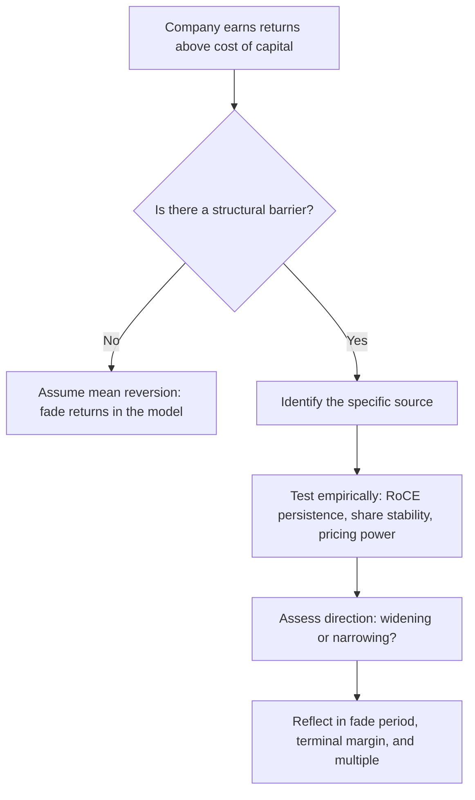

# Competitive Strategy and Moat Analysis

## The Problem / Why this matters
The single most important question in long-horizon equity analysis is whether a company's current profitability will persist. Capitalism's default is that high returns attract competition and get competed away — so a company earning 30% RoCE will, absent something protecting it, drift toward the cost of capital. Whether that erosion happens over three years or thirty is the difference between a stock worth 12x earnings and one worth 40x. "Moat" is the name for whatever prevents that erosion, and assessing it rigorously is the core of fundamental research.

## Core Idea
A **moat** is a structural characteristic that allows a company to sustain returns above its cost of capital against competitive attack. It must be identified specifically (which of the recognised sources?), tested empirically (does the financial record actually show persistence?), and monitored (is it widening or narrowing?).

## Why it works this way
Excess returns are, in a competitive market, temporary by default. Persistent excess returns therefore require an explanation — some barrier preventing competitors from replicating the economics. If you cannot name that barrier specifically, you should assume the returns will mean-revert, and value the company accordingly.

## Full technical content

### The recognised sources of competitive advantage

| Source | Mechanism | Sector examples | How to verify |
|---|---|---|---|
| **Intangibles — brand** | Customers pay more for the same functional product | FMCG, luxury, paints | Sustained price premium vs unbranded; gross margin vs peers |
| **Intangibles — patents/regulatory** | Legal exclusion of competitors | Pharma, licensed businesses | Patent expiry schedule; licence conditions |
| **Switching costs** | Changing supplier is costly, risky or disruptive | Enterprise software, banking, medical devices | Customer retention rate; contract length; share of wallet |
| **Network effects** | Product becomes more valuable as more people use it | Exchanges, marketplaces, payment networks | User growth vs competitors; take rate stability |
| **Cost advantage — scale** | Fixed costs spread over more volume | Cement, telecom, retail | Cost per unit vs peers at different scales |
| **Cost advantage — process/location** | Structurally cheaper production or distribution | Commodities with captive resources | Cost-curve position |
| **Efficient scale** | Market only supports one or two players profitably | Regional utilities, pipelines, airports | Market structure; history of entry attempts failing |
| **Distribution reach** | Physical presence competitors cannot economically replicate | Indian FMCG, paints, building materials | Outlets covered; direct reach vs peers |

**Distribution deserves emphasis in the Indian context**: reaching millions of small retail outlets across a fragmented market takes decades and enormous capital, and it is why incumbents in Indian consumer categories have been so durable against well-funded challengers.

### Testing a claimed moat empirically

A moat claim without evidence is a story. Three tests:

**1. Return persistence.** Plot RoCE (or RoE for financials) over 10+ years, and against peers. A genuine moat shows returns *sustained* above the cost of capital across a full cycle — including the downturn. Returns that were high only during a boom are cyclical, not structural.

**2. Market-share stability.** A moat should show up as share that is stable or rising over time, particularly during periods of aggressive competitive entry. Share lost during a competitive attack, later recovered by discounting, indicates a weak moat.

**3. Pricing power.** The cleanest single test: can the company raise prices without losing volume? Look at historical episodes of input-cost inflation and check whether gross margin was preserved. A company that fully passed through a cost spike within two quarters has pricing power; one whose margins compressed and never recovered does not.

A useful supplementary check is **the incumbent's response to attack**: when a well-funded competitor entered, what happened to the incumbent's margins and share? That natural experiment is more informative than any qualitative argument.

### Porter's Five Forces — as a diagnostic, not a checklist

The framework's value is in identifying *where the profit pool sits and why*:

- **Rivalry among existing competitors** — concentration, capacity utilisation, exit barriers. High fixed costs plus high exit barriers produce chronic overcapacity and poor returns (the structural problem in steel, airlines, and telecom in many markets).
- **Threat of new entry** — capital intensity, regulation, distribution access, brand.
- **Supplier power** — concentration of suppliers, switching costs, forward-integration threat.
- **Buyer power** — concentration of customers, price sensitivity, backward-integration threat. This is the key structural risk for auto-component makers and IT services with concentrated clients.
- **Threat of substitutes** — often the most under-analysed, because substitutes usually come from *outside* the industry definition.

The analytical output is not "rivalry is high" but a conclusion about **who captures the industry's profit** and whether that is shifting.

### Moat direction — the more valuable question

Most analysts assess whether a moat exists. The higher-value question is whether it is **widening or narrowing**, because that determines re-rating or de-rating:

**Widening signals:** rising market share with stable or rising margins; increasing switching costs as products embed deeper; scale advantages compounding; distribution reach extending; regulatory position strengthening.

**Narrowing signals:** technology change altering the basis of competition; a new distribution channel bypassing the incumbent's advantage (e-commerce versus physical distribution reach); deregulation; patent cliff approaching; customer consolidation increasing buyer power; a well-capitalised entrant willing to sustain losses.

**The disruption question:** the most dangerous moats are those that are strong against *existing* competition but irrelevant against a new mode of competing. A distribution moat is formidable against another physical-distribution competitor and much weaker against a direct-to-consumer digital model.

### Translating moat analysis into the model and valuation

This is where the analysis becomes financially consequential, and where most notes stop short:

- **Fade period.** In a DCF, how long before returns converge toward the cost of capital? A wide, verified moat justifies a long fade (15–20 years or effectively none); no identifiable moat justifies a short one (5–7 years). This single choice moves DCF value enormously.
- **Terminal margin and RoCE.** A moat justifies a terminal margin above the industry average; its absence does not.
- **Terminal growth.** Only a genuinely durable franchise can justify growth at the upper end of the plausible range in perpetuity.
- **The multiple.** Sustainably higher RoCE mathematically justifies a higher multiple — this is the rigorous version of "quality deserves a premium."
- **Risk assessment.** The moat-narrowing signals become the specific, monitorable risks in the note.

A note that asserts a moat but then models returns fading to the cost of capital in five years has not connected its qualitative and quantitative work — a very common internal inconsistency.

## Common mistakes
- Calling a company's strong current margins a "moat" — high profitability is the *evidence to be explained*, not the explanation.
- Naming a moat without specifying **which source** it comes from.
- Confusing **operational excellence** (replicable) with structural advantage (not replicable). Good management is not a moat.
- Assessing existence but never **direction**.
- Assuming a moat that was durable against past competition is durable against a new mode of competition.
- Failing to connect the moat conclusion to the **fade period and terminal assumptions** in the model.
- Treating first-mover advantage or scale as automatic moats — both are frequently competed away.

## Interview angle
"What makes this a good business?" Do not answer with margins. Name the specific moat source — brand, switching costs, network effects, cost advantage, efficient scale, distribution — then give the empirical evidence: RoCE sustained above cost of capital through a full cycle, stable-to-rising share, and demonstrated pricing power through an input-cost spike. Then add the two things that mark a senior answer: whether the moat is widening or narrowing and why, and how that conclusion shows up in your model as the fade period and terminal return assumption.
