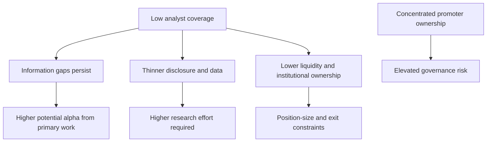

# Small- and Mid-Cap Research

## The Problem / Why this matters
Large-cap research is crowded — thirty analysts cover the same company, all reading the same filings, and genuine informational edge is scarce. Small- and mid-caps are where the structural inefficiency lives: fewer analysts, thinner disclosure, less institutional ownership, and therefore more mispricing. But the same conditions that create the opportunity also create the risks — liquidity constraints, governance concerns, and data scarcity — and an analyst who applies large-cap methods unmodified to a small-cap will get hurt.

## Core Idea
Small- and mid-cap research offers **higher potential edge** in exchange for **higher research effort, higher governance risk, and hard liquidity constraints**. The methodology must adapt on all three dimensions, not just be scaled down.

## Why it works this way
Market efficiency is a function of the number of informed participants. Where twenty well-resourced analysts compete, prices reflect available information quickly. Where two do, and where institutional mandates prevent many funds from participating at all, prices can diverge from value for extended periods — which is precisely the condition an analyst is looking for.

## Full technical content

### Where the edge actually comes from

| Source | Why it exists in small/mid caps |
|---|---|
| **Coverage gap** | 0–3 analysts versus 25–40 for large caps; often no consensus at all |
| **Disclosure gap** | Less granular segment reporting, shorter concalls, sometimes no concall at all — rewarding primary work |
| **Institutional-mandate exclusion** | Many funds cannot buy below a market-cap or liquidity threshold, so a genuine buyer base only appears later |
| **Index exclusion** | No passive ownership, so no automatic bid |
| **Under-modelled inflections** | A single new plant or product can change the earnings base materially in a way that is easy to model but few have modelled |
| **Re-rating potential** | Moving from unknown to covered, or from small-cap to mid-cap index inclusion, brings a valuation re-rating on top of earnings growth |

That last point is the specific small-cap return engine: returns compound from **earnings growth × multiple re-rating** simultaneously, which is why successful small-cap calls produce outsized outcomes.

### The modified research process

**Primary research matters far more.** With thin disclosure, channel checks, supplier and customer conversations, plant visits and dealer conversations move from "helpful supplement" to "the core of the work." A small-cap thesis built only on published filings is usually not differentiated, because those filings are all anyone has and they are thin.

**Management access is usually easier and more valuable.** Small-cap managements are typically more accessible than large-cap ones — often the promoter directly. This is a genuine advantage for understanding strategy and capital allocation, but it carries a specific hazard: proximity creates the risk of becoming an advocate rather than an analyst. Maintain the same evidentiary standards you would apply to a company whose management never returns your calls.

**Longer time horizons.** Small-cap mispricings can persist for years because there is no institutional pressure forcing correction. The catalyst discipline matters more here, not less — but the realistic catalyst timeline is longer.

**Balance-sheet scrutiny is disproportionately important.** Small companies fail. Large caps rarely go to zero; small caps do. Every small-cap thesis needs an explicit solvency assessment: debt maturity schedule, refinancing requirement, covenant headroom, promoter pledge, and whether the business survives a demand downturn.

### The governance premium on due diligence

Small- and mid-caps are typically promoter-controlled with high concentration, which raises the stakes on everything in the governance framework:

- **Related-party transactions** — proportionately more common and more material relative to company size.
- **Promoter pledge** — a small-cap promoter under personal financial stress has both stronger incentive and greater ability to affect reported results.
- **Auditor quality** — smaller audit firms, less scrutiny. An auditor change or resignation is a severe signal.
- **Disclosure quality** — inconsistent segment reporting, sparse notes, sometimes no earnings call.
- **Minority-shareholder track record** — has the promoter previously diluted minorities on unfavourable terms, or transferred value to unlisted group entities?

The practical rule: **governance failure is the dominant loss mechanism in small caps, not valuation error.** Weight the governance work accordingly, and be willing to pass on a fundamentally attractive business where the governance evidence is poor — "cheap enough to compensate for governance risk" is a proposition that fails far more often than it works.

### Liquidity — the constraint that shapes everything

Liquidity is not a footnote in small-cap work; it determines whether a correct call is implementable.

**Metrics to compute and state explicitly:**
- **Average daily traded value (ADTV)** over 3 and 6 months.
- **Days to build** a target position at, say, 20–25% of ADTV.
- **Days to exit** — critically, assessed under *stressed* conditions, where liquidity typically falls sharply exactly when you need it.
- **Free float** — promoter holding of 70%+ leaves a small tradeable float regardless of headline market cap.
- **Impact cost** — the price move caused by transacting meaningful size.

The asymmetry that matters: **liquidity evaporates precisely when you most want to sell.** A stock with adequate normal-conditions liquidity can become effectively untradeable during a drawdown, which is why position sizing in small caps must be set against stressed liquidity, not average.

### Valuation adjustments

- **Illiquidity discount** — a genuine, defensible adjustment, though it should be estimated rather than applied by convention.
- **Higher cost of equity** — small-cap risk premium in CAPM, reflecting genuine higher fundamental and liquidity risk.
- **Governance discount** where warranted, argued from evidence.
- **Peer-set difficulty** — often no directly comparable listed peer, so relative valuation may require larger peers with an explicit size adjustment, or cross-market comparables.
- **Higher scenario dispersion** — small-cap bull and bear cases should be genuinely wider than large-cap ones, because the business outcomes genuinely are.

### The re-rating thesis structure

A well-constructed small-cap thesis usually has this shape:

1. **The business is better than its multiple implies** — evidence from returns, moat, growth.
2. **Why the market hasn't noticed** — no coverage, recent listing, a past problem now fixed, an under-modelled capacity addition, index exclusion.
3. **The catalyst that forces attention** — earnings inflection, index inclusion, coverage initiation, a large institutional investor entering, promoter pledge release.
4. **The dual return driver** — earnings growth of X% plus re-rating from Ay to By.
5. **Honest liquidity and governance assessment** — including what would make you exit.

## Common mistakes
- Applying large-cap methods unmodified — relying on filings alone where primary work is required.
- Ignoring **liquidity**, recommending a position that cannot be built or exited at size.
- Under-weighting **governance**, which is the dominant loss mechanism in this segment.
- Assuming a low multiple is opportunity when it reflects genuine risk — small caps are often cheap for reasons.
- Becoming an **advocate** through close management access.
- Failing to assess **solvency** explicitly — small companies do go to zero.
- Assuming the mispricing will correct on a large-cap timeline.
- Sizing against average liquidity rather than stressed liquidity.

## Interview angle
"Why would you look at small caps rather than large caps?" Frame it as a structural inefficiency: coverage of 0–3 analysts versus 30, thinner disclosure, and institutional-mandate exclusion mean information gaps persist, so primary research earns a genuine return — and successful calls compound earnings growth *and* multiple re-rating together. Then show you understand the cost of that edge: governance is the dominant loss mechanism so due diligence must be disproportionate; balance-sheet solvency needs explicit assessment because small caps do fail; and liquidity must be assessed under stressed rather than average conditions, because it disappears exactly when you need to exit. That balanced answer is what distinguishes a considered candidate from one who has only heard that small caps outperform.
