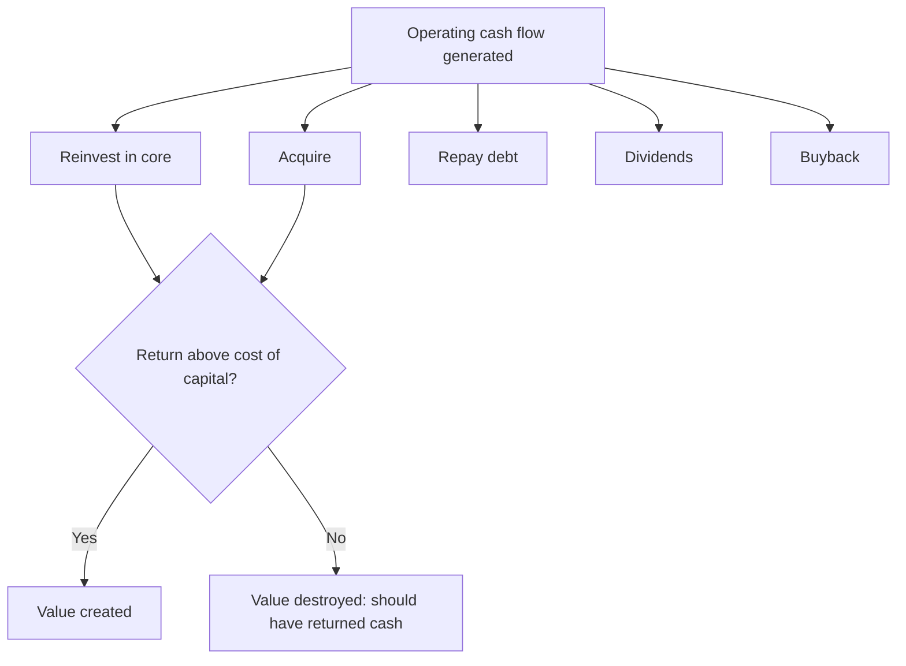

# Capital Allocation Analysis

## The Problem / Why this matters
Over a decade, the compounding effect of capital-allocation decisions frequently exceeds the effect of operating performance. A company earning a 20% RoCE that reinvests all its cash at 8% will destroy the value its operations create; a company earning 15% that returns excess cash rather than reinvesting badly will compound shareholder value steadily. Yet capital allocation is the least-analysed dimension in most equity research, because it requires assembling a decade of history rather than reading one quarter.

## Core Idea
Management has exactly **five uses** for cash generated: reinvest in the core business, acquire, repay debt, pay dividends, or buy back stock. Capital-allocation analysis evaluates the historical record of those choices against the returns they generated, and assesses whether current policy is value-creating.

## Why it works this way
Every rupee retained is a rupee not returned to shareholders, who could have invested it themselves. Retention is therefore only justified if the company can earn more on that rupee than the shareholder's alternative — the cost of equity. This is the single test that governs the whole subject.

## Full technical content

### The central test — incremental return on invested capital

Reported RoCE reflects the whole asset base, most of which was deployed long ago by possibly different management. What matters for judging *current* management is the return on capital **they** have deployed:

**Incremental RoCE = Δ EBIT(1−t) over period ÷ Δ Capital employed over period**

Compute over 5 and 10 years. Then compare to the cost of capital:

| Incremental RoCE vs WACC | Interpretation |
|---|---|
| Well above | Reinvestment is creating value; retention justified; growth is genuinely valuable |
| Approximately equal | Growth is value-neutral; the company is running to stand still |
| Below | **Reinvestment is destroying value**; cash should be returned instead |

This last case is common and rarely called out in research: a company growing revenue and profit in absolute terms while earning below its cost of capital on new investment is destroying value *through growth*. Growth is only good when it earns above the cost of capital.

### Evaluating each allocation channel

**1. Reinvestment in the core (capex)**

- Split maintenance capex from growth capex where disclosable — maintenance is non-discretionary, growth is the decision being judged.
- Check **capex timing through the cycle**: capacity added at the cycle peak (when returns look best and costs are highest) is the classic value-destroying pattern in cyclicals and commodities. Counter-cyclical investment is the mark of a disciplined allocator.
- Compare **announced project returns to delivered returns**. Companies announce IRRs; few report whether they were achieved. Track the capacity that was commissioned and what happened to consolidated returns afterward.

**2. Acquisitions**

The highest-risk channel, and empirically the one where most value is destroyed. For each material deal, assemble:

| Question | Where to find it |
|---|---|
| Price paid, and multiple paid | Deal announcement |
| Synergies promised | Announcement and concall |
| Was the target's business actually growing? | Target's own filings pre-deal |
| Post-deal: did consolidated RoCE rise or fall? | Financials 2–3 years after |
| Has goodwill been impaired? | Balance sheet and notes |

**Serial acquirers who never impair goodwill despite underperforming acquisitions are signalling something.** Impairment is an admission; its persistent absence alongside disappointing performance is a governance flag as much as an accounting one.

**3. Debt repayment**

Value-creating when leverage is genuinely excessive or refinancing risk is real. But note the mirror error: a company sitting on large net cash while insisting on further deleveraging is being conservative at shareholders' expense, since surplus cash earning treasury rates drags RoE.

**4. Dividends**

Assess **policy consistency** rather than yield level. Key questions: is there a stated payout policy? Is the payout ratio stable through the cycle, or cut opportunistically? Is the dividend covered by free cash flow, or funded by debt (a genuine warning sign)? A company borrowing to sustain a dividend is transferring risk, not returning value.

**5. Buybacks**

The most misunderstood channel. A buyback creates value **only if shares are repurchased below intrinsic value** — otherwise it is a transfer from continuing shareholders to exiting ones.

Assess: at what price and multiple did the company buy back, and what has happened since? Buying back at the peak of a re-rating is common and value-destructive. Also check whether the buyback is genuinely reducing share count or merely offsetting ESOP dilution — the latter is a compensation expense being routed through the buyback line, not a return of capital.

In India, mandatory **extinguishment** means the share-count reduction is permanent, which strengthens the case relative to treasury-share regimes.

### The cash-deployment scorecard

A practical research output assembling a decade:

| Period metric | Value |
|---|---|
| Cumulative CFO (10 yr) | ₹X |
| → Growth capex | ₹A (% of CFO) |
| → Acquisitions | ₹B |
| → Debt repayment | ₹C |
| → Dividends | ₹D |
| → Buybacks | ₹E |
| Incremental RoCE over period | Y% |
| Cost of capital | Z% |
| **Value created / destroyed** | (Y − Z) × capital deployed |

This table, more than any narrative, tells a client whether management can be trusted with retained earnings — and it is directly usable in the management-quality assessment.

### Signals of a disciplined allocator

- A **stated, consistent capital-allocation framework**, articulated and adhered to over years.
- Willingness to **return cash** when reinvestment opportunities are inadequate — the hardest discipline, because it implicitly admits limited growth options.
- **Counter-cyclical** investment and acquisition timing.
- Acquisitions in **adjacent** areas with articulated, measurable synergies, subsequently reported against.
- **Honest reporting** on underperforming investments, including impairment.
- Management compensation tied to **returns on capital**, not to revenue or absolute profit growth (which reward empire-building).

### Signals of poor allocation

- **Diversification into unrelated businesses** — the classic conglomerate value destroyer.
- Growth capex continuing while incremental RoCE sits below the cost of capital.
- Serial acquisitions with rising goodwill and falling consolidated returns.
- Large cash balances held indefinitely alongside costly debt.
- Buybacks concentrated at valuation peaks.
- Dividends funded by borrowing.
- Compensation linked to size rather than returns.

## Common mistakes
- Judging management on **reported RoCE** rather than incremental RoCE on capital they deployed.
- Treating **growth as automatically good** without checking it earns above the cost of capital.
- Assessing dividends by yield rather than by policy consistency and free-cash-flow coverage.
- Assuming a buyback is shareholder-friendly regardless of the price paid.
- Not tracking **acquisitions against what was promised** at announcement.
- Ignoring **capex timing** relative to the cycle.
- Treating capital allocation as a governance topic rather than as a direct driver of forecast returns and therefore of valuation.

## Interview angle
"How do you judge whether management is good at capital allocation?" Lead with the quantitative test: incremental RoCE over 5–10 years versus the cost of capital — this tells you directly whether retained earnings created value. Then walk the five channels with what you'd check in each: capex timing through the cycle and delivered versus announced returns; acquisitions against promised synergies with goodwill impairment as the honesty test; debt repayment versus excess conservatism; dividend policy consistency and free-cash-flow coverage; and buyback prices versus intrinsic value. Close with the point that carries the most weight: growth only creates value when it earns above the cost of capital, and a company growing below it is destroying value *through* growth.
