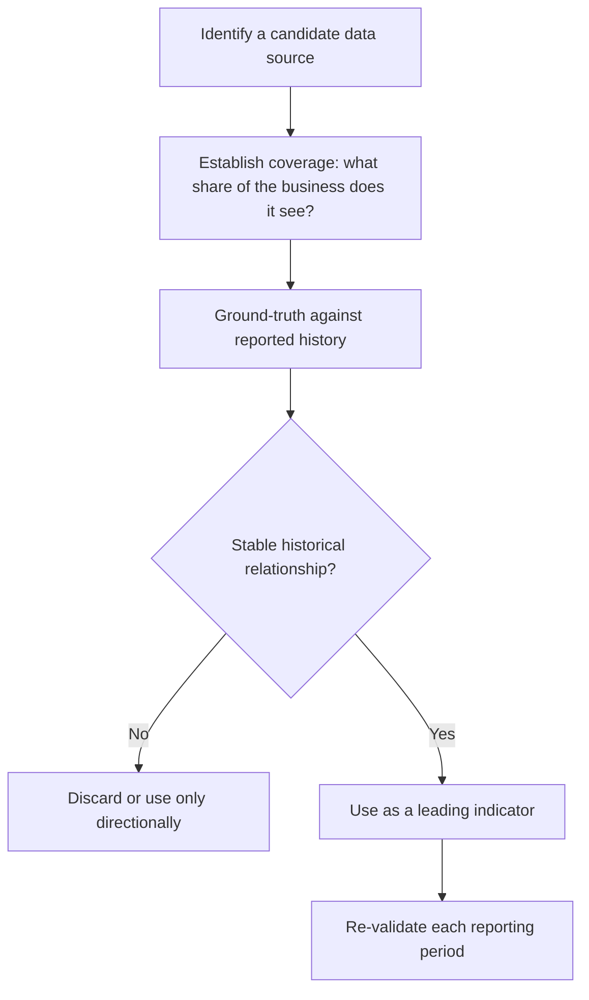

# Alternative Data in Equity Research

## The Problem / Why this matters
Company disclosure is quarterly, lagged, aggregated and identical for every analyst. Between reporting dates, the business generates continuous signals that are increasingly observable through non-traditional data sources — app downloads, satellite imagery, job postings, web traffic, payment data, shipping records. Analysts who can locate, validate and interpret these sources see inflections weeks or months before they appear in a filing. This is now a standard part of institutional research, and familiarity with both its power and its limits is expected at senior level.

## Core Idea
**Alternative data** is any non-traditional dataset informative about a company's operations. Its value comes from **timeliness** (higher frequency than reporting) and **exclusivity** (fewer analysts using it), but it requires rigorous **ground-truthing** against reported figures before it can be trusted.

## Why it works this way
A company reports quarterly what it did over three months. If footfall, hiring, downloads or shipping volumes are observable weekly, an analyst can construct a real-time proxy for the reported number. That proxy is only useful, however, if its historical relationship to the reported figure has been established — otherwise it is an uncalibrated signal that may be measuring something else entirely.

## Full technical content

### The main categories

| Data type | What it proxies | Typical use |
|---|---|---|
| **App download / DAU-MAU rankings** | User acquisition and engagement | Fintech, consumer internet, broking |
| **Web traffic and search trends** | Demand interest, brand momentum | E-commerce, consumer, travel |
| **Satellite imagery** | Parking-lot fill, construction progress, storage-tank levels, crop yields | Retail footfall, capex progress, commodities |
| **Geolocation / footfall data** | Store visits | Retail, QSR, malls, cinemas |
| **Job postings and headcount** | Expansion plans, functional priorities | Any — an early indicator of strategic direction |
| **Shipping / customs / port data** | Import-export volumes | Commodities, manufacturing, trade-exposed sectors |
| **Payment / card-spend panels** | Consumer spending by category and merchant | Consumer, retail |
| **Pricing scrapes** | Competitive pricing, discount intensity | E-commerce, airlines, hotels, financial products |
| **App-store reviews / social sentiment** | Product issues, satisfaction shifts | Consumer-facing businesses |
| **Government/regulatory datasets** | GST filings, e-way bills, electricity consumption, vehicle registrations | Sector-level demand |

**In the Indian context specifically**, publicly available government data is unusually rich and under-used: **monthly vehicle registration data (VAHAN)**, **GST collections**, **e-way bill volumes**, **electricity generation**, and **monthly auto dispatch numbers** together give a genuinely high-frequency read on real economic activity, and are free.

### Ground-truthing — the discipline that makes it research rather than noise

An alternative dataset is worthless until its relationship to the reported figure is established. The process:

1. **Assemble history** — the alternative series and the corresponding reported metric over as many periods as available.
2. **Measure the relationship** — correlation, and more importantly the *stability* of that correlation over time. A source that tracked well for eight quarters and then decoupled is telling you something changed.
3. **Establish coverage** — what share of the business does the data actually see? Card-spend panels capture card transactions, not cash; footfall data captures smartphone users with location enabled. Both have systematic, non-random coverage gaps.
4. **Check for structural breaks** — a change in the company's channel mix, or in the data provider's own panel composition, can break the relationship without either being obvious.
5. **Re-validate every period** — treat the relationship as an ongoing hypothesis, not a settled fact.

### The systematic biases to correct for

- **Panel composition bias** — the panel is rarely representative. Smartphone-based footfall data skews urban and younger; card panels skew affluent.
- **Panel drift** — the provider's panel changes over time, creating apparent trends that are artefacts of composition change rather than of the underlying business.
- **Coverage mismatch** — the data may cover one channel or geography while reported revenue covers all.
- **Definitional mismatch** — app downloads are not customers; footfall is not sales; job postings are not hires.
- **Crowding** — once a dataset becomes widely used, its edge decays, and it stops being informative because it is already in the price.

### From data to a research conclusion

The analytical chain must be explicit:

> *App downloads for the company's platform rose 34% QoQ (source: third-party ranking data, historical correlation to reported new-customer additions of 0.81 over 11 quarters). Applying that relationship implies new customer additions of ~2.4mn versus consensus ~1.9mn. Because ARPU on new customers is roughly 60% of the base, we model a 4% revenue upside to consensus for the quarter.*

That is usable research: source stated, historical relationship quantified, translation to a financial line explicit, and the conclusion sized. Compare with *"app downloads are strong, which is positive"* — which is an observation, not analysis.

### Combining sources — the real edge

Single-source signals are fragile. The strongest alternative-data work **triangulates**: satellite-observed construction progress *plus* job postings for the new plant *plus* equipment-import customs records together give a far more confident read on a capacity expansion's timing than any one alone. Where multiple independent sources agree, confidence rises materially; where they conflict, that conflict is itself the finding worth investigating.

Alternative data also works best **paired with traditional primary research** — a channel check confirming what the data suggests, or vice versa.

### Cost, compliance and practical constraints

- **Cost** — commercial alternative datasets are expensive, which is why they are more common at large institutions. Public datasets (government data, app rankings, job postings, web traffic estimates) are the accessible starting point and remain under-exploited.
- **Legality and terms of use** — web scraping must respect terms of service and applicable law; personal-data regulations constrain geolocation and transaction data.
- **Material non-public information** — alternative data is generally permissible under the mosaic theory because it aggregates non-material public observations. But data obtained from someone breaching a confidentiality duty is not permissible regardless of the format it arrives in. The source's *provenance* matters, not just its statistical form.
- **Vendor due diligence** — how was the data collected, with what consent, and is the panel disclosed? A vendor unwilling to explain collection methodology is a compliance and quality risk.

## Common mistakes
- Using a dataset without **ground-truthing** it against reported history.
- Ignoring **coverage** — treating a partial-panel signal as representative of total business.
- Missing **panel drift**, and reading a data-composition artefact as a business trend.
- Confusing a proxy with the thing itself — downloads are not revenue.
- **Single-source dependence** without triangulation.
- Continuing to rely on a source after its historical relationship has broken.
- Assuming legality from availability — provenance and terms of use both matter.
- Presenting an observation without translating it into an estimate impact.

## Interview angle
"How would you get an edge on a consumer internet company between quarters?" Name specific sources — app-download rankings, DAU/MAU estimates, web traffic, app-store review volume and sentiment, job postings signalling expansion, and payment-panel spend data. Then show the discipline that matters more than the list: establish the historical relationship between the proxy and the reported metric before trusting it, understand what share of the business the data actually sees, watch for panel drift, and triangulate across independent sources. Finish by translating it into a number — "this implies X% versus consensus" — because an observation that isn't converted into an estimate impact isn't yet research.
