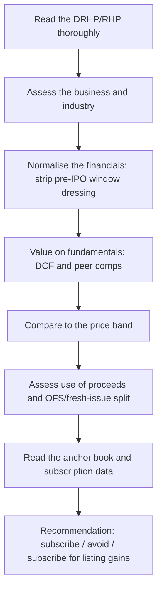

# IPO Analysis — Valuing a Company With No Trading History

## The Problem / Why this matters
An IPO strips away the analyst's usual anchors. There is no historical share price, no consensus, no track record of management delivering against public guidance, and — critically — the seller controls the disclosure and chooses the timing. Companies list when *they* believe conditions are favourable, which introduces a systematic bias into the entire exercise. Assessing an IPO well requires a distinct discipline from covering a listed company.

## Core Idea
IPO analysis is a **valuation problem with an adverse-selection overlay**. Value the business on fundamentals, then explicitly adjust for the structural fact that the issuer chose the timing, controls the narrative, and has priced the issue to sell.

## Why it works this way
In secondary-market research, buyer and seller face the same public information. In an IPO, the seller has vastly superior information and chose both the moment and the framing. That asymmetry does not make every IPO a bad investment, but it means the default posture should be scepticism requiring evidence, rather than enthusiasm requiring disproof.

## Full technical content

### The prospectus is the primary source

The **DRHP** (Draft Red Herring Prospectus) and **RHP** are the most information-dense documents an analyst will encounter on a company, and most retail participants never read them. Priority sections:

| Section | What to extract |
|---|---|
| **Risk factors** | Legally mandated candour — the company must disclose what could go wrong. Read every one; the material risks are here, not in the marketing |
| **Objects of the issue** | What the money is actually for (see below) |
| **Financial statements + restated** | 3 years, restated to a consistent basis |
| **Related-party transactions** | Pre-IPO promoter dealings, often subsequently unwound |
| **Litigation and contingent liabilities** | Outstanding proceedings against the company and promoters |
| **Management and promoter background** | Prior ventures, any regulatory history |
| **Capital structure history** | Prices at which pre-IPO investors bought — the single most useful benchmark |
| **Basis for issue price** | The company's own justification, with its selected peer set |

**The pre-IPO placement price is the analytical goldmine.** The capital-structure section discloses what earlier investors paid and when. If a private round three or six months before the IPO was priced at ₹180 and the IPO band is ₹420–460, the analyst must ask what changed to justify a 2.5× uplift in months. Sometimes there is a genuine answer; often the answer is simply that the market window opened.

### Normalising pre-IPO financials

Companies frequently present unusually strong financials in the years immediately preceding a listing. Not necessarily improperly, but predictably. Check for:

- **Margin expansion in the pre-IPO year** that reverses historical patterns — often achieved through deferred spending on marketing, R&D or maintenance.
- **Working-capital tightening** immediately before listing, releasing cash flow that then reverses.
- **Related-party transactions restructured** just before the IPO — sales previously routed through promoter entities being brought in-house, flattering revenue and margin.
- **One-offs** included in the growth narrative.
- **Change in accounting policy** or a restatement improving the trend.
- **Promoter remuneration** reduced pre-IPO and restored afterward.

The corrective: build the forecast from **normalised** rather than peak-reported margins, and test whether the pre-IPO growth rate is achievable when the pre-listing incentives disappear.

### Objects of the issue — where the money goes

Read the fresh-issue/OFS split (covered in the OFS chapter) and then the specific use of the fresh-issue proceeds:

| Use of proceeds | Signal |
|---|---|
| Capacity expansion / growth capex | Genuine growth funding — positive |
| Debt repayment | Balance-sheet repair; check whether the debt was productive |
| Working capital | Routine; assess whether it funds growth or plugs a gap |
| Acquisition (unspecified target) | Weak — the company is raising money without a defined plan |
| **"General corporate purposes"** in large proportion | Weak — regulation caps this, but a large allocation signals no specific plan |
| Repayment of promoter loans | Genuine concern — public money repaying insiders |

### The anchor book

Anchor investors are allotted the day before the issue opens, at the issue price, with a lock-in. Their identity is disclosed and is genuinely informative:

- **Marquee long-only domestic mutual funds and reputable global institutions** anchoring in size is a credibility signal, since they conducted their own diligence with full access.
- **An anchor book dominated by smaller, less-known entities**, or one that is thinly subscribed, is a negative signal.
- **Anchor concentration** matters: a book spread across many quality names is stronger than one dependent on two or three.
- Note the **lock-in expiry dates** (typically a portion at 30 days and the remainder at 90 days) as scheduled supply events post-listing.

### Subscription data as it builds

During the bidding window, category-wise subscription is published daily:

- **QIB** subscription is the most informative — institutions with analytical resources voting with capital.
- **NII/HNI** subscription is often funded and leverage-driven, oriented to listing gains rather than fundamental conviction; very high NII subscription with weak QIB is a low-quality combination.
- **Retail** subscription reflects sentiment and marketing reach more than analysis.
- **The pattern matters more than the level**: strong QIB with weak retail suggests institutional conviction without retail hype; strong retail with weak QIB is the reverse and is generally the less encouraging configuration.

### Grey market premium — use with care

The GMP is an unofficial, unregulated indication of expected listing gain. It is genuinely informative as a sentiment gauge but is thin, easily influenced, and has no regulatory standing. Treat it as one input on *listing-day* expectations and as essentially uninformative about **fundamental value** — the two questions are entirely separate, and conflating them is the most common retail error.

### The two distinct recommendations

An IPO note should be explicit about which question it is answering:

1. **Subscribe for listing gains** — a short-horizon view driven by demand, GMP, subscription and market conditions. This is a trading call.
2. **Subscribe for the long term** — a fundamental view that the business at the issue price offers attractive returns over years.

These frequently diverge: an over-subscribed issue in a hot market may well deliver a listing pop while being expensive on fundamentals. Conflating them misleads the reader, and separating them explicitly is a mark of a well-constructed note.

### Valuation without a trading history

- **Peer comparison** is the primary method, but scrutinise the company's own selected peer set in the "basis for issue price" section — issuers routinely select flattering comparables. Construct your own.
- **DCF** is usable but rests entirely on forecast assumptions with no track record of public guidance to calibrate against; widen the scenario range accordingly.
- Apply an **IPO discount** in principle: a listing company has no public track record, unproven governance under public scrutiny, and impending lock-in supply. Demanding a discount to listed peers is analytically defensible, and the absence of one is a reason for caution.

## Common mistakes
- Not reading the **risk factors** and the **capital-structure history** in the prospectus.
- Extrapolating **pre-IPO peak margins** without normalising.
- Accepting the issuer's **selected peer set**.
- Treating **GMP** as a fundamental valuation signal.
- Conflating "**subscribe for listing gains**" with "good long-term investment."
- Ignoring **anchor lock-in expiry** as a scheduled post-listing supply event.
- Overlooking a large "**general corporate purposes**" allocation or promoter-loan repayment in the objects of the issue.
- Forgetting that the issuer chose the timing — the adverse-selection overlay applies to every IPO.

## Interview angle
"How would you evaluate an IPO?" Structure: read the DRHP properly — risk factors, objects of the issue, related-party transactions, and especially the capital-structure history showing what pre-IPO investors paid and when; normalise the financials for pre-IPO window dressing; build your own peer set rather than accepting the issuer's; value on fundamentals and compare to the band; assess the fresh-issue/OFS split and where the money goes; read the anchor book quality and the QIB-versus-retail subscription pattern. Then close with the framing that shows judgement: separate the listing-gain call from the long-term investment call, and remember the issuer chose the timing — the information asymmetry runs one way.
