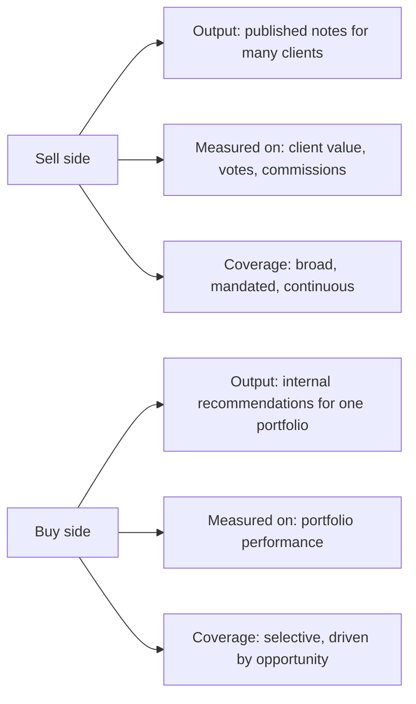

# The Buy-Side Analyst Role

## The Problem / Why this matters
Sell-side and buy-side research look superficially similar — both analyse companies and form views — but the jobs differ in objective, output, incentives and success measurement. Candidates frequently prepare for one and interview for the other, and the mismatch shows immediately. Understanding the distinction matters both for choosing a career path and for answering "why buy side?" credibly.

## Core Idea
The sell side produces **research as a product** distributed to many clients and monetised indirectly; the buy side produces **decisions on capital** for one portfolio, monetised by investment performance. Every difference in the role follows from that.

## Why it works this way
A sell-side analyst is measured on whether clients value their work — commissions, broker votes, rankings. A buy-side analyst is measured on whether the portfolio makes money. Those two objectives overlap substantially but not entirely, and where they diverge, the behaviours diverge.

## Full technical content

### The core differences

| Dimension | Sell side | Buy side |
|---|---|---|
| **Employer** | Broker, investment bank, independent research house | Mutual fund, hedge fund, PMS, insurance, pension, family office |
| **Output** | Published research notes, models, client calls | Internal recommendation memos, model, pitch to PM/IC |
| **Audience** | Many institutional clients | One PM or investment committee |
| **Coverage** | ~10–25 stocks, mandated, must cover all continuously | Selective; can ignore uninteresting names entirely |
| **Success measure** | Client votes, commission share, rankings, accuracy | Contribution to portfolio return |
| **Rating** | Public Buy/Hold/Sell with target price | Position recommendation with size |
| **Sizing** | Not required | **Required** — how much of the portfolio |
| **Time horizon** | Often 12 months by convention | Whatever the fund's mandate is |
| **Being wrong** | Reputational cost | Direct financial cost |
| **Access** | Strong — sell side gets management access and hosts conferences | Varies; often relies on sell-side-arranged access |

### What changes in the analysis itself

**1. Sizing replaces rating.** A sell-side Buy says a stock will outperform. A buy-side recommendation must say *how much of the portfolio* — which forces explicit engagement with conviction level, downside, correlation to existing holdings, and liquidity. This is why buy-side analysts think in risk-reward and position size rather than target prices.

**2. Selectivity replaces coverage obligation.** A sell-side analyst must publish on every stock in their coverage regardless of whether anything interesting is happening. A buy-side analyst can say "nothing to do here" and move on — a genuine luxury that concentrates effort where returns are available.

**3. Portfolio context matters.** A buy-side analyst must consider what the fund already owns: adding a fifth private bank has different portfolio consequences from adding the first, even if the stock is equally attractive standalone. Correlation and factor exposure become part of the analysis.

**4. Depth over breadth on fewer names.** Because there is no publishing obligation, a buy-side analyst can spend six weeks on one idea. The work often goes deeper than sell-side research on the same name, particularly on primary research.

**5. No requirement to be public or diplomatic.** Buy-side views can be as negative as the evidence supports, with no corporate-access consequence and no management relationship to preserve. This is a real analytical freedom.

**6. Different relationship with consensus.** The sell side effectively *is* part of consensus. The buy side uses sell-side research as an input — often primarily to understand what the market believes, so as to identify where it may be wrong.

### How the buy side actually uses sell-side research

Worth understanding because it explains what makes sell-side research valuable:

- **Models** — a well-built sell-side model saves the buy-side analyst days of work.
- **Consensus mapping** — understanding what the market expects, which is the baseline for finding differentiated views.
- **Access** — sell-side-arranged management meetings, conferences and expert calls.
- **Primary work** — channel checks and proprietary surveys the buy side cannot replicate at scale.
- **Sector education** — initiation notes as a fast route into an unfamiliar industry.

What the buy side generally does *not* use is the rating itself. This is why the most valued sell-side analysts are those whose work is deep, whose primary research is genuine, and who are available for detailed conversation — not those whose ratings have been most accurate.

### Fund-type variation within the buy side

| Fund type | Horizon | Style implications |
|---|---|---|
| **Long-only mutual fund** | 1–5 years | Benchmark-relative; constrained by mandate, sector limits, liquidity |
| **Hedge fund (long/short)** | Weeks to years | Can short; absolute-return focused; higher turnover; short ideas as valuable as longs |
| **PMS / family office** | Multi-year | Concentrated, less benchmark-constrained |
| **Insurance / pension** | Very long | Liability-driven, income-oriented, large size constrains small caps |

The **long/short** distinction matters most analytically: a long-only analyst's downside work protects the portfolio, while a long/short analyst's downside work is itself a source of return — which means forensic accounting and moat-erosion analysis are directly monetisable rather than merely defensive.

### The transition sell side → buy side

The common path, and what changes:
- Shift from **communication** skills to **decision** skills.
- Learning to size positions and think in portfolio rather than single-stock terms.
- Adjusting to less external validation — no rankings, no client feedback, only performance over time.
- Adjusting to a longer feedback loop: a call can look wrong for a year before being right, and the discipline is distinguishing "wrong" from "early."

## Common mistakes
- Assuming buy-side work is simply sell-side work without the writing — the sizing and portfolio-context dimensions are genuinely different analytical problems.
- Interviewing for buy-side roles with a **target-price** frame rather than a risk-reward-and-sizing frame.
- Underestimating how much buy-side value comes from **saying no** — most ideas examined are rejected.
- Believing the buy side reads sell-side ratings; they mostly read the analysis and use the access.
- Ignoring **liquidity and correlation** in a buy-side pitch.

## Interview angle
"Why do you want to be on the buy side rather than the sell side?" A credible answer engages with the actual differences: you want to be measured on decisions rather than on distribution; you want the selectivity to go deep on a few ideas rather than maintaining continuous coverage obligations; and you want to think in position sizing and portfolio context rather than in ratings. If asked to pitch, structure it the buy-side way: the idea, the differentiated insight, the risk-reward with a quantified bear case, the position size you would recommend and why, the liquidity constraint, and what would make you exit. Ending on the exit condition is what marks the answer as buy-side thinking rather than sell-side thinking with different vocabulary.
