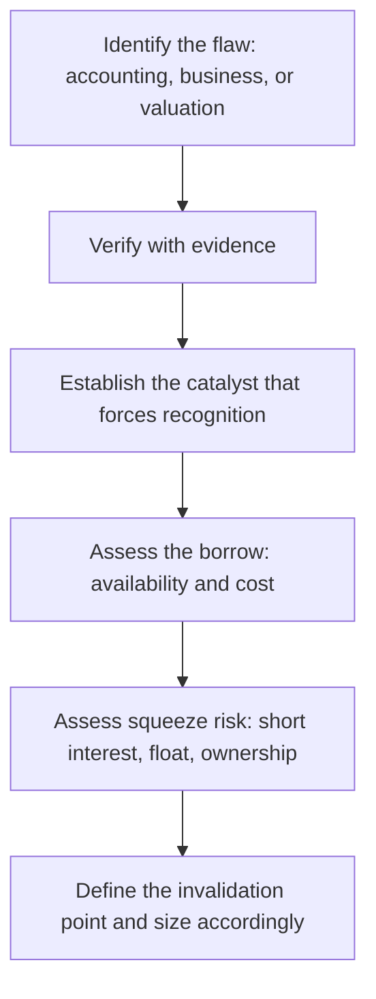

# Shorting and Bear-Thesis Construction

## The Problem / Why this matters
Almost all published equity research is bullish — typical sell-side rating distributions run heavily to Buy, with Sells often in low single-digit percentages. This creates a structural shortage of rigorous negative analysis, which is exactly why a well-constructed bear thesis is disproportionately valuable to the buy side. It is also genuinely harder: the asymmetry of short payoffs, the borrow constraint, and the career risk all work against it. Understanding how to build one is a differentiating skill even for an analyst who will never short.

## Core Idea
A short thesis requires everything a long thesis requires **plus a catalyst and a timeline**, because the payoff structure is inverted — losses are theoretically unbounded, gains are capped at 100%, and time works against the position through borrow cost.

## Why it works this way
A long position's worst case is losing the invested capital, and holding costs nothing. A short position's worst case is unbounded, and it costs borrow fees every day it is held. Being right eventually is sufficient for a long and insufficient for a short, which is why the analytical bar is higher.

## Full technical content

### The three families of short thesis

**1. Accounting / fraud shorts** — the reported numbers are not real. Built on the forensic-accounting toolkit: profit not converting to cash, receivables and inventory growth outrunning revenue, aggressive capitalisation, related-party flows, auditor resignations. These have the largest payoffs when correct and the highest evidentiary burden, and they typically require a catalyst — an auditor exit, a regulatory action, a short-seller report, a failed refinancing — to force recognition.

**2. Business-deterioration shorts** — the numbers are real but the business is structurally impaired. Technology substitution, moat erosion, a distribution channel being bypassed, a key patent expiring, permanent margin compression from a new low-cost entrant. These are the most analytically tractable and the most common productive short.

**3. Valuation shorts** — the business is fine but the price embeds impossible expectations. The most dangerous category, because an expensive stock can become far more expensive and there is no mechanism forcing correction. Valuation alone is rarely a sufficient short thesis; it needs a catalyst that changes the growth narrative.

### The reverse-DCF — the analytical tool for valuation shorts

Instead of forecasting cash flows to derive a value, invert it: take the **current market price** and solve for the growth and margin the market must be assuming. Then assess whether those implied assumptions are achievable.

*Example framing:* "At ₹2,400, the market is implying 27% revenue CAGR for ten years with terminal EBIT margin of 24%. The company has never exceeded 17% margin, the addressable market implies a 55% share at that revenue level, and no company in this industry globally has sustained 27% for a decade."

That is a far stronger argument than "it trades at 68x, which is expensive," because it identifies the specific implied assumption that fails a plausibility test — and it is checkable by the reader.

### The catalyst requirement

The single most common failure in short theses is being correct about the flaw and wrong about the timing. Acceptable catalysts:

| Catalyst type | Examples |
|---|---|
| **Scheduled** | Results, lock-in expiry, debt maturity, patent expiry, regulatory decision date |
| **Financial** | Refinancing requirement, covenant test, cash burn reaching a limit |
| **Structural** | Competitor capacity commissioning, technology launch, regulation taking effect |
| **Disclosure** | Auditor rotation, an accounting-standard change forcing disclosure, a mandated filing |
| **Sentiment** | Index exclusion, coverage initiation with a negative view, lock-in supply |

A thesis with a **dated** catalyst is far more actionable than one relying on the market eventually noticing.

### The mechanics that constrain the trade

**Borrow availability and cost.** A short requires borrowing the shares. In India this runs through the **Securities Lending and Borrowing (SLB)** mechanism, where availability is genuinely limited for many mid- and small-caps. Practical checks: is stock available to borrow, at what fee, and is the borrow **recallable**? A recall forces a buy-in at the worst possible moment.

Note the reflexive point: the stocks most attractive to short are often the ones hardest and most expensive to borrow, precisely because others have reached the same conclusion. High borrow cost is itself information — it tells you the trade is crowded.

**Squeeze risk.** Assess before entering:
- **Short interest as % of free float** — high levels mean crowded positioning.
- **Days-to-cover** (short interest ÷ average daily volume) — high days-to-cover means an exit stampede would be violent.
- **Free float size** — a small float with concentrated promoter holding is squeeze-prone.
- **Promoter/insider buying** — a promoter buying into a heavily shorted stock can force a squeeze.

**Cost of carry** — borrow fee plus any dividend the short must pay to the lender. A 12% annual borrow fee means the thesis must deliver more than 12% before it breaks even, and it means a thesis that takes three years to play out is uneconomic regardless of being correct.

**In derivative markets**, a short view can be expressed through single-stock futures or put options, which avoids the borrow problem but introduces expiry timing and, for options, time decay — trading one constraint for another.

### Constructing the note

A rigorous bear thesis contains:

1. **The specific flaw**, stated plainly in the first line.
2. **Evidence** — this bar is higher than for a long thesis, because the claim is contrarian and the consequences of being wrong are asymmetric. Prefer primary and documentary evidence over inference.
3. **What the market believes and why it is wrong** — often via reverse-DCF for valuation shorts.
4. **The catalyst and its timing.**
5. **The bull case, presented fairly** — a bear thesis that does not engage seriously with the strongest counter-argument is not credible.
6. **Invalidation condition** — what specific evidence would make you cover. Stated in advance.
7. **Mechanics** — borrow availability and cost, squeeze risk, position size.

### The asymmetry that governs sizing

Because losses are unbounded and gains capped, short positions are typically sized smaller than longs of equivalent conviction, with defined risk limits. Many practitioners set an explicit stop, not because the thesis has changed but because the position's risk profile requires it. The discipline that matters: **distinguish "the thesis is wrong" from "the position is too large"** — those require different responses, and confusing them is how short books blow up.

### The professional and career dimension

Publishing a Sell has real consequences: loss of management access, hostility from the company, and occasionally legal pressure. This is precisely why so few exist, and why a well-evidenced Sell builds outsized credibility with institutional clients who are structurally starved of genuine negative research. Analysts who publish rigorous, fair Sells and are subsequently proven right build durable reputations from them.

## Common mistakes
- Shorting on **valuation alone**, with no catalyst — expensive stocks routinely get more expensive.
- Correct thesis, **no timeline** — carry cost erodes the position while you wait.
- Not checking **borrow availability and cost** before committing to the idea.
- Ignoring **squeeze risk** in a crowded, high-days-to-cover name.
- Sizing a short like a long, despite the unbounded downside.
- Failing to state an **invalidation condition**, so the position is never re-examined.
- Not engaging with the strongest **bull argument**, making the thesis look like advocacy.
- Confusing "the market is irrational" with an investment thesis.

## Interview angle
"Pitch me a short." Structure: state the specific flaw in one line — accounting, business deterioration, or expectations embedded in the price; give the evidence, ideally documentary or primary; if it is a valuation short, use a reverse-DCF to show precisely what the market must be assuming and why that is implausible; then the catalyst with timing, because a short without one is a carry-cost trap. Close on mechanics and risk: borrow availability and cost, short interest and days-to-cover for squeeze risk, the position size given unbounded downside, and the specific condition that would make you cover. Naming the invalidation condition unprompted is what marks a disciplined answer.
