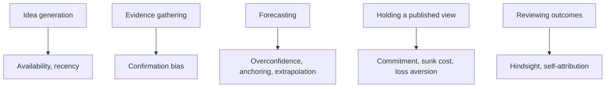

# Behavioural Biases in the Analyst's Own Process

## The Problem / Why this matters
Behavioural finance is usually taught as an explanation for *market* mispricing — other people's irrationality creating opportunity. The more useful and less comfortable application is inward: the analyst is subject to the same biases, and an analyst who cannot identify their own is systematically less accurate. Interviewers ask about this because self-awareness about process failure is a genuine differentiator, and because a candidate who can describe a call they got wrong and *why* is demonstrating exactly the reflective capacity the job requires.

## Core Idea
The analyst's process is vulnerable at specific, identifiable points — idea generation, evidence gathering, forecasting, and holding a published view. Each vulnerability has a known bias and a practical counter-discipline.

## Why it works this way
Research is a sequence of judgements under uncertainty with delayed, noisy feedback — precisely the conditions under which cognitive biases operate most strongly and are hardest to detect. Markets punish these errors financially, but the feedback arrives slowly enough that the connection between the process failure and the outcome is easy to miss.

## Full technical content

### At idea generation

**Availability and recency bias** — ideas come disproportionately from what is salient: recent news, a sector that has just performed, a company that presented at a conference last week. The counter-discipline is a **systematic screen** run on defined criteria, so the idea funnel is not driven by attention.

**Familiarity bias** — over-covering what you already know and under-exploring unfamiliar sectors where mispricing may be greater precisely because fewer people have looked.

### At evidence gathering — the dominant bias

**Confirmation bias** is the most consequential failure in research. Once a view forms — often within the first hours of looking at a company — subsequent evidence gets filtered: supporting data is accepted readily, contradicting data is scrutinised for flaws until a reason to discount it is found.

Practical counters:
- **Write the bear case first**, before the bull case, when initiating on a company you like.
- **Pre-commit to falsification conditions** — state in advance what evidence would change your mind, before you encounter it. This is the single most effective counter, because it removes the ability to redefine disconfirming evidence after the fact.
- **Actively seek the strongest opposing view** — read the most credible bearish note on your bullish idea and engage with its best argument rather than its weakest.
- **Red-team review** — have a colleague argue the opposite case internally.

**Narrative bias** — a compelling story about a company is more persuasive than it should be, and stories are easier to remember than base rates. The corrective is to check the story against the numbers: if the narrative says transformation, incremental RoCE should show it.

### At forecasting

**Overconfidence** — forecast ranges are systematically too narrow. Analysts asked for 90% confidence intervals produce ranges containing the outcome far less than 90% of the time. The counter is to widen scenario ranges deliberately, and to build bear cases from coherent narratives rather than by mechanically shading the base case.

**Anchoring** — the first number encountered exerts disproportionate influence. Specific anchors in research: the current share price (which quietly shapes the target price), consensus (which makes a differentiated estimate feel risky), management guidance, and one's own previous forecast. The counter is to **build the forecast from drivers before looking at consensus or the current price**, then compare — rather than starting from consensus and adjusting.

**Extrapolation** — projecting recent trends indefinitely. This is the mechanism behind analysts being systematically late at cycle turning points in both directions. Counter with explicit **base rates**: how often do companies sustain 25%+ growth for five years? How frequently do margins at cyclical peaks persist? Historical frequency is a better starting point than the recent trend.

**Conservatism / underreaction** — revising estimates too slowly and too incrementally after genuinely new information, which is the documented mechanism behind post-earnings-announcement drift. When something materially changes, make the full revision at once rather than in cautious steps.

### At holding a published view

**Commitment and consistency bias** — once a Buy is published with your name on it, admitting error is costly, so the incentive is to defend rather than to revise. This is the most professionally damaging bias because it is reinforced by external pressure.

**Sunk-cost fallacy** — six weeks of work on an initiation makes abandoning the thesis feel wasteful, even when the evidence has changed. The work is spent regardless; only the forward evidence matters.

**Loss aversion** — reluctance to downgrade a losing call and crystallise being wrong, versus willingness to take a small win by upgrading a stock that has performed.

Counters: **scheduled thesis reviews** independent of price moves, pre-committed invalidation conditions, and a culture where changing a view promptly is treated as competence rather than failure. An analyst who downgrades quickly on new evidence is more valuable than one whose ratings never change.

### At reviewing outcomes

**Hindsight bias** — after the fact, the outcome feels as though it was predictable, which prevents genuine learning about what was actually knowable at the time.

**Self-attribution bias** — correct calls attributed to skill, incorrect ones to bad luck or unforeseeable events. This asymmetry prevents improvement entirely.

The single most effective counter across both: a **decision journal**. At the time of each recommendation, record the thesis, the key assumptions, the confidence level, the falsification conditions, and what you expected to happen. Reviewing this later — before looking at the outcome — gives an honest read on whether the reasoning was sound, separately from whether the outcome was good. Good process can produce bad outcomes and vice versa, and only a contemporaneous record lets you tell them apart.

### Institutional biases worth naming

Beyond individual cognition, structural pressures push in predictable directions:
- **Optimism bias in sell-side ratings**, from corporate access, banking relationships and management goodwill.
- **Herding** — clustering near consensus because being wrong alone is more career-damaging than being wrong with everyone.
- **Career risk asymmetry** — a missed opportunity costs less professionally than a visible loss, biasing toward caution on contrarian calls.
- **Coverage pressure** — the obligation to publish continuously generates notes with no genuine view.

Naming these honestly is not cynicism; it is the precondition for resisting them.

## Common mistakes
- Treating behavioural finance as something that only affects **other** market participants.
- Forming a view early and then gathering evidence — the sequence that guarantees confirmation bias.
- Building the model **after** looking at consensus and the current price, guaranteeing anchoring.
- Bear cases constructed by shading the base case rather than from a coherent alternative narrative.
- Defending a published view under evidentiary pressure because the rating carries your name.
- Reviewing calls by outcome rather than by process quality.
- No contemporaneous record, so every post-mortem is contaminated by hindsight.

## Interview angle
"Tell me about a call you got wrong." The answer should demonstrate process reflection, not just narrate an outcome: state the thesis, what you assumed, what actually happened, and — critically — whether the **reasoning** was flawed or the reasoning was sound and the outcome adverse. Then name the specific bias if one was operating: did you anchor on consensus, extrapolate a trend past its base rate, or defend the view too long after contradicting evidence appeared? Finish with the process change you made. Candidates who can separate decision quality from outcome quality, and who describe a concrete counter-discipline like pre-committed falsification conditions or a decision journal, stand out sharply.
