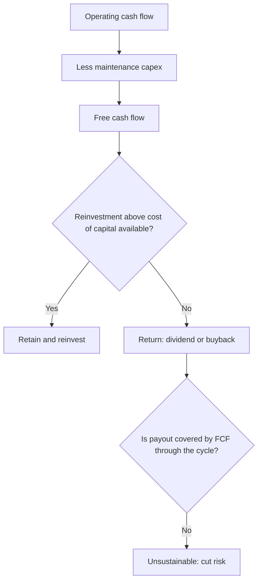

# Dividend Policy and Shareholder Returns

## The Problem / Why this matters
Dividend yield is one of the most widely quoted and least well-understood metrics in equity markets. A high yield can signal a mature, cash-generative, disciplined business — or a stock that has fallen sharply on a dividend the company can no longer afford. Distinguishing the two, and understanding how payout policy interacts with growth and valuation, is core to income-oriented equity research and to any long-horizon investment case.

## Core Idea
A company's payout policy is the visible output of its capital-allocation decision: what it cannot reinvest above the cost of capital, it should return. **Sustainability and coverage matter far more than the headline yield.**

## Why it works this way
Dividends are paid from cash, not from reported profit. A payout policy is sustainable only if free cash flow supports it through the cycle, after funding the maintenance capex the business genuinely requires. A dividend funded by debt, by asset sales, or by underinvestment is a transfer of future value to present shareholders, not a return generated by the business.

## Full technical content

### The core metrics

| Metric | Formula | What it tells you |
|---|---|---|
| **Dividend yield** | DPS ÷ price | Current income return |
| **Payout ratio** | DPS ÷ EPS | Share of earnings distributed |
| **FCF payout ratio** | Total dividend ÷ FCF | **The sustainability test** — more reliable than the earnings-based ratio |
| **Dividend cover** | EPS ÷ DPS | Inverse of payout; below ~1.5 warrants scrutiny |
| **Dividend CAGR** | Growth in DPS over 5–10 yr | Policy consistency and management confidence |
| **Total shareholder yield** | (Dividends + net buybacks) ÷ market cap | The complete picture of cash returned |

**The FCF payout ratio is the metric that matters most** and is the one most often skipped. A company paying out 60% of earnings sounds prudent; if it converts only half its earnings to free cash flow, that same dividend is consuming 120% of FCF and is being funded by the balance sheet.

### Assessing sustainability — the checklist

1. **Is the dividend covered by free cash flow**, not just by earnings, averaged across a full cycle rather than in one favourable year?
2. **Is maintenance capex genuinely being funded?** A dividend sustained by deferring necessary asset replacement is borrowing from the future.
3. **What is the debt trajectory?** Rising debt alongside a maintained dividend is the clearest warning sign.
4. **How did the dividend behave in the last downturn?** Maintained, cut, or suspended? This is the single best evidence of both policy commitment and genuine capacity.
5. **Is there a stated policy?** A formal payout-ratio or minimum-DPS policy is more credible than ad hoc declarations.
6. **Cyclicality of earnings** — a cyclical business with a high payout ratio at the cycle peak has an inevitably unsustainable dividend.

### The dividend-trap pattern

A high yield frequently reflects a falling price rather than a rising dividend — and the market is often correctly anticipating a cut. Diagnostic markers:

- Yield sharply above the company's own historical range and above sector peers.
- Payout ratio above ~80% of earnings, or above 100% of FCF.
- Deteriorating operating performance with the dividend held flat.
- Rising leverage.
- No stated policy, with the dividend maintained apparently to support the share price.

The analytical point: **a yield is only real if the dividend is paid.** Model the dividend forward from FCF rather than assuming the trailing DPS persists.

### Dividends versus buybacks

Both return cash; they differ in mechanics and signalling:

| | Dividends | Buybacks |
|---|---|---|
| **Signal** | Commitment — cutting is punished, so raising signals confidence | Flexible — can be paused without penalty |
| **Value creation** | Value-neutral in itself | Creates value **only if bought below intrinsic value** |
| **Who benefits** | All shareholders equally | Continuing shareholders, at the expense of sellers if underpriced |
| **Effect on share count** | None | Reduces it (permanently, in India, via mandatory extinguishment) |
| **Best used when** | Stable, predictable cash generation | Stock trades below intrinsic value; cash flow is lumpy |

**The buyback discipline test:** examine the prices at which the company has historically repurchased. Buying back at valuation peaks — common, because that is when cash and confidence are highest — destroys value for continuing shareholders. Also check whether the buyback genuinely reduces share count or merely offsets ESOP issuance, in which case it is compensation expense routed through the buyback line.

### The dividend-discount model

For stable, dividend-paying businesses, the DDM provides a valuation cross-check:

**Value = D₁ ÷ (Ke − g)**

Its practical limits: extremely sensitive to the spread between the cost of equity and growth (the same denominator problem as the perpetuity-growth terminal value), inapplicable to non-payers, and it values only distributed cash rather than the full cash-generating capacity. Most useful for utilities, mature financials and REITs; least useful for growth companies.

The **sustainable growth rate** relationship is the more broadly useful idea it embeds:

**g = RoE × (1 − payout ratio)**

This states formally that a company can only grow from retained earnings at the rate its returns and retention allow. A company forecasting 20% growth with a 15% RoE and a 50% payout is implicitly assuming external funding — which the model should then show explicitly. This is a fast, powerful consistency check on any forecast.

### Policy interpretation as a signal

- **Initiating a dividend** typically signals a transition to maturity and confidence in sustainable cash generation.
- **Raising the payout ratio** can be positive (discipline, returning what cannot be reinvested well) or negative (an admission that growth opportunities have run out) — read it against the incremental-RoCE evidence.
- **Cutting** is severely punished, which is precisely why managements resist it and why a cut, when it comes, is credible information about genuine stress.
- **Special dividends** signal a one-off event rather than a change in ongoing capacity, and should not be capitalised into a forward yield.

### The Indian context

Taxation of dividends in the hands of shareholders (rather than at the company level) changed the relative attractiveness of dividends versus buybacks for different investor classes, and payout behaviour shifted accordingly. Note also that **PSUs frequently carry elevated payout ratios** driven by government fiscal requirements rather than by an optimal capital-allocation judgement — a structural feature worth naming rather than reading as management discipline.

## Common mistakes
- Screening on **dividend yield** without checking FCF coverage — the classic dividend trap.
- Using the **earnings** payout ratio rather than the FCF payout ratio for sustainability.
- Assuming the trailing dividend persists rather than modelling it forward from cash flow.
- Ignoring **maintenance capex** when assessing whether a payout is genuinely funded.
- Treating a buyback as automatically shareholder-friendly regardless of the price paid.
- Not checking whether buybacks merely offset **ESOP dilution**.
- Capitalising a **special dividend** into a forward yield.
- Applying the **DDM** to a company whose value comes from reinvestment rather than distribution.

## Interview angle
"A stock yields 9% against a sector average of 2%. Interesting?" Treat it as a warning rather than an opportunity until proven otherwise: check whether the yield rose because the price fell; test the FCF payout ratio, not just the earnings payout; verify that maintenance capex is being funded and that debt is not rising to sustain the payment; check what happened to the dividend in the last downturn; and confirm whether a stated policy exists. If the dividend is genuinely covered by through-cycle free cash flow with stable leverage, it may be a genuine opportunity — otherwise the market is pricing an anticipated cut, and the yield is a number that will not be paid.
