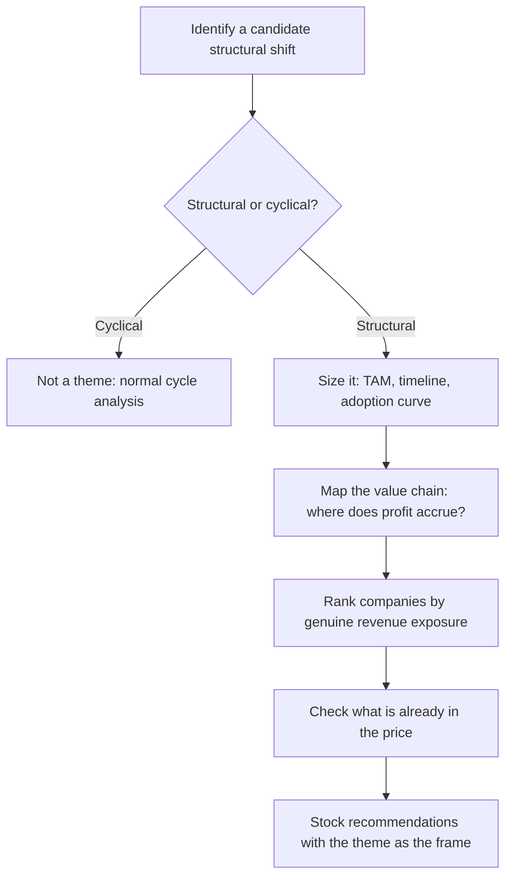

# Thematic and Top-Down Research

## The Problem / Why this matters
Single-stock research answers "is this company mispriced?" Thematic research answers a different and often more valuable question: "is this *shift* mispriced, and which companies are positioned for it?" Structural changes — energy transition, premiumisation, formalisation, import substitution, demographic shifts — play out over years and affect whole groups of companies simultaneously. A well-constructed thematic note can generate multiple actionable ideas from one body of work, which is why it is among the highest-leverage formats a research analyst produces.

## Core Idea
Thematic research identifies a **structural change**, establishes that it is real and durable rather than cyclical, maps the **value chain** to find where the profit accrues, and then ranks companies by genuine exposure — distinguishing real beneficiaries from those merely associated with the narrative.

## Why it works this way
Markets price cyclical changes reasonably efficiently because they are familiar and recur. Structural changes are harder: they unfold slowly, their magnitude is uncertain, and analysts anchored to historical patterns systematically underestimate them in the early stages and overestimate them once they become consensus. That asymmetry is the opportunity.

## Full technical content

### Step 1 — Distinguishing structural from cyclical

The most important and most frequently skipped test. A structural change alters the *level* or *nature* of demand permanently; a cyclical change alters its timing. Diagnostic questions:

- Is there an identifiable **driver that does not reverse**? Regulation, demographics, technology cost curves, income thresholds crossed.
- Has a similar transition **occurred in another market** already, giving an empirical template? (Cross-country analogues are the strongest available evidence — a category's penetration path in a comparable economy at a similar income level.)
- Does the change **survive a downturn**? Structural shifts continue through recessions; cyclical enthusiasm does not.
- Is the underlying **unit economics** changing, or only the volume?

### Step 2 — Sizing and timing the theme

- **Total addressable market** and the realistic penetration path — build this bottom-up rather than citing an industry report's headline number.
- **The adoption curve.** Most structural shifts follow an S-curve: slow early adoption, rapid acceleration, then saturation. Identifying where on the curve a theme currently sits is the central analytical judgement, because returns are concentrated in the acceleration phase and the market usually prices the theme fully only after it has begun.
- **The timeline** — themes frequently take longer than expected to arrive and then move faster than expected once they do. Being early is functionally the same as being wrong for a position with a defined horizon.
- **The base rate check** — how quickly have comparable transitions actually occurred elsewhere? Analyst forecasts of adoption are systematically optimistic on timing.

### Step 3 — Value-chain mapping — where the profit actually goes

This is where thematic research either creates or destroys value. A theme's existence does not tell you who profits from it. The disciplined approach maps the chain and asks, at each link, whether that participant has pricing power:

*Example — an electrification theme:* raw materials (lithium, copper) → cell manufacture → battery packs → vehicle assembly → charging infrastructure → power generation → grid equipment. Each link has different competitive intensity, different capital intensity, and different barriers. Historically in technology transitions, **assembly is often the most competitive and least profitable link**, while control of a scarce input or a proprietary component captures disproportionate profit.

The two questions at each link:
1. Is there a **structural barrier** at this link, or will competition compete returns away? (This is the moat framework applied to a value chain.)
2. Is the link's profit pool **growing faster than its capacity**? Capacity that arrives faster than demand destroys the economics regardless of theme strength.

**The "picks and shovels" observation** generalises this: in many transitions the enablers — the equipment, components or infrastructure everyone needs regardless of which end-player wins — capture more durable profit than the end-players competing with each other.

### Step 4 — Ranking companies by genuine exposure

The most common failure in thematic investing is buying companies **associated with** a theme rather than **exposed to** it. Discipline:

| Test | Question |
|---|---|
| **Revenue exposure** | What % of current revenue actually comes from the theme? |
| **Forward exposure** | What % of forecast incremental revenue? |
| **Margin on theme revenue** | Is the theme-related business as profitable as the base? |
| **Competitive position within the theme** | Is the company a leader or a marginal participant? |
| **Investment required** | What capex is needed, and does it earn above the cost of capital? |

A company deriving 4% of revenue from a theme is not a theme play regardless of how often management mentions it on calls. Conversely, a company with 40% exposure whose management never uses the theme's vocabulary may be the better exposure precisely because it is less recognised.

**Watch for narrative attachment** — companies repositioning their communications to attach to a fashionable theme without changing the business. Compare the frequency of theme mentions on concalls against the actual segment revenue disclosure; a widening gap between the two is a real signal.

### Step 5 — What is already priced in

A correct theme is not an investable idea if the market has already discounted it fully. Tests:
- Have the identified beneficiaries **already re-rated** relative to their own history and to the market?
- Use a **reverse-DCF** on the leading names: what growth does the current price imply, and is it plausible even if the theme plays out as expected?
- Is the theme now **consensus**? Widely covered themes with universal analyst enthusiasm rarely offer attractive risk-reward at that stage.

The most valuable thematic work is typically done when a theme is **identifiable but not yet consensus** — which necessarily means it feels less certain at the time of writing.

### Top-down versus bottom-up integration

Thematic research is top-down in origin but must terminate in bottom-up stock work. A theme note that identifies a genuine structural shift and then recommends companies without company-specific valuation, balance-sheet and governance analysis has done half the job. The failure mode is buying a poor company because it is in a good theme — a structurally attractive industry does not rescue a badly capitalised or badly governed participant.

### Format

A thematic note typically runs 15–40 pages: the thesis and its evidence, sizing and timeline, value-chain map, the ranked beneficiary list with exposure quantified, what is priced in, risks to the theme itself, and specific stock recommendations with targets. Its distinguishing feature is that it should generate **several actionable ideas** from one research effort, which is what makes the format efficient.

## Common mistakes
- Failing to test whether a shift is **structural or cyclical** — the foundational error.
- Sizing the theme from an **industry report headline** rather than a bottom-up build.
- Assuming theme growth translates to profit **without mapping the value chain**.
- Recommending companies **associated with** rather than **exposed to** the theme.
- Ignoring what is **already priced in** — being right about the theme and wrong about the entry.
- Underestimating the **timeline**, so a correct theme becomes a poor position over the relevant horizon.
- Abandoning company-level rigour because the theme is compelling.
- Ignoring that capacity often arrives faster than demand in a hot theme, destroying the economics.

## Interview angle
"Pitch me a theme." Structure: name the structural shift and prove it is structural, not cyclical — the non-reversing driver, and ideally a cross-country analogue showing the same transition already completed elsewhere; size it bottom-up with an explicit view on where the adoption curve currently sits; map the value chain and identify **which link captures the profit and why** — usually where a barrier exists, often the enablers rather than the end-players; rank companies by actual revenue exposure rather than narrative association; and check what is already in the price using a reverse-DCF on the leaders. Naming a link that will *not* profit despite being in the theme is what demonstrates you have done the value-chain work rather than adopted a story.
