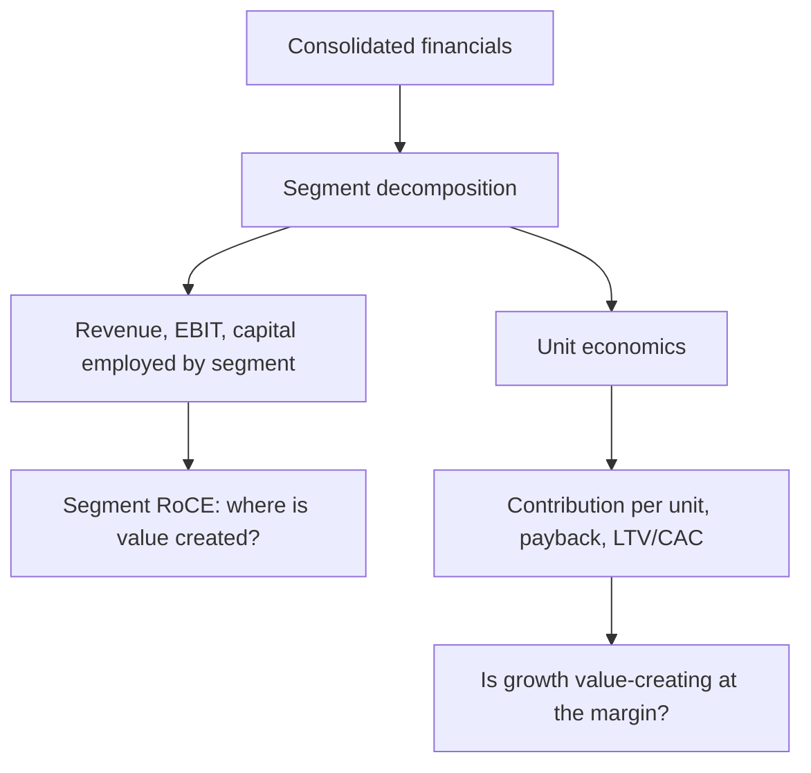

# Segment and Unit Economics Analysis

## The Problem / Why this matters
Consolidated financials average away the most important information in a multi-business company. A group reporting 12% EBIT margin might contain a 28%-margin core business subsidising a loss-making expansion — and the investment case depends entirely on which of those is growing. Similarly, a company's aggregate growth tells you nothing about whether it is acquiring customers profitably. Segment and unit-economics analysis is how an analyst gets underneath the consolidated numbers to the economics that actually drive value.

## Core Idea
Decompose the business to the smallest level the disclosure supports — by segment, and where possible to a **repeatable unit** (a store, a customer, a plant, a subscriber) — because value is created or destroyed at the unit level, and consolidated numbers hide it.

## Why it works this way
A company is a portfolio of activities with different economics. Aggregating them produces a number that describes none of them. Where a business is scaling, the consolidated picture is especially misleading: growth costs are expensed immediately while the returns accrue over years, so a business with excellent unit economics can report poor consolidated profitability precisely *because* it is growing well.

## Full technical content

### Segment analysis

**What to extract.** Indian accounting standards require segment disclosure of revenue, results and, usually, segment assets and liabilities. From that, build:

| Metric | Derivation | What it reveals |
|---|---|---|
| Segment revenue growth | YoY per segment | Where growth actually comes from |
| Segment EBIT margin | Segment result ÷ segment revenue | Which businesses are profitable |
| **Segment RoCE** | Segment EBIT ÷ segment capital employed | **Where value is created** — the key metric |
| Capital employed mix | Segment capital ÷ total | Where management is deploying money |
| Incremental capital by segment | Δ capital employed | Where management is *increasing* deployment |

**The critical cross-check:** compare where capital is being deployed against where returns are highest. A company deploying most incremental capital into its lowest-RoCE segment is destroying value regardless of consolidated growth — and this is visible only through segment analysis. It is one of the most reliably valuable findings in fundamental research and one of the least frequently performed.

**Practical complications:**
- **Unallocated corporate costs** sit outside segments; treat them explicitly (as in SOTP) rather than ignoring them.
- **Inter-segment transfers** at internal prices can shift reported profit between segments; check the disclosure note.
- **Segment definitions change**, breaking comparability. When a company re-segments, restate history where possible — and note that re-segmentation immediately before a weak period is worth a second look.
- Some companies disclose **only revenue by segment**, not profit, which materially limits the analysis and is itself a disclosure-quality signal.

### Unit economics

Where segment analysis decomposes by business line, unit economics decomposes to the repeatable transaction or asset. The relevant unit varies:

| Business | Unit | Core metrics |
|---|---|---|
| Retail / QSR | A store | Revenue per store, store-level EBITDA margin, capex per store, payback period, same-store sales growth |
| Subscription / fintech | A customer | CAC, ARPU, gross margin per user, churn, LTV, LTV/CAC, payback months |
| Manufacturing | A plant / tonne | Realisation per tonne, cost per tonne, capacity utilisation, EBITDA per tonne |
| Lending | A loan / borrower | Yield, cost of funds, credit cost, opex per account, RoA per product |
| Hotels | A room | ARR, occupancy, RevPAR, cost per available room |
| Airlines | A seat-kilometre | RASK, CASK, load factor, spread |

### The customer-economics chain

For subscription and consumer-internet businesses, the standard framework:

- **CAC (Customer Acquisition Cost)** = sales and marketing spend ÷ new customers acquired in the period.
- **Contribution margin per customer** = ARPU × gross margin %, less variable servicing cost.
- **Churn** — the annual or monthly rate at which customers leave; **customer lifetime ≈ 1 ÷ churn rate**.
- **LTV (Lifetime Value)** = contribution margin per period × lifetime, discounted.
- **LTV/CAC ratio** — a widely used benchmark, with roughly 3× often cited as a reasonable threshold, though the appropriate level varies by capital intensity and churn.
- **Payback period** = CAC ÷ contribution margin per month. Shorter payback means growth is self-funding sooner and the business needs less external capital.

**Payback period is frequently more informative than LTV/CAC**, because LTV depends on a churn assumption extrapolated over many years — the most uncertain input in the chain — whereas payback depends only on near-term, observable figures. A business claiming 5× LTV/CAC on a 40-month payback is making a much weaker claim than one showing 3× on an 11-month payback.

### Cohort analysis — the honest version of unit economics

Aggregate metrics can improve simply because of mix shifts rather than genuine improvement. **Cohort analysis** — tracking each acquisition cohort separately over time — is the corrective, and it answers questions aggregates cannot:

- Is retention improving for **newer cohorts** versus older ones, or does the aggregate simply reflect a growing share of recent (not-yet-churned) customers?
- Does revenue per customer **expand** within a cohort over time (a strong signal) or decay?
- Is CAC rising as the company scales beyond its most accessible customer segment — the near-universal pattern, and one that aggregate CAC masks during rapid growth?

The last point matters enormously in practice: a fast-growing company's blended CAC is dominated by its cheapest early customers, and the *marginal* CAC of the newest cohort is what determines whether continued growth remains economic.

### Same-store / like-for-like metrics

For any business adding capacity, separating growth from **new units** and growth from **existing units** is essential. Same-store sales growth (SSSG) isolates the underlying business's health from expansion. A company reporting 24% revenue growth of which 22 points come from new stores and 2 from SSSG is a very different proposition from the reverse — the first is buying growth with capital, the second is generating it.

The paired check: **new-store payback**. Expansion creates value only if new units earn above the cost of capital, so revenue growth from expansion must be assessed against capex per unit and time to maturity.

### Connecting to valuation

Unit economics enter valuation directly:
- A business with proven unit economics but consolidated losses due to growth investment can be valued on **mature-state unit economics** applied to a forecast unit count — the standard approach for scaling businesses, though it depends entirely on the maturity assumption being defensible from cohort evidence.
- Segment RoCE justifies **different multiples for different segments**, which is the analytical basis for SOTP.
- Deteriorating marginal unit economics is one of the earliest warnings that a growth story is ending, typically visible in cohort data well before it appears in consolidated results.

## Common mistakes
- Analysing only **consolidated** figures for a genuinely multi-business company.
- Not computing **segment RoCE**, and therefore missing capital being deployed into the lowest-return business.
- Using **blended CAC** for a fast-growing company, masking rising marginal acquisition cost.
- Relying on **LTV/CAC** where LTV rests on an unvalidated long-horizon churn assumption; payback is more robust.
- Reading aggregate retention improvement that is actually a **cohort-mix artefact**.
- Ignoring **SSSG**, treating expansion-driven growth as organic strength.
- Missing **segment re-definition** that breaks historical comparability.
- Valuing a loss-making scaling business on mature unit economics without cohort evidence that maturity is achievable.

## Interview angle
"A company is growing revenue 30% but losing money. How do you decide whether it's a good business?" Go to unit economics: is the *unit* profitable — contribution margin per customer or per store positive after variable costs? What is the CAC payback period, and is marginal CAC for the newest cohort rising or stable? Does cohort data show retention holding and revenue expanding within cohorts? Then separate growth investment (expensed now, returns later) from genuine operating losses, and check segment RoCE to see whether incremental capital is going into the highest-return part of the business. The conclusion follows: profitable units plus a reasonable payback plus stable marginal CAC means losses are growth investment; deteriorating marginal economics means they are not.
