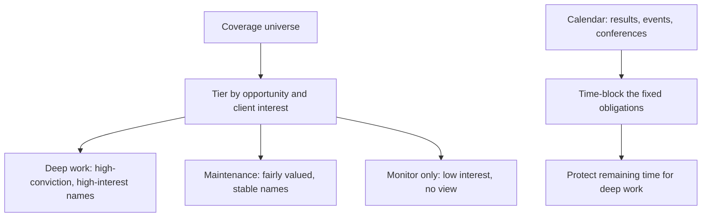

# The Analyst Workflow and Coverage Management

## The Problem / Why this matters
An equity research analyst typically covers 10–25 companies while fielding client calls, attending management meetings, updating models through earnings season, and producing thematic work — all with hard, externally-imposed deadlines. Analytical ability is necessary but not sufficient; analysts fail far more often from workflow collapse than from inability to value a company. How an analyst organises coverage, prioritises attention and maintains models is a genuine professional skill, and it is what makes the difference between covering 12 names well and covering 20 badly.

## Core Idea
Coverage is a **portfolio of attention**. Not every stock deserves equal effort, and the analyst's core management decision is continuously reallocating time toward where the marginal research hour produces the most client value — which is rarely spread evenly.

## Why it works this way
Research effort has sharply diminishing returns per name. The eleventh hour spent on a well-understood, fairly valued large-cap produces almost nothing; the first hour on an under-covered name where something has just changed can produce a genuine idea. Since total hours are fixed, allocation is the highest-leverage decision an analyst makes.

## Full technical content

### Tiering the coverage universe

Not a formal industry practice, but a discipline good analysts apply informally:

| Tier | Characteristics | Effort |
|---|---|---|
| **Active ideas** | High conviction, differentiated view, significant client interest | Deep, continuous — primary research, frequent updates |
| **Core coverage** | Large, widely held, must maintain a credible view | Full model maintenance, results updates, but limited primary work |
| **Maintenance** | Fairly valued, no differentiated view currently | Model updated at results; monitor for change |
| **Watch** | Not formally covered but relevant to the sector | Track key data; initiate if an inflection appears |

The judgement is recognising when a name should **move tiers** — an inflection in a maintenance name deserves promotion to deep work, and an active idea whose thesis has played out should be demoted rather than defended.

### The annual rhythm

Indian equity research runs on a predictable quarterly cycle, and the calendar largely determines workload:

| Period | Dominant activity |
|---|---|
| **Results season** (roughly 4–6 weeks per quarter) | Previews, live result reactions, concalls, updates, revised estimates |
| **Post-results** | Management meetings, channel checks, deeper thematic work |
| **Pre-results** | Preview notes, consensus checks, positioning assessment |
| **Conference season** | Corporate access events, group meetings, client interaction |
| **Annual report season** | The deepest single source — full notes, related-party disclosures, accounting policy |

**The annual report deserves specific mention.** It is the most information-dense document a covered company produces, and it arrives when analysts are least busy. Reading it properly — notes, related-party transactions, contingent liabilities, accounting policy changes, auditor's report, management discussion — is where most durable analytical edge on a covered name is actually built.

### Model maintenance discipline

Models decay. Practical hygiene:

- **Update immediately after results**, while the detail is fresh. Deferred updates accumulate and become error-prone.
- **Keep one master file per company**, versioned by date, with a clear changelog of what was revised and why.
- **Maintain an assumptions log** — when you change a forecast driver, record the reason. Six months later, "why did I assume 14% margin?" is a question you must be able to answer.
- **Reconcile to reported figures** every quarter — actual versus your estimate, line by line. This is how forecasting accuracy improves; without it you never learn which lines you systematically get wrong.
- **Re-check the balance and sanity checks** after every update, since edits break links.

### Information intake

The daily-to-weekly routine that keeps coverage current:

- **Exchange filings** for covered names — the primary source, and the only one that is both complete and timely.
- **Concall transcripts**, including those of competitors, customers and suppliers, which frequently contain more about your company than its own call does.
- **Sector and channel data** — monthly volumes, price data, government datasets.
- **Competitor research**, to know what consensus believes.
- **News and regulatory announcements.**

The discipline is having a **defined intake routine** rather than reacting to whatever surfaces, so that a material filing on a maintenance-tier name does not go unnoticed for a week.

### Client interaction

For sell-side analysts, client-facing work is a substantial share of time and the primary channel through which research is valued:
- **Inbound calls** — reactive, unpredictable, and the main mechanism by which clients form a view of an analyst's depth.
- **Marketing** — roadshows and calls presenting recent work.
- **Corporate access** — arranging and hosting management meetings, one of the most valued services.
- **Bespoke work** — a specific model or analysis for a large client.

The practical tension: client work is externally scheduled and urgent, deep research is internally scheduled and important. Without deliberately **protecting blocks of time** for the latter, it is systematically crowded out — which is the most common way an analyst's work quality declines without any single visible failure.

### The information-management problem

Over years of covering a company, an analyst accumulates concall notes, meeting notes, channel-check findings, and observations that will matter later but are impossible to recall on demand. A simple **per-company running file** — dated entries of what management said, what checks found, what changed — compounds enormously in value. Its highest use is checking what management said two years ago against what happened, which is the raw material for the guidance-accuracy assessment in management-quality work.

### Judging your own accuracy

Few analysts systematically track their own record; those who do improve faster. Worth maintaining:
- **Estimate accuracy** — your forecast versus actual, by line item, over time. Most analysts have systematic, correctable biases (typically over-forecasting revenue growth and under-forecasting cost inflation).
- **Recommendation performance** — absolute and relative to benchmark and sector, over the stated horizon.
- **Decision-quality review** — as covered in the behavioural material, assessing whether the reasoning was sound separately from whether the outcome was favourable.

## Common mistakes
- Spreading effort **evenly** across coverage rather than allocating to where marginal research value is highest.
- Deferring model updates through results season until the detail is no longer fresh.
- No **assumptions log**, so past forecast decisions cannot be reconstructed or learned from.
- Letting client work crowd out **protected deep-research time**.
- Not reading the **annual report** properly because results-season material feels more urgent.
- No systematic **intake routine**, so filings on lower-tier names are missed.
- Never reconciling estimates to actuals, so systematic forecasting biases persist uncorrected.
- Defending tier assignment — keeping an idea "active" after its thesis has played out.

## Interview angle
"How would you manage covering 15 companies?" Show that you understand it as an allocation problem rather than a scheduling one: tier the universe by where a differentiated view and client interest actually exist, giving deep primary work to a few names and disciplined maintenance to the rest; build the calendar around the fixed quarterly rhythm and protect blocks for deep work so client demands do not consume everything; maintain models immediately post-results with a logged assumptions trail; keep a running per-company file so historical management commentary is retrievable; and track your own estimate accuracy to find systematic biases. The point that lands well is recognising that the marginal research hour is worth far more on some names than others, and that reallocating it deliberately is the job.
