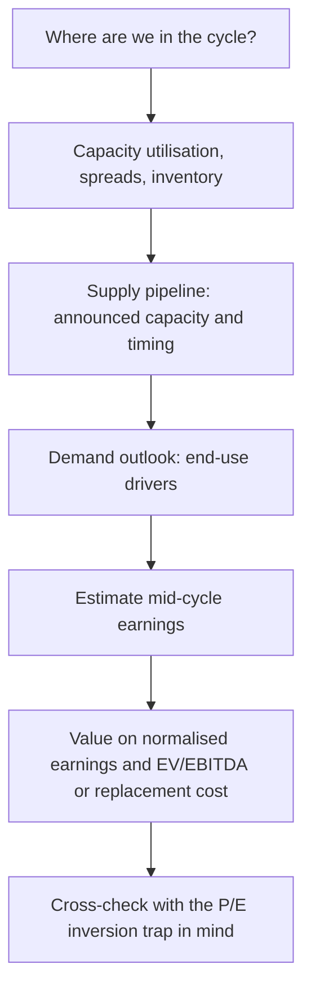

# Cyclical Industries and Commodity Analysis

## The Problem / Why this matters
Cyclicals are where the largest and most reliable analytical errors happen. The core trap is well documented and still routinely fallen into: a cyclical stock looks **cheapest on P/E at the earnings peak** and **most expensive at the trough**, so a valuation screen systematically recommends buying at exactly the wrong moment. Metals, cement, chemicals, autos, capital goods and shipping together form a substantial share of the Indian market, so an equity analyst cannot avoid the problem — only handle it well or badly.

## Core Idea
For a cyclical business, value derives from **mid-cycle earnings power**, not from current earnings. The analytical task is estimating where in the cycle the industry currently sits, what normalised earnings look like, and what the supply-demand balance implies for the next few years.

## Why it works this way
Cyclical earnings swing violently around a mean because prices are set by the marginal balance of supply and demand, and capacity adjusts with long lags. Capitalising a peak or trough earnings figure at a normal multiple therefore produces a value that is wrong by a large multiple, in the direction that feels most reassuring at the time.

## Full technical content

### The P/E inversion trap

| Cycle stage | Earnings | P/E on trailing earnings | What it looks like | What it actually is |
|---|---|---|---|---|
| **Peak** | Very high | **Low** (e.g. 6x) | "Cheap" | Most dangerous entry point |
| **Downturn** | Falling | Rising | "Getting expensive" | Deteriorating, but approaching value |
| **Trough** | Near zero or negative | **Very high or meaningless** | "Expensive" | Often the best entry point |
| **Recovery** | Rising | Falling | "Cheapening" | Usually the strongest phase to hold |

The corrective tools:
- **EV/EBITDA through the cycle** — less distorted than P/E because it removes leverage and depreciation effects.
- **Price to book / EV to replacement cost** — book value and asset replacement cost are far more stable than earnings, so P/B is a more reliable cyclical anchor. Buying quality cyclical assets meaningfully below replacement cost has historically been a durable approach, because no rational competitor builds new capacity when existing assets trade below the cost of building them.
- **Normalised (mid-cycle) EPS** — apply a mid-cycle margin to current revenue or capacity, then apply a normal multiple.
- **EV per tonne / per unit of capacity** — for homogeneous commodity assets, a directly comparable valuation anchor that is independent of where earnings currently sit.

### Reading where the cycle sits

The indicators that actually matter, roughly in order of usefulness:

**Capacity utilisation** — the single best cycle indicator. Above roughly 85–90%, pricing power appears and margins expand non-linearly; below 70%, price competition sets in and margins collapse. Utilisation is often disclosed by companies and estimated by industry bodies.

**The spread** — for a processing industry, the gap between output price and input cost (refining crack spread, steel spread over iron ore and coking coal, petrochemical delta). Spreads mean-revert and are the cleanest read on industry profitability, independent of any single company's cost position.

**Inventory levels** across the chain — at producers, distributors and end-users. Rising inventory with flat demand is the standard early warning that a downturn is beginning.

**The supply pipeline** — the most under-analysed factor and the most predictable. New capacity takes years to build and is publicly announced. An analyst who tracks announced capacity, commissioning dates and slippage can forecast the supply side with reasonable confidence, which is a genuine and durable edge because most participants extrapolate current prices instead.

**Cost-curve position** — where each producer sits on the industry cost curve determines who survives the trough. The marginal producer's cost sets the floor price; the lowest-cost producer earns through the cycle. This is the structural quality assessment for a commodity business.

### The capacity-cycle mechanism

Understanding the loop is what allows forecasting rather than extrapolation:

1. Demand exceeds supply → prices and margins rise
2. High returns attract investment → capacity is announced
3. Capacity takes 2–4 years to build → prices stay high in the interim, encouraging *more* announcements
4. Capacity commissions, often several projects simultaneously → supply exceeds demand
5. Prices fall, margins collapse, high-cost producers lose money
6. Investment stops, weak capacity closes, demand grows into the overhang
7. Cycle repeats

The forecastable part is step 3 to 4: **capacity commissioning dates are known in advance**. The most common failure is companies (and analysts) assuming peak prices persist while simultaneously modelling the industry's capacity additions — an internal contradiction, since that capacity is precisely what will end the peak.

### Commodity price forecasting — the honest position

An equity analyst should generally **not** forecast commodity prices with confidence; the professional approach mirrors the macro discipline:

- Use **forward curves** or consensus commodity forecasts as the base case, stated explicitly.
- Run **sensitivity** to price: "every $50/t change in the realised steel price changes FY27 EBITDA by X% and our value by Y%."
- Publish scenarios rather than a point view.
- Focus edge where it is genuinely available — **supply pipeline and cost-curve position** are analysable; the spot price next year mostly is not.

### Company-level differentiators within a cyclical industry

Two companies in the same cycle can have very different outcomes:

| Factor | Why it matters |
|---|---|
| **Cost-curve position** | Determines survival and through-cycle profitability |
| **Balance-sheet strength** | Determines whether the trough is survived and whether counter-cyclical acquisition is possible |
| **Operating leverage** | High fixed costs amplify both directions |
| **Integration** | Backward integration into raw materials stabilises the spread |
| **Product mix / value-add** | Speciality or downstream products dampen cyclicality |
| **Capex timing discipline** | Expanding at the trough versus the peak is the clearest management-quality signal in this sector |

That last point deserves emphasis: **capex timing through the cycle is the single most revealing capital-allocation test in a cyclical business**, because the temptation to expand at the peak — when cash is abundant and returns look best — is at its strongest precisely when it is most value-destructive.

### Structural versus cyclical deterioration

The judgement that matters most: is a downturn cyclical (recoverable) or structural (permanent)? A cyclical trough is an opportunity; a structural decline is a value trap wearing the same clothes. Tests:
- Is demand **deferred or destroyed**? Substitution and technology change destroy demand permanently.
- Has the **cost curve shifted** — a new low-cost region or process making existing capacity permanently uncompetitive?
- Is capacity actually **closing**, or being maintained by subsidy or by owners unwilling to write off assets? Chronic overcapacity that never clears turns a cycle into a permanently poor industry.

## Common mistakes
- Buying on a **low trailing P/E at the peak** — the canonical error.
- Modelling peak prices as persistent while simultaneously modelling the industry's own capacity additions.
- Ignoring the **announced supply pipeline**, which is publicly knowable.
- Forecasting commodity prices confidently rather than publishing sensitivities.
- Using **P/E** rather than EV/EBITDA, P/B or EV per unit of capacity for a cyclical.
- Not distinguishing **cyclical from structural** decline.
- Ignoring **balance-sheet strength**, which determines who survives the trough.
- Treating all producers as equivalent regardless of **cost-curve position**.

## Interview angle
"A steel company trades at 5x earnings. Would you buy it?" The expected reflex is to recognise the trap: 5x on peak-cycle earnings is a warning, not an attraction. Work through it properly — where is capacity utilisation, what are spreads relative to history, what capacity is announced and when does it commission, and where does this company sit on the cost curve? Value on mid-cycle normalised earnings, cross-checked against P/B and EV per tonne relative to replacement cost. Then assess balance-sheet strength for trough survival and management's historical capex timing. Naming the P/E inversion explicitly — cheapest at the peak, dearest at the trough — is what signals you have handled cyclicals before.
