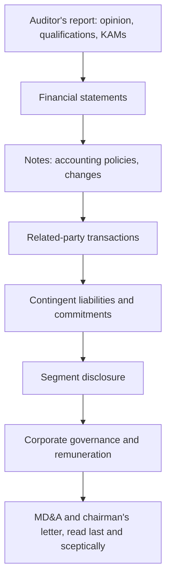

# Reading the Annual Report — A Systematic Method

## The Problem / Why this matters
The annual report is the single most information-dense document a listed company produces, and the section most analysts read — the glossy front half — is the section with the least information. The genuinely valuable material sits in the notes to accounts, the related-party disclosures, the auditor's report and the contingent liabilities, precisely where it is dullest to read. An analyst who reads annual reports systematically develops a durable edge on covered companies, because most of the market does not.

## Core Idea
Read the annual report **backwards and in a defined order** — auditor's report and notes first, narrative last — because the audited, legally-mandated disclosures are the reliable content, and the narrative is the part management controls entirely.

## Why it works this way
Management writes the chairman's letter and the MD&A; auditors and regulation govern the notes. The parts subject to external verification and mandatory disclosure requirements carry information the company may not have volunteered, which is exactly where an analyst's edge lies.

## Full technical content

### 1. The auditor's report — read this first

- **Opinion type.** Unqualified (clean), qualified, adverse, or disclaimer. Anything other than unqualified is a serious signal requiring full investigation.
- **Emphasis of Matter** — the auditor drawing attention to something without qualifying. Frequently the earliest formal flag of a problem.
- **Key Audit Matters (KAMs)** — the areas the auditor considered most significant and difficult. This is effectively the auditor telling you where the judgement-heavy, highest-risk numbers are. If revenue recognition or impairment of a specific asset is a KAM, that is where to focus.
- **CARO report** (Companies Auditor's Report Order) — specific mandated disclosures on fixed assets, inventory, loans to related parties, statutory dues, defaults, and fraud reporting. Dense and unusually revealing.
- **Internal Financial Controls opinion** — an adverse or qualified ICFR opinion is a significant governance signal.
- **Auditor tenure and any change** — a change, especially mid-term, requires reading the resignation letter for the stated reason.

### 2. Accounting policies and changes

In the notes, the policies section states how revenue is recognised, how assets are depreciated, what is capitalised, and how provisions are estimated. What to look for:
- **Any change from the prior year**, and its quantified effect. Companies must disclose the impact; find it and assess whether the change flattered results.
- **Comparison to peers** — a capitalisation or depreciation policy meaningfully more aggressive than competitors is a red flag even when individually defensible.
- **Revenue-recognition policy** for long-cycle or percentage-of-completion businesses, where judgement is greatest.

### 3. Related-party transactions

The single most valuable note in an Indian annual report. Extract:
- **All parties** — promoter entities, associates, key management personnel and their relatives.
- **Transaction types and amounts** — sales, purchases, loans given and taken, guarantees, royalties, rent, remuneration.
- **Scale relative to revenue and net worth**, tracked as a trend over 3–5 years.
- **Balances outstanding** at year-end — loans and receivables from related parties that are never settled are a classic value-leakage route.
- **Guarantees given** on behalf of group companies — a contingent exposure that can become real.

The analytical question is not whether related-party transactions exist (they are normal in promoter-led groups) but whether they are **at arm's length, proportionate and stable**.

### 4. Contingent liabilities and commitments

Disclosed but not provided for, and therefore invisible in the reported numbers:
- **Disputed tax demands** — often large in India; assess quantum against net worth and read management's assessment of likelihood.
- **Legal proceedings.**
- **Guarantees** given to group entities or third parties.
- **Capital commitments** — contracted capex not yet incurred, which tells you what the company is actually committed to spending regardless of what guidance says.
- **Letters of comfort** to lenders of subsidiaries.

Compute contingent liabilities as a percentage of net worth. A figure that is large and growing is a genuine risk that never appears in any ratio a screen would compute.

### 5. Segment disclosure

As covered in the segment chapter — revenue, results and, where disclosed, capital employed by segment, enabling segment RoCE. Check specifically whether segment definitions have **changed**, which breaks comparability and occasionally coincides with a segment's deterioration.

### 6. Corporate governance and remuneration

- **Board composition, independence and tenure**; attendance records; other directorships.
- **Committee composition**, particularly audit committee.
- **Managerial remuneration** — absolute, as a proportion of profit, and its trend versus profit. Remuneration rising while profit falls is a direct alignment failure.
- **Promoter shareholding and pledge**, including any change during the year.
- **Any resignation** of directors or KMP with stated reasons.

### 7. Cash flow statement — read it properly

Frequently skimmed, and it is where earnings quality is verified:
- Operating cash flow versus PAT, cumulatively over several years.
- Whether working-capital movements explain any gap.
- Whether "operating" cash flow has been flattered by classification choices.
- Investing section — actual capex versus what was guided.
- Financing section — debt raised and repaid, dividends paid, and whether dividends were covered by FCF.

### 8. MD&A and the chairman's letter — read last, and comparatively

Read these **after** the audited content, so the narrative is assessed against the numbers rather than framing them. The highest-value technique is **year-over-year comparison of the narrative**:
- What was highlighted last year that is not mentioned this year? A segment that was a strategic priority and has vanished from the discussion is usually a problem.
- What guidance or targets were stated last year, and were they met? This is the raw material for the guidance-accuracy element of the management-quality assessment.
- Has the strategic narrative changed without acknowledgement?
- Has disclosure granularity **reduced** — a metric previously reported and now omitted? Companies rarely stop disclosing something that is going well.

### A practical reading order and time budget

For a covered company, a full annual-report read is a 3–5 hour exercise:

1. Auditor's report, KAMs, CARO (20 min)
2. Financial statements — P&L, balance sheet, cash flow (30 min)
3. Accounting policies and any changes (20 min)
4. Related-party transactions (30 min)
5. Contingent liabilities and commitments (20 min)
6. Segment disclosure (20 min)
7. Corporate governance and remuneration (30 min)
8. MD&A versus prior year (40 min)
9. Build/update the multi-year comparison sheet (60 min)

That last step is what makes the exercise compound: maintaining a **multi-year sheet** of related-party quantum, contingent liabilities, segment RoCE, remuneration ratios and policy changes turns each year's reading into a trend rather than a snapshot.

## Common mistakes
- Reading the **glossy narrative** and skipping the notes.
- Not reading the **auditor's report**, including KAMs and CARO.
- Skipping related-party transactions because the note is dense.
- Ignoring **contingent liabilities** because they are not in the ratios.
- Reading the MD&A **first**, so it frames the numbers rather than being tested against them.
- Not comparing this year's narrative to last year's — where the most useful signals live.
- Treating one year in isolation rather than maintaining a multi-year trend sheet.
- Missing a **change in accounting policy** and its quantified effect.

## Interview angle
"What do you look for in an annual report?" Show the systematic method and, critically, the order: auditor's report first — opinion type, emphasis of matter, key audit matters and CARO, because that is the auditor telling you where the risk is; then accounting policies and any changes with their quantified impact; then related-party transactions in scale and trend; then contingent liabilities against net worth; then segment data for segment RoCE; then governance and remuneration versus profit. Read the MD&A last and comparatively against the prior year — what stopped being mentioned, and were last year's stated targets met. That inversion of the obvious reading order is what signals genuine familiarity.
