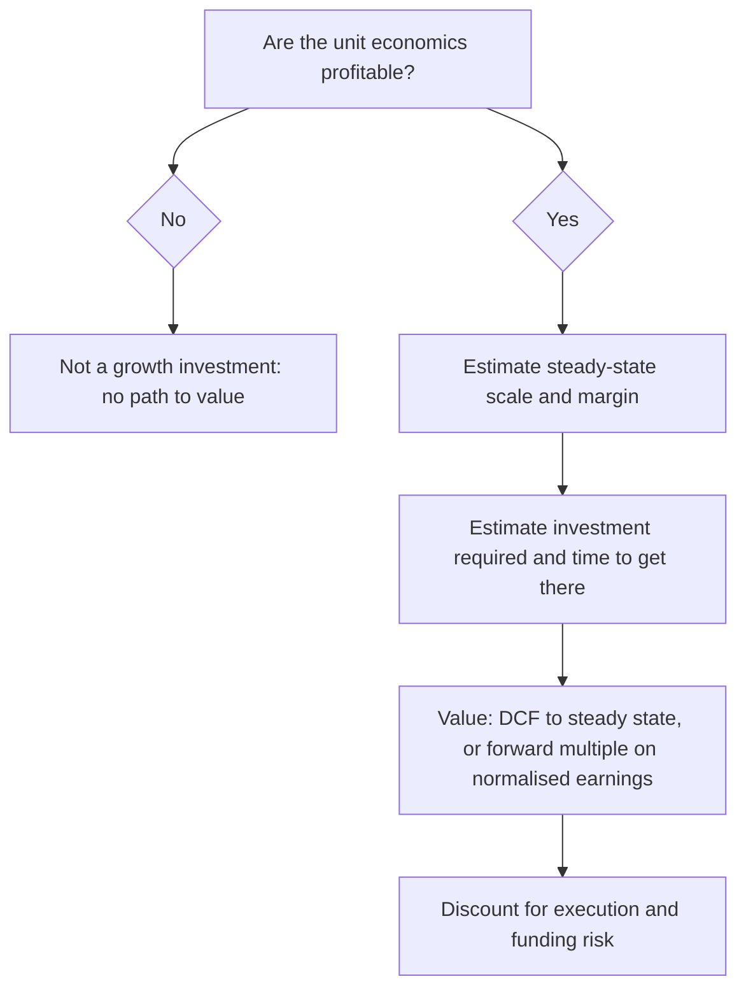

# Valuing Growth Companies and Loss-Making Businesses

## The Problem / Why this matters
A company with no profits cannot be valued on P/E, and a company growing 40% cannot be sensibly valued on the same multiple as one growing 6%. Yet an increasing share of listed market capitalisation — new-age consumer internet, fintech, platform businesses — falls into exactly this category, and Indian markets have seen a wave of such listings. The standard toolkit fails, and analysts either avoid the sector or apply frameworks that produce numbers with no analytical content. Doing this well requires a different approach, not a modified one.

## Core Idea
For a growth or loss-making business, value derives from **future steady-state economics** — the profit the business will generate once it stops investing for growth. The analysis is therefore about establishing what that steady state plausibly looks like, and how much investment is required to reach it.

## Why it works this way
Accounting expenses growth investment immediately (customer acquisition, market development, technology build) while the returns accrue over years. A business acquiring customers profitably can therefore report large losses precisely *because* it is succeeding. Reported profitability tells you about the investment rate, not about the underlying economics — which must be inferred from unit-level data instead.

## Full technical content

### First test — separate growth investment from operating losses

The essential distinction, and the one that determines whether the company is investable at all:

| | Growth investment | Structural loss |
|---|---|---|
| Unit economics | Positive contribution margin | Negative even at the unit level |
| Losses driven by | Customer acquisition, market expansion, capacity ahead of demand | Cost structure that does not work |
| What happens if growth stops | Company becomes profitable | Company still loses money |
| Evidence | Cohort profitability, contribution margin, improving marginal economics | Contribution margin negative or deteriorating |

**The decisive test:** if the company stopped spending on growth tomorrow, would it be profitable? A business with positive contribution margin and a defined payback period is investing; one with negative contribution margin is subsidising every transaction, and scale makes it worse rather than better. This test should be applied before any valuation work, because it determines whether valuation is even a meaningful exercise.

### Valuation approaches

**1. DCF to a defined steady state.** The most rigorous method. Forecast explicitly through the investment phase to a year when the business reaches a normalised margin, then apply terminal value. Its weakness is that value is almost entirely determined by two highly uncertain assumptions — steady-state margin and the scale achieved — so it must be presented as a scenario range rather than a point.

**2. Forward multiple on normalised earnings.** Project earnings in the year the business reaches maturity, apply a multiple appropriate to a mature business with that growth and return profile, then discount back at the cost of equity. Transparent, and easy for a reader to disagree with — which is a virtue.

**3. EV/Sales with a margin bridge.** The common shorthand, but it is only meaningful when paired with an explicit view on terminal margin. EV/Sales without a margin assumption is not a valuation; it is a comparison of unlike things. State the implied EV/normalised-EBIT alongside it.

**4. Unit-economics build-up.** Value = (steady-state number of units) × (mature profit per unit), discounted. Most appropriate where the unit is well defined — stores, subscribers, active customers — and where cohort data supports the mature-unit assumption.

**5. Reverse-DCF as a sanity check.** Take the market price and solve for the implied growth and terminal margin. This is often the single most useful output, because it converts an unintuitive multiple into a testable statement: "the price implies 32% revenue CAGR for a decade and a 22% terminal EBIT margin, versus a current margin of −8% and no comparable company globally above 18%."

### The assumptions that carry the value

Three, and everything else is detail:

**Terminal margin.** The most important and least verifiable. Anchor it to: mature comparables in the same or an analogous business globally; the company's own best-performing cohort or geography; and the structural economics of the model (gross margin sets the ceiling). Be explicit that this is the swing assumption.

**Steady-state scale.** How large does the business get? Build bottom-up from addressable market and plausible penetration, then sanity-check the **implied market share** — a forecast implying an implausible share is the most common way growth valuations become detached.

**Time to maturity and capital required.** Longer paths are worth less (discounting) and riskier (more can go wrong). Critically, model the **funding requirement**: a company burning cash needs capital, and if that capital comes as equity, existing shareholders are diluted. Failing to model dilution is a frequent and material error — the value per *share* can fall even as the value of the business rises.

### Growth-specific risks to assess explicitly

- **Funding risk** — how many months of runway at the current burn rate? A business dependent on raising capital in a market that may close is exposed to a risk unrelated to its operations.
- **Dilution** — model future rounds explicitly at plausible valuations.
- **Competitive intensity** — growth markets attract capital; a competitor willing to fund losses longer can destroy the economics for everyone.
- **Regulatory** — new business models frequently operate ahead of regulation, and rule changes can alter the model fundamentally.
- **Cohort deterioration** — the earliest and most reliable warning that growth quality is falling: rising marginal CAC, worsening retention in newer cohorts.
- **Key-person and governance risk**, often elevated in younger companies.

### The PEG ratio and its limits

**PEG = P/E ÷ earnings growth rate**, with 1.0 conventionally treated as fair. It is a useful rough screen for comparing profitable companies with different growth rates, but its limits are severe: it ignores risk and capital intensity entirely, breaks down at very high or negative growth, is highly sensitive to which growth period is used, and rewards growth regardless of the returns at which that growth is achieved. Use it as a screen, never as a valuation.

### Presenting the work honestly

Growth valuations have genuinely wide uncertainty, and pretending otherwise is the main failure of research in this area. Best practice:
- Present **scenarios**, with the terminal margin and scale assumptions varying coherently.
- Show the **reverse-DCF** so readers see what the market is assuming.
- State the **two or three assumptions** carrying the value and quantify their sensitivity.
- Give **monitorables** — the cohort and unit metrics that will confirm or break the thesis long before the P&L does.

## Common mistakes
- Valuing on **EV/Sales** without an explicit terminal-margin view.
- Failing to distinguish **growth investment from structural loss** before valuing anything.
- Not modelling **future equity dilution**, so per-share value is overstated.
- Terminal margins above anything the business model or its global comparables have achieved.
- Implied market share that is implausible — the check that catches most inflated forecasts.
- Using **blended** rather than marginal CAC, masking deteriorating cohort economics.
- Applying **PEG** as a valuation rather than a screen.
- Presenting a single point value for a business whose plausible range is several-fold.

## Interview angle
"How would you value a loss-making consumer internet company?" Start with the gating question — are the unit economics positive? Contribution margin per customer, CAC payback, and cohort retention; if the unit is unprofitable, no growth rate fixes it. If the units work, value on the steady state: project to a maturity year with an explicit terminal margin anchored to mature global comparables, apply an appropriate multiple, discount back, and model the equity dilution required to fund the path. Then run a reverse-DCF to state what the current price implies and test that against the implied market share. Close by naming the two assumptions that carry the value — terminal margin and steady-state scale — and presenting the answer as a scenario range rather than a point.
