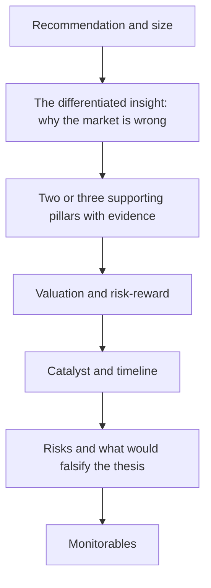

# Pitching and Defending an Investment Idea

## The Problem / Why this matters
Analysis that cannot be communicated under pressure is worth very little. Whether pitching a portfolio manager, presenting to an investment committee, or answering a hostile question in a client meeting, an analyst must compress weeks of work into a few minutes and then defend it against people whose job is to find the flaw. This is also the format of most equity research interviews — the stock pitch is the standard test, and it assesses analytical judgement and composure simultaneously.

## Core Idea
A pitch is not a summary of research; it is an **argument for a decision**. Its structure should be: what to do, why the market is wrong, what makes you confident, what would make you wrong, and how much to commit.

## Why it works this way
The listener is deciding whether to allocate capital, not evaluating your effort. Everything in the pitch either supports that decision or wastes their attention. This is why the natural instinct — to narrate the research chronologically, building to a conclusion — is precisely wrong.

## Full technical content

### The 90-second version

Most pitches are effectively decided in the opening. Prepare a version that stands alone:

> *"I'd buy Company X at ₹640 with a ₹950 target — 48% upside, and the bear case is ₹520, so roughly 3.5 to 1 risk-reward. The market is treating the Dahej capacity as a FY28 story; our channel checks and the equipment-import data indicate commissioning is running two quarters early, which we think adds 22% to FY27 EPS versus consensus. The catalyst is the Q3 result, where the ramp becomes visible. I'd size it at 3% of the portfolio, constrained by liquidity — it's ₹14 crore ADV, about six days to build at 25% of volume."*

Everything essential is there: action, price, upside, downside, risk-reward, the differentiated insight with evidence, the catalyst, the timeline, size and the constraint. A listener can act on it or interrogate it immediately.

### Structuring the full pitch

**1. Recommendation and size, first.** Never build to it. If you are three minutes in and the listener does not know whether you are bullish, you have failed structurally.

**2. The differentiated insight.** The single most important element: *what do you believe that the market does not?* Be explicit and quantified — "we are 22% above consensus FY27 EPS because…". A pitch that agrees with consensus has no reason to exist, and the most common weakness in interview pitches is a well-researched company description with no differentiated view.

**3. Two or three pillars, no more.** Each with its strongest single piece of evidence. Listeners retain three things; a pitch with seven reasons signals that none is individually convincing.

**4. Valuation and risk-reward.** Method, key assumptions, target, and explicitly the bear case with its value. Give the ratio.

**5. Catalyst and timeline.** What forces the market to converge to your view, and roughly when. A mispricing without a catalyst is not actionable.

**6. Risks and falsification.** State the strongest argument against you and answer it, then state what specific evidence would make you exit. Volunteering this builds credibility rather than undermining it.

**7. Monitorables.** The two or three data points that will show whether the thesis is tracking.

### Defending under questioning

**Anticipate the obvious challenges** and have quantified answers ready:
- "Why is it cheap?" — the market's reason, and why it is wrong or already discounted.
- "What does consensus assume, and why are you different?"
- "What if [key assumption] is wrong?" — you should already know the EPS and value impact.
- "Who is on the other side of this trade, and what do they believe?"
- "Why now?"

**Rules for handling questions well:**

- **Answer the question asked**, then stop. Over-explaining signals uncertainty.
- **Concede genuine points immediately.** "That's a fair concern — it's the main risk, and here's how I've sized it" is far stronger than defending an indefensible detail. Attempting to win every point destroys credibility for the whole pitch.
- **Distinguish what you know from what you assume.** "The company disclosed X; I'm assuming Y, and if Y is wrong the value falls to Z."
- **Say "I don't know"** when you don't, followed by how you would find out. Every experienced investor has seen candidates fabricate, and it ends the conversation.
- **Have the numbers.** Not knowing your own model's key figures — the target multiple, the growth assumption, the bear-case value — undermines everything else.
- **Don't argue with the PM's premise reflexively.** Understand the objection fully before responding; often the objection is information you didn't have.

### Common interview-pitch failures

| Failure | Why it fails |
|---|---|
| Long company description before the recommendation | The listener doesn't know what you want them to do |
| No differentiated view — just "good company, reasonable valuation" | Consensus already knows; no reason to act |
| No bear case, or a token one | Suggests you haven't stress-tested the thesis |
| No catalyst | Being right eventually is not investable |
| Seven reasons instead of three | None of them is load-bearing |
| Not knowing your own numbers under questioning | Suggests the work isn't yours or isn't deep |
| Defending every challenged point | Credibility collapses on the whole pitch |
| Ignoring liquidity and sizing | Signals sell-side rather than decision-oriented thinking |

### Choosing what to pitch in an interview

Practical guidance:
- **Pick something you genuinely know**, not the most impressive-sounding name.
- **Avoid the obvious mega-cap** everyone covers, unless you truly have a differentiated angle — the bar for differentiation is much higher there.
- **Avoid extremely recent IPOs** with little history unless that is the point of the pitch.
- **Have a second idea ready**, and ideally a short idea — being asked "what would you sell?" is common and few candidates prepare it.
- **Know the counter-case** to your own pitch better than the interviewer does.
- **Match the horizon** to the fund's mandate: pitching a three-week trade to a long-only fund shows you haven't understood the seat.

### The written version

Many funds ask for a one-page memo. Its structure mirrors the verbal pitch: recommendation and size at the top; the differentiated insight; three pillars with evidence; a small valuation table with base, bull and bear; catalyst and timeline; risks with quantified impact; and monitorables. One page, no filler — the discipline of fitting it forces the argument to be tight.

## Common mistakes
- Narrating the research process instead of arguing for a decision.
- Burying or omitting the **differentiated insight**.
- No **bear case value**, so no risk-reward.
- No catalyst.
- Not knowing your own model's numbers.
- Defending points that should be conceded.
- Fabricating an answer instead of saying you don't know.
- Ignoring **position sizing and liquidity** — the marks of decision-oriented thinking.

## Interview angle
The stock pitch *is* the interview question. Lead with the recommendation, price, target, bear case and risk-reward in the first fifteen seconds. Then the differentiated insight stated as a quantified difference from consensus, three evidenced pillars, the catalyst with timing, the strongest counter-argument and your answer to it, what would make you exit, and the size you'd take with the liquidity constraint. Then stop talking and let them question you. The two things that most distinguish strong candidates: volunteering the falsification condition before being asked, and conceding a genuine weakness immediately rather than defending it.
