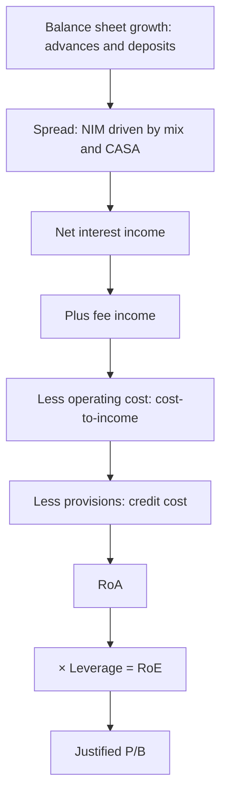

# Banks — A Full Analytical Deep Dive

## The Problem / Why this matters
Banking is the largest sector weight in most Indian equity indices, so almost every generalist analyst and portfolio manager must have a view on banks — yet banks are the sector where standard equity analysis fails most completely. There is no revenue line in the usual sense, no gross margin, no working capital, and no meaningful free cash flow. The P&L is an output of the balance sheet rather than the other way round, and the single largest swing factor in earnings — credit cost — is a management estimate. "Walk me through how you'd analyse a bank" is the most frequently asked sector question in Indian equity research interviews.

## Core Idea
A bank's earnings are: **(assets × spread) + fees − operating cost − credit cost**, levered roughly 7–10× onto equity. Analysis therefore proceeds through growth, spread, asset quality, efficiency and capital — in that order — and terminates in RoA and RoE, which drive the P/B multiple.

## Why it works this way
A lender's product is its balance sheet. It earns a spread on assets funded by liabilities, and the risk it takes is that some assets do not repay. Because leverage is high by design, a small change in credit cost — say 50bp on assets — swings RoE by several percentage points. Asset quality is therefore not one factor among several; it is the dominant variable.

## Full technical content

### The RoA decomposition — the master framework

Everything in bank analysis fits into this single expression, with each line stated as a percentage of average assets:

| Line | Typical range (Indian banks) | Driver |
|---|---|---|
| Net interest income / avg assets (**NIM**) | 3.0–4.5% | Loan mix, CASA, rate cycle |
| + Fee and other income | 0.8–1.5% | Cards, distribution, forex, treasury |
| = Total income | 4.0–6.0% | |
| − Operating expenses | 1.8–2.8% | Branch model, digital maturity, staff |
| = Pre-provision operating profit (**PPOP**) | 2.0–3.2% | The buffer that absorbs credit losses |
| − Provisions (**credit cost**) | 0.4–1.5% (2.5%+ in stress) | Asset quality |
| − Tax | | |
| = **RoA** | 1.0–2.0% | |
| × Leverage (assets ÷ equity, ~7–10×) | | Capital adequacy |
| = **RoE** | 12–18% | |

**PPOP is the metric to watch most closely.** It is the pre-credit-cost earnings power — the buffer the bank has to absorb losses before capital is touched. A bank with PPOP of 3% of assets can absorb a very severe credit cycle; one at 1.8% cannot. Comparing credit cost to PPOP, rather than to profit, is the correct stress lens.

### Growth and the loan mix

- **Advances growth** relative to system credit growth tells you whether the bank is gaining or losing share, and aggressive outperformance is usually a warning rather than a strength — market share in lending is easy to buy by relaxing standards.
- **Loan mix** determines both yield and risk: corporate (lower yield, lumpy risk), retail secured — home, auto (lower yield, low loss), retail unsecured — personal loans, credit cards (high yield, high loss in stress), MSME (high yield, cyclically sensitive), microfinance (highest yield, highest volatility).
- The **mix shift** is often the real story: a bank shifting toward unsecured retail will show rising NIM, which looks like improving profitability but is actually rising risk being taken. Always ask whether NIM expansion came from pricing power or from moving down the credit ladder.

### Funding — where durable quality lives

- **CASA ratio** (current + savings as a share of deposits) is the single biggest structural differentiator between Indian banks. Current accounts pay no interest and savings accounts pay little, so a high-CASA bank has a permanently lower cost of funds and therefore a structurally higher NIM at the same asset yield — meaning it can lend to *safer* borrowers and still earn the same spread. That is a genuine, compounding competitive advantage.
- **Deposit growth versus advances growth** — advances persistently outrunning deposits forces reliance on wholesale funding, which is costlier and flightier.
- **Credit-deposit ratio** — very high levels constrain further growth without deposit mobilisation.
- **Cost of funds trend** versus peers.

### Asset quality — the dominant variable

| Metric | Definition | What it tells you |
|---|---|---|
| **GNPA %** | Gross NPAs ÷ gross advances | Stock of recognised bad loans |
| **NNPA %** | Net of provisions held | Unprovided residual — the direct hit to book value |
| **PCR** | Provisions held ÷ GNPA | Cushion; low PCR means future P&L pain pending |
| **Slippage ratio** | Fresh NPAs ÷ opening standard advances | **The forward-looking indicator** |
| **Credit cost** | Provisions ÷ average advances | The P&L impact |
| **Recovery/upgrade** | NPAs resolved | Offsets slippages |
| **SMA-1 / SMA-2** | Overdue 31–60 / 61–90 days | Pre-NPA stress; the earliest warning |
| **Restructured book** | Loans given forbearance | Deferred rather than resolved stress |
| **Write-offs** | NPAs removed from books | **Can flatter GNPA without any recovery** |

**Two disciplines that separate real analysis from metric-quoting:**

1. **Slippages, not GNPA.** GNPA is a stock that reflects past problems; slippages are the flow that predicts future ones. A bank with falling GNPA but rising slippages is deteriorating, not improving.

2. **Check whether GNPA fell because of recovery or write-off.** A write-off removes the loan from the books without any cash coming back. Reconcile: opening GNPA + slippages − recoveries − upgrades − write-offs = closing GNPA. If the improvement is driven by write-offs, the bank has taken the loss, not solved the problem.

### Capital

- **CAR** and, more importantly, **CET-1 / Tier-1** — the loss-absorbing core.
- **Growth constrains capital:** risk-weighted assets grow with the loan book, so a bank growing 20% with 15% RoE and no dividend cannot fund that growth internally — it must raise equity, diluting existing shareholders. This is the standard reason banks dilute, and modelling it is essential rather than optional.
- Check **headroom above the regulatory minimum**; a bank close to the minimum has a raise coming, and that expectation should already sit in your forecast.

### Valuation — P/B anchored to RoE

The justified relationship, from the Gordon model applied to book value:

**Justified P/B = (RoE − g) ÷ (Ke − g)**

The intuition matters more than the formula: a bank earning RoE exactly equal to its cost of equity is worth 1× book; every point of sustainable RoE above Ke justifies a premium. This is why Indian private banks with 16–18% RoE trade at multiples of book while public-sector banks with 8–10% RoE trade at or below it — the market is not being irrational, it is pricing sustainable returns.

**P/ABV (adjusted book value)** — subtract unprovided NNPA from book value before computing the multiple. Essential for stressed lenders, where reported book overstates real equity.

Cross-check with **P/E on normalised credit cost**: a bank in a benign credit year has flattered earnings, so applying a normal P/E to trough credit costs overstates value — the same cyclical trap as in commodities.

### NBFC differences

- No deposit franchise (mostly), so funding is wholesale — bank lines, NCDs, commercial paper — making **ALM mismatch** the structural risk. Borrowing short and lending long is what converts a liquidity event into a solvency crisis.
- Use **spread** (yield − cost of funds) rather than NIM.
- **Leverage** is higher and is the deliberate business model.
- **Liquidity coverage** and the maturity ladder deserve specific attention.
- Valuation on P/B versus RoE similarly, but with a discount reflecting funding fragility.

### Sector-specific red flags

- Falling PCR while GNPA rises.
- Loan growth far above system, concentrated in one high-yield segment.
- NIM expansion driven purely by mix shift into unsecured lending.
- Rising SMA-2 and restructured book.
- Divergence between RBI-assessed and bank-reported NPAs (disclosed, and a serious governance signal).
- Repeated capital raises without commensurate RoE improvement.
- Heavy reliance on treasury gains to make the quarter.
- Large, growing exposure to a single group or sector.

## Common mistakes
- Applying **P/E** rather than P/B to a bank.
- Reading falling GNPA as improvement without checking **write-offs**.
- Watching GNPA (stock) instead of **slippages** (flow).
- Treating NIM expansion as unambiguously positive without asking whether risk rose.
- Ignoring the **capital constraint** on growth, and therefore not modelling dilution.
- Using reported book value for a bank with high unprovided NNPA.
- Applying a normal multiple to **trough credit-cost** earnings.
- Comparing an NBFC to a bank without adjusting for the funding-model difference.

## Interview angle
"Walk me through how you'd analyse a bank." Use the RoA decomposition as the spine: balance-sheet growth versus system, and the loan mix; spread — NIM driven by CASA and mix, asking whether expansion came from pricing power or from taking more risk; asset quality — GNPA, NNPA, PCR, and *especially* slippages as the forward indicator, checking whether any GNPA improvement came from write-offs rather than recoveries; efficiency via cost-to-income; PPOP as the buffer against credit losses; capital adequacy and therefore dilution risk; then RoA × leverage = RoE, and valuation on P/B justified by sustainable RoE versus cost of equity. Naming slippages and CASA specifically, and the write-off check, is what marks a prepared candidate.
