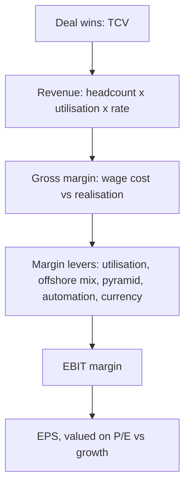

# IT Services — A Full Analytical Deep Dive

## The Problem / Why this matters
Indian IT services is one of the largest sectors by index weight and by employment, and its economics are unusual enough that generic analysis misses most of what drives the stocks. Revenue is reported in dollars but costs are largely in rupees; growth is a function of headcount and pricing rather than capacity; and the single most-watched disclosure — deal TCV — appears in no financial statement. It is also a sector where a well-known set of operational metrics genuinely predicts earnings, which makes it rewarding to analyse properly.

## Core Idea
An IT services company's revenue is **billable headcount × utilisation × realisation**, and its margin is a contest between wage inflation and the offsetting levers of utilisation, offshoring, pyramid management and currency. Growth visibility comes from the deal pipeline, not from the order book in a conventional sense.

## Why it works this way
The business converts people into billable hours. There is no capacity constraint in the manufacturing sense — capacity is hired — so growth is bounded by demand and by the ability to recruit and retain. Because the cost base is overwhelmingly people, margin is essentially a wage-versus-productivity equation, and because revenue is in dollars while wages are in rupees, currency is a genuine earnings driver rather than a translation footnote.

## Full technical content

### The revenue build

**Revenue = billable headcount × utilisation rate × realisation per person**

Each component is separately disclosed or estimable, which is what makes the sector so tractable:

| Component | Typical disclosure | What moves it |
|---|---|---|
| **Headcount** | Reported quarterly, with net additions | Demand, attrition, hiring plans |
| **Utilisation** | Reported (with and without trainees) | Demand strength; the primary near-term margin lever |
| **Realisation / pricing** | Rarely direct; inferred from revenue ÷ headcount | Mix, contract renegotiation, value-add |

**Constant-currency (cc) growth is the only revenue figure worth reading.** Reported USD growth blends business performance with cross-currency movements (EUR, GBP, AUD against USD). A company reporting 4% USD growth and 6% cc growth had a currency headwind, not weak demand. Sequential (QoQ) cc growth is the sector's key momentum metric.

### The margin bridge

Margin analysis in IT services is a standard set of offsetting forces, and companies typically walk through it explicitly on calls:

**Headwinds:** annual wage hikes (usually one quarter each year, a 150–300bp hit), promotions, rupee appreciation, higher onsite mix, visa costs, travel normalisation, investments in sales and capability.

**Tailwinds:** utilisation improvement, offshore mix shift, **pyramid rationalisation** (hiring more freshers relative to laterals, reducing average cost per employee), automation and non-linear delivery, pricing improvement, SG&A leverage, rupee depreciation.

**Currency sensitivity is quantifiable and worth stating:** for a typical Indian IT company, roughly **every 1% INR depreciation against the USD adds ~20–30bp to EBIT margin**. Note the hedging overlay — most companies hedge 6–12 months forward, so currency moves reach the P&L with a lag rather than immediately.

### The operational metrics that predict earnings

| Metric | Why it matters | What to watch |
|---|---|---|
| **Deal TCV** (Total Contract Value) | Forward revenue visibility | Trend, and the **net new** versus renewal split |
| **Book-to-bill** | Bookings relative to revenue | Sustained >1 implies growth |
| **Utilisation** | Operating leverage | Room above/below the company's normal band |
| **Attrition** (LTM) | Cost and delivery risk | Rising attrition precedes margin pressure |
| **Headcount net adds** | Forward capacity and demand confidence | Falling adds signal caution ahead of revenue |
| **Client metrics** | Revenue concentration and mining | $1mn/$10mn/$50mn+ client counts, and top-5/top-10 share |
| **Revenue per employee** | Productivity and value-add | Rising = mix improvement or automation |
| **Offshore-onsite mix** | Margin structure | Offshore is materially higher margin |

**The most important qualification on TCV:** headline deal value mixes renewals with genuinely new work, and includes long-duration contracts whose revenue recognises over many years. A large TCV number driven by a single ten-year renewal is very different from the same figure from net-new short-cycle deals. Always seek the **net-new** disclosure and the duration.

**Headcount as a leading indicator:** companies hire ahead of demand and stop hiring ahead of a slowdown. Net headcount additions turning negative while management maintains guidance is a genuine early-warning divergence.

### Demand-side analysis

- **Vertical mix** — BFSI (typically the largest vertical, and therefore the sector's biggest single demand risk), retail/CPG, manufacturing, healthcare, telecom, energy. Vertical concentration means a client-industry downturn transmits directly.
- **Geography** — North America dominant, Europe second. Regional macro matters.
- **Service mix** — traditional application maintenance and infrastructure (stable, lower growth, price-pressured) versus digital/cloud/data/AI (faster growth, higher realisation). The disclosed digital revenue share and its growth is the sector's structural narrative.
- **Discretionary versus non-discretionary spend** — in a client cost-cutting cycle, discretionary transformation projects are deferred first while run-the-business work continues. This is why a downturn shows up as slower *new* deal activity long before revenue falls.

### Structural considerations

- **Pricing pressure** in commoditised services is chronic; the offset is mix shift toward higher-value work.
- **Non-linearity** — breaking the link between headcount and revenue through platforms, automation and managed services is the sector's long-term margin story, and progress is measurable via revenue per employee.
- **Large-deal capability** is a genuine barrier to entry — only a handful of vendors can bid credibly for very large, multi-year engagements, which protects the tier-1 players.
- **Visa and immigration policy** affects the onsite delivery model and cost structure.
- **Currency** is structural, not incidental, given the revenue-cost mismatch.

### Valuation

**P/E is the convention**, benchmarked against growth and against the company's own historical band. The sector's multiple structure reflects:
- **Tier-1 premium** for scale, client relationships, delivery consistency and large-deal capability.
- **Growth differential** — the market pays for sustained cc growth outperformance.
- **Margin resilience** — companies with demonstrated ability to protect margin through wage cycles command a premium.
- Cash generation is strong and capital intensity low, so **FCF conversion is high** — a genuine quality feature supporting the multiple.

Cross-check with **EV/EBITDA** and, given consistently high payout ratios and buybacks in the sector, with **total shareholder yield**.

### Red flags

- Revenue growth maintained while **headcount net adds turn negative** and utilisation is already at the top of its band — growth without capacity to sustain it.
- **Deal TCV falling** while revenue still grows — the pipeline is emptying, and revenue follows with a lag.
- Rising **attrition** with flat reported margin — cost pressure not yet visible.
- Growth concentrated in a **single large client or vertical**.
- Margin held up entirely by **currency** rather than operations.
- Rising **DSO** — clients stretching payments, an early sign of client-side stress.

## Common mistakes
- Reading **reported USD growth** instead of constant-currency.
- Treating **headline TCV** as forward revenue without checking net-new versus renewal and contract duration.
- Ignoring the **wage-hike quarter**, then treating the resulting margin dip as deterioration.
- Missing the **hedging lag**, so currency impact is modelled in the wrong quarter.
- Ignoring **headcount and utilisation** as leading indicators of both demand and margin.
- Assuming digital revenue growth translates to margin — digital work often carries higher cost as well as higher price.
- Comparing an Indian IT company's P/E directly to a global peer without adjusting for growth, currency and tax.

## Interview angle
"How would you analyse an IT services company?" Build revenue from drivers — billable headcount × utilisation × realisation — and insist on constant-currency growth as the only meaningful top-line read. Walk the margin bridge: wage hikes and rupee appreciation against utilisation, offshore mix, pyramid rationalisation and automation, quantifying currency at roughly 20–30bp of EBIT per 1% INR move with a hedging lag. Then the forward indicators — deal TCV with the net-new split, book-to-bill, headcount net adds and attrition — noting that hiring turns before revenue does. Close on valuation: P/E against growth and the company's own band, with the tier-1 premium justified by large-deal capability. Mentioning that falling net adds alongside maintained guidance is a divergence worth flagging shows genuine sector familiarity.
