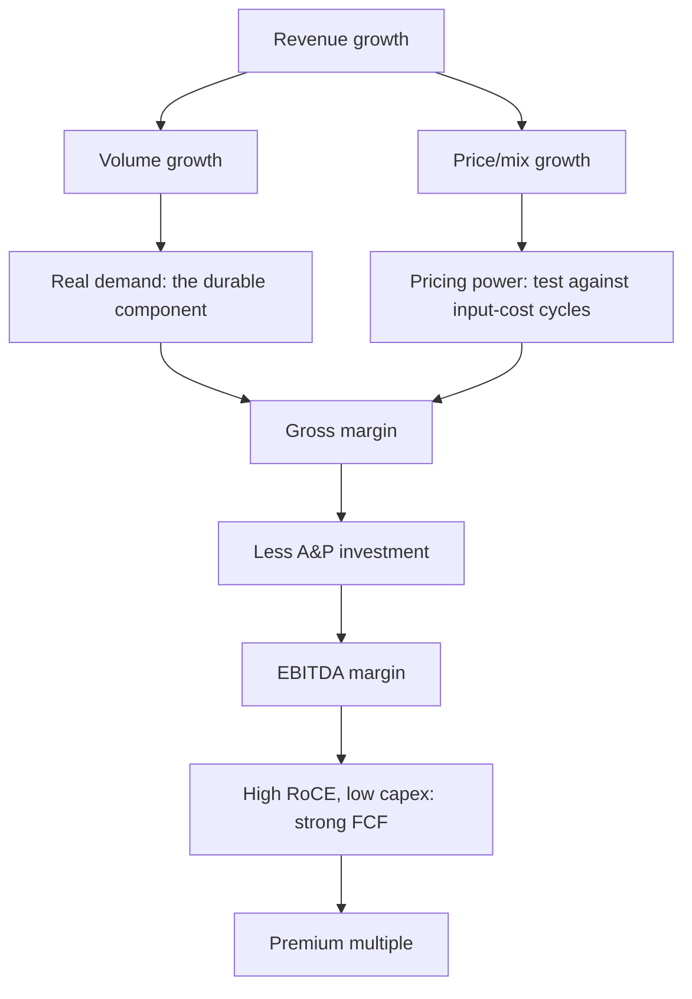

# Consumer and FMCG — A Full Analytical Deep Dive

## The Problem / Why this matters
Consumer staples command persistently high multiples — often 40–60x earnings — which makes them a permanent puzzle for analysts trained to look for cheapness. Understanding *why* the market pays those multiples, and what would justify a de-rating, requires understanding the specific economics: very high returns on capital, low capital intensity, predictable cash generation, and moats built on brand and distribution that have proven unusually durable in India. It is also the sector where the single most important analytical distinction — volume versus value growth — is most frequently ignored.

## Core Idea
FMCG value comes from **high RoCE and reinvestment-light growth**, protected by brand and distribution moats. The core analytical work is decomposing growth into volume and price, assessing whether pricing power is real, and judging whether the distribution advantage is being eroded by new channels.

## Why it works this way
A branded consumer business earns high returns because the brand allows a price premium over an undifferentiated product with similar production cost, and because the asset base required is small relative to sales. High RoCE plus low capital intensity means growth requires little incremental capital, so most earnings convert to distributable cash — which is precisely the profile a DCF values most highly, and why the multiples are structurally elevated rather than irrational.

## Full technical content

### The volume-versus-value decomposition

The single most important disclosure in the sector, and the first thing to look for in any result:

| Scenario | Volume | Value | Interpretation |
|---|---|---|---|
| Healthy | +7% | +11% | Real demand plus pricing/mix — the ideal |
| **Price-led** | +1% | +10% | Growth is entirely price hikes; not durable, and vulnerable when input costs fall and competitors reprice |
| **Volume-led, no pricing** | +9% | +6% | Demand strong but discounting or downtrading; margin risk |
| Deteriorating | −2% | +4% | Losing volume, holding revenue on price — the classic pre-decline pattern |

**Value growth without volume growth is the warning to watch for.** It looks like growth in the headline but reflects price increases that may not be sustainable, and it frequently precedes share loss to competitors who did not raise prices as far.

**Downtrading** is the related sector-specific phenomenon — consumers shifting to smaller pack sizes or cheaper variants during inflation. This shows up as volume growth holding while realisation per unit falls, and it is a genuine demand-stress signal that headline value growth conceals.

### Gross margin — the raw-material equation

FMCG gross margins are highly sensitive to agricultural and crude-linked inputs (palm oil, wheat, milk, packaging, crude derivatives for detergents and personal care). The analytical questions:

- **Pass-through ability and lag.** Even strong brands raise prices with a delay, so an input spike compresses margin for two to three quarters before recovery. Distinguishing this timing effect from structural deterioration is often the whole call.
- **The pricing-power test.** Look at the last input-cost spike: did gross margin recover fully within a few quarters? Companies that recovered demonstrated pricing power; those whose margins never returned did not.
- **The asymmetry to watch:** when input costs *fall*, does the company keep the price (margin expands, evidence of real pricing power) or pass it back through promotions (margin reverts, evidence that the earlier hike was not durable)? This is the cleanest single test of brand strength in the sector.

### A&P — the reinvestment that does not appear as capex

**Advertising and promotion spend as a percentage of sales** is the brand's maintenance capex, expensed rather than capitalised. Its treatment is a genuine analytical trap:

- A company **cutting A&P to protect reported margin** is borrowing from future brand equity. Reported margin improves; the moat quietly erodes. Track A&P as a percentage of sales over multiple years, not the absolute number.
- Conversely, **elevated A&P during a launch or competitive defence** depresses margin for good reasons and should not be read as deterioration.
- Compare A&P intensity to peers — persistent underspending relative to competitors in the same categories is a slow-acting negative.

### Distribution — the Indian moat

Distribution reach is the most durable competitive advantage in Indian consumer goods, and it is measurable:

- **Direct reach** (outlets served directly by the company) versus **total/indirect reach** (served via wholesalers). Direct reach is more expensive, gives better control, shelf placement and data, and is far harder to replicate.
- **Number of distributors and stockists**; the trend in outlets added.
- **Rural versus urban mix** — rural distribution is the hardest and most defensible, and rural demand behaves differently (monsoon, crop prices, government transfers, MSP).
- **Channel mix** — general trade, modern trade, e-commerce, and quick commerce. The shift toward the last two is the structural change that could erode the traditional distribution moat, since a new entrant can reach consumers digitally without building physical reach.

**Primary versus secondary sales** is the corresponding integrity check: primary (company to distributor) is what gets reported as revenue; secondary (distributor to retailer) reflects actual offtake. A gap — primary growing faster than secondary — means inventory is building in the channel and future primary sales must fall. Distributor inventory days is the metric, and channel checks are how you get it.

### The returns profile that justifies the multiple

| Characteristic | Typical FMCG | Why it supports a premium |
|---|---|---|
| RoCE | 30–80%+ | Far above cost of capital |
| Capital intensity | Low; capex often 2–4% of sales | Growth needs little capital |
| Working capital | Often negative or minimal | Suppliers and fast turns fund the business |
| FCF conversion | High | Most earnings are distributable |
| Earnings volatility | Low | Staples demand is defensive |
| Payout | High dividends/buybacks | Cannot productively reinvest all earnings |

The DCF logic: a business earning very high returns on small incremental capital, growing steadily with low volatility, generates a large stream of distributable cash — which supports a high multiple mathematically, not merely by sentiment. **The corollary matters too:** if RoCE falls or growth slows structurally, the multiple has a long way to fall, which is the principal risk in the sector.

### Premiumisation and category structure

- **Premiumisation** — mix shift to higher-priced variants — is the sector's main margin-expansion narrative, and it is verifiable in realisation-per-unit trends.
- **Category penetration versus consumption depth** — in under-penetrated categories growth comes from new users; in penetrated ones it comes from more frequent or larger usage. These have different growth ceilings and different competitive dynamics.
- **New-age competition** — direct-to-consumer brands that bypass traditional distribution entirely, competing on digital marketing rather than shelf reach. They are individually small but collectively erode the distribution moat's exclusivity.

### Red flags

- Value growth persistently exceeding volume growth.
- **A&P cut** while margin improves.
- Primary sales outrunning secondary sales; rising distributor inventory.
- Market-share loss in core categories, disguised by growth in a small new one.
- Gross margin never recovering after an input-cost normalisation.
- Heavy dependence on a single category or brand.
- Rising receivable days in a business that should be near cash-and-carry.

## Common mistakes
- Reading headline revenue growth without the **volume/value split**.
- Missing **downtrading** because volume held up while realisation fell.
- Treating an **A&P cut** as margin improvement.
- Not checking **primary versus secondary** sales, and so missing channel stuffing.
- Assuming raw-material-driven margin expansion is structural.
- Dismissing the sector as "expensive" on P/E without engaging with the RoCE and capital-intensity economics that justify it.
- Ignoring the channel shift to e-commerce and quick commerce as a threat to the distribution moat.

## Interview angle
"An FMCG company reports 11% revenue growth. What do you want to know?" The first question is the volume/value split — 11% built on 7% volume is real demand; 11% on 1% volume is price-led and fragile. Then: what happened to gross margin and why, and if input costs fell did the company keep the pricing (real pricing power) or promote it away? What did A&P do as a percentage of sales — margin protected by cutting brand investment is not margin improvement. Is primary tracking secondary, or is inventory building in the channel? And is growth coming from core categories or masked share loss? Closing on why the sector's multiple is structurally high — very high RoCE on very low incremental capital — shows you understand the valuation rather than just observing it.
