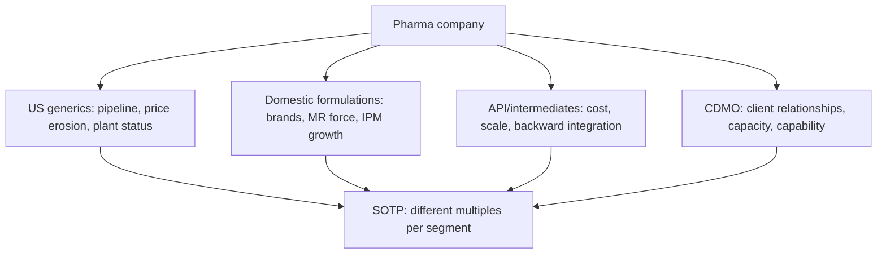

# Pharmaceuticals — A Full Analytical Deep Dive

## The Problem / Why this matters
Indian pharma is not one business but several with genuinely different economics filed under a single sector label — US generics, domestic branded formulations, API/intermediates, CDMO, and speciality. Applying one framework to all of them produces bad analysis. The sector also carries a risk that exists almost nowhere else in equity research: a single regulatory inspection outcome at a single plant can eliminate a substantial share of a company's revenue with no warning and no fundamental change in the business. Plant-level regulatory status is therefore a first-order equity variable, not a compliance footnote.

## Core Idea
Value the segments separately, because their economics differ fundamentally: **US generics** is a price-eroding, pipeline-driven commodity business; **domestic branded formulations** is closer to FMCG with pricing power and distribution moats; **API** is a cost-and-scale business; **CDMO** is a relationship-and-capability business.

## Why it works this way
A generic drug is chemically identical to its competitors, so once exclusivity ends, competition is on price and cost, and prices decline structurally. A branded formulation sold to a doctor-influenced Indian consumer competes on brand and distribution, so it retains pricing power. Same molecules, entirely different economics — which is why segment-level analysis is mandatory rather than optional.

## Full technical content

### Segment 1 — US generics

The most analytically demanding segment.

**Economics:** file an ANDA (Abbreviated New Drug Application) with the USFDA, receive approval, launch, and compete on price. Each additional competitor on a molecule drives price down — the well-documented pattern of steep erosion as the field broadens.

**Key metrics:**
- **ANDA filings and approvals** — the pipeline. Pending approvals indicate future launches.
- **Para-IV filings and First-to-File (FTF) status** — challenging an innovator's patent; a successful FTF earns **180 days of marketing exclusivity**, during which margins are extraordinary. The cliff when exclusivity ends is severe and must be modelled explicitly.
- **Base business price erosion** — typically high single digit to low double digit percentage annually, and the sector's structural headwind. Ask management for the erosion rate; it is usually disclosed qualitatively.
- **Complex generics** — injectables, inhalers, transdermals, ophthalmics. Harder to manufacture means fewer competitors and slower erosion — the sector's main strategy for escaping commoditisation. The share of revenue from complex products is a genuine quality metric.
- **Customer concentration** — US generics sells through a small number of large buying consortia with substantial negotiating power. This is a structural margin constraint.

**The modelling discipline:** a company's US revenue is base business (declining at the erosion rate) plus new launches. A forecast showing US revenue growing without specifying which launches drive it is not a forecast. Model the base decline and the launch pipeline separately.

### Segment 2 — Domestic formulations

**Economics:** branded generics sold in India, prescribed by doctors, with brand loyalty at the prescriber level. This makes it closer to a consumer business than to US generics.

**Key metrics:**
- **Growth versus IPM** (Indian Pharmaceutical Market) growth — the sector benchmark, so outperformance versus IPM is the relevant measure rather than absolute growth.
- **Therapy mix** — chronic (cardiac, diabetes, CNS) versus acute (anti-infectives, gastro). **Chronic is structurally superior**: repeat prescriptions, higher patient stickiness, more predictable revenue. A rising chronic mix is a genuine quality improvement.
- **Medical representative (MR) productivity** — revenue per MR, and the MR headcount trend. The field force is both the main cost and the distribution moat.
- **New launches** and their contribution.
- **Price control (NLEM/DPCO)** — essential medicines under price control have capped realisations and limited annual increases. The proportion of the portfolio under price control is a structural constraint worth quantifying.

### Segment 3 — API and intermediates

Cost-driven, scale-driven, competing largely with Chinese manufacturers. Key considerations: backward integration (into key starting materials), the China+1 supply-diversification theme, environmental compliance costs, and capacity utilisation. Margins are structurally lower than formulations and more cyclical.

### Segment 4 — CDMO / CRAMS

Contract development and manufacturing for innovators. Economics rest on long-term client relationships, regulatory-compliant capacity and technical capability. Revenue is lumpier and more project-driven; visibility comes from the order book and from the number of commercial-stage molecules. Commands higher multiples than generics when the client base is high-quality and the capability genuinely differentiated.

### The regulatory variable — the sector's dominant risk

**USFDA plant inspection outcomes, in escalating severity:**

| Outcome | Meaning | Equity impact |
|---|---|---|
| **EIR with VAI/NAI** | Inspection closed satisfactorily | Positive/neutral; removal of overhang |
| **Form 483 observations** | Deficiencies noted at inspection | Depends entirely on severity and whether data integrity is implicated |
| **Warning Letter** | Serious, unresolved deficiencies | Major — new approvals from that site typically stall |
| **Import Alert / OAI** | Products from the site barred from US import | Severe — revenue from that plant's US products stops |
| **Consent decree** | Court-supervised remediation | Most severe; multi-year |

**The analytical discipline this requires:** maintain a **plant-to-revenue map** — which facilities serve which markets and what share of revenue each represents. Without it, a Warning Letter headline cannot be translated into an earnings impact, which is exactly the moment an analyst is expected to have an answer. Note also that pending approvals from an affected site are frozen, so the impact extends to the future pipeline, not just current revenue.

**Data integrity observations** are the most serious category, because they call into question the reliability of the site's records rather than a specific process, and remediation is correspondingly longer.

### R&D — the capitalisation question

R&D typically runs 6–9% of sales for a generics-focused company and higher for those pursuing complex or novel products. Two analytical points:
- **Capitalisation policy** — how much R&D is capitalised versus expensed, and how that compares to peers. Aggressive capitalisation flatters current margin. This is one of the sector's most common accounting-quality issues.
- **R&D productivity** — filings and approvals per rupee of R&D, trended. Rising R&D with flat filings is a warning.

### Valuation

Because the segments differ so much, **SOTP is frequently the right approach**: a P/E appropriate to a stable domestic branded business, a lower multiple on volatile US generics, and a separate multiple on CDMO. Cross-check with EV/EBITDA where leverage or depreciation differs.

Specific adjustments: strip out **exclusivity-period earnings** before applying a multiple (they are non-recurring by definition), and apply a discount or explicit risk adjustment where a material plant is under a Warning Letter or Import Alert.

### Red flags

- Revenue concentrated in a **single product's exclusivity period** — a cliff is coming.
- **Repeated regulatory observations** across multiple plants, suggesting a systemic quality-systems problem rather than a site issue.
- Aggressive **R&D capitalisation** relative to peers.
- **Receivables stretching** in the US channel.
- Base-business erosion accelerating beyond guidance.
- Domestic growth persistently **below IPM**, indicating share loss.
- Heavy dependence on one therapy area facing patent or regulatory change.

## Common mistakes
- Applying a **single multiple** to a company with genuinely different segment economics.
- Modelling US revenue growth **without separating base erosion from new launches**.
- Extrapolating **exclusivity-period earnings** as recurring.
- Not maintaining a **plant-to-revenue map**, so regulatory news cannot be quantified.
- Treating a Form 483 as equivalent to a Warning Letter — severity varies enormously.
- Ignoring the proportion of the domestic portfolio under **price control**.
- Comparing domestic growth to absolute targets rather than to **IPM growth**.
- Overlooking R&D **capitalisation policy** differences when comparing margins across companies.

## Interview angle
"How would you analyse an Indian pharma company?" Insist on segmentation first, because the economics differ fundamentally: US generics — model base-business price erosion separately from the launch pipeline, check complex-generics share and any exclusivity contribution that must be stripped out; domestic formulations — growth versus IPM, chronic versus acute mix, MR productivity, and the share under DPCO price control; plus API and CDMO where relevant. Then the sector's dominant risk: maintain a plant-to-revenue map so any USFDA outcome can be translated immediately into a revenue and pipeline impact, distinguishing a 483 from a Warning Letter from an Import Alert. Value by SOTP with different multiples per segment. Naming the plant-to-revenue map unprompted is what marks genuine sector experience.
