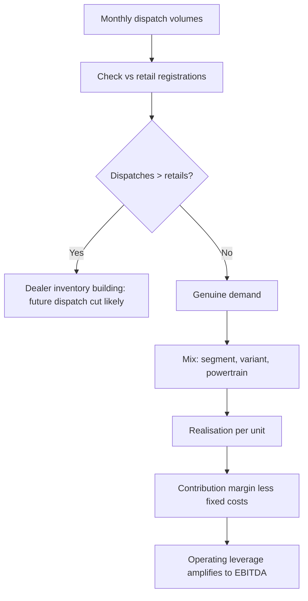

# Autos and Auto Components — A Full Analytical Deep Dive

## The Problem / Why this matters
Autos is one of the few sectors where genuinely high-frequency operating data is published monthly and publicly — dispatch volumes, and separately vehicle registrations. That makes it unusually tractable for an analyst willing to work with the data, and unusually punishing for one who does not, because the market reprices these stocks on monthly numbers. It is also a textbook operating-leverage sector, where a modest volume change produces a large earnings change in both directions.

## Core Idea
Auto earnings are **volume × realisation × contribution margin, less a large fixed cost base**. Because fixed costs are high, small volume changes produce amplified profit changes — so volume forecasting, informed by monthly data, is the core analytical task, and mix is the second.

## Why it works this way
Assembly plants have high fixed costs and substantial operating leverage. Above breakeven utilisation, incremental volume drops through to profit at close to the contribution margin; below it, losses accumulate rapidly. This is why auto earnings swing far more than auto revenue, and why the cyclical framework applies.

## Full technical content

### The dispatch-versus-retail distinction

The single most important analytical point in the sector.

- **Dispatches (wholesales)** — vehicles sold by the manufacturer to its dealers. This is what companies report monthly and what gets recognised as revenue.
- **Retails (registrations)** — vehicles actually sold to end customers, visible in government vehicle-registration data.

**When dispatches persistently exceed retails, dealer inventory is building** — and since dealers have finite floor-plan financing capacity, a correction is coming: the manufacturer must cut dispatches, which hits reported revenue with a lag of a quarter or two. This divergence is one of the most reliable forward indicators available in Indian equities, and it is fully public.

Track **dealer inventory in days** (industry bodies and dealer associations publish estimates). Normal is roughly 21–30 days; sustained levels well above that signal an impending dispatch cut regardless of how strong monthly dispatch numbers look.

### Volume drivers by segment

| Segment | Primary demand drivers |
|---|---|
| **Passenger vehicles (PV)** | Disposable income, credit availability and rates, fuel prices, new-model cycle, replacement demand |
| **Two-wheelers** | Rural income, monsoon, crop prices, entry-level affordability, financing penetration |
| **Commercial vehicles (CV)** | Freight rates, industrial and infrastructure activity, e-way bill volumes, replacement cycles, regulatory changes (emission norms, axle-load rules) |
| **Tractors** | Monsoon, crop prices, MSP, rural credit, reservoir levels |

**Commercial vehicles are the most cyclical and the most economically informative** — CV demand is essentially a derivative of freight activity, which makes it a leading indicator for the broader industrial economy. Medium and heavy CVs (M&HCV) swing far more than light CVs.

**Regulatory pre-buy and post-buy** is a recurring pattern worth knowing: ahead of an emission-norm transition, buyers accelerate purchases of cheaper pre-transition vehicles, inflating volumes; afterwards, volumes fall sharply. This creates artificial growth followed by an artificial decline, and analysts who extrapolate either are systematically wrong at both turns.

### Realisation and mix

Revenue per unit is driven by:
- **Segment mix** — SUVs realise materially more than small cars, and the structural shift toward SUVs in India has been a genuine, sustained realisation tailwind for the manufacturers positioned for it.
- **Variant mix** — top-end trims carry disproportionate margin.
- **Powertrain mix** — EV versus ICE, with different cost structures, different margins during the transition, and different competitive dynamics.
- **Discounting** — the direct offset. Track discount per vehicle (often disclosed or estimable from channel checks); rising discounts alongside flat volumes is demand weakness being masked.

**The analytical point:** realisation growth from *mix* is high quality and durable; realisation growth from *price increases* with falling volumes is not; and volume growth achieved through rising discounts is the weakest of all.

### Cost structure and margin

**Raw material** is roughly 65–75% of sales — steel, aluminium, precious metals for catalytic converters, rubber, and increasingly battery-related inputs. Commodity moves therefore hit margins hard, with a pass-through lag of one to two quarters.

**Operating leverage:** with a high fixed cost base, EBITDA margin expands sharply as utilisation rises. Model this explicitly through a contribution-margin approach rather than assuming a flat EBITDA margin — a flat-margin forecast for a volume-cyclical business is a modelling error that systematically understates both upside and downside.

### The components sub-sector — different economics

Auto components deserve separate treatment because the drivers differ:

| Factor | Why it matters |
|---|---|
| **Customer concentration** | Often 2–4 OEMs are most of revenue — significant buyer power, and annual price-down demands are standard |
| **Content per vehicle** | The key growth lever: even in a flat volume market, a supplier growing content per vehicle grows revenue |
| **Aftermarket share** | Higher margin, less cyclical, and a genuine quality differentiator versus pure OEM supply |
| **Export share** | Diversifies away from domestic cycle; adds currency exposure |
| **Technology positioning** | EV transition destroys some component categories (exhaust, fuel systems, transmissions) and creates others |
| **RM pass-through clauses** | Whether contracts allow automatic commodity pass-through determines margin volatility |

**The EV transition is the structural question for components.** A supplier whose content is powertrain-agnostic (suspension, interiors, lighting, electronics) faces a different future from one supplying internal-combustion-specific parts. Estimating the share of revenue at structural risk, and the timeline, is the core long-horizon analysis in this sub-sector.

### The data toolkit

This sector rewards data discipline more than most:
- **Monthly dispatch numbers** from each manufacturer.
- **VAHAN registration data** — the government's vehicle-registration database, giving retails.
- **Dealer inventory estimates** from industry bodies.
- **Discount tracking** via dealer channel checks.
- **Freight rate indices** for CV demand.
- **E-way bill volumes** as a proxy for goods movement and hence CV utilisation.
- **Monsoon, reservoir levels and crop prices** for tractors and rural two-wheelers.
- **Steel and aluminium prices** for the cost side.

### Valuation

**EV/EBITDA through the cycle** is the primary approach, for the standard cyclical reason that P/E on peak earnings is misleading (the P/E inversion trap). Cross-check on:
- **P/E on mid-cycle normalised EPS.**
- **EV/Sales** at cycle extremes, where EBITDA can be distorted or negative.
- **Replacement value** for asset-heavy manufacturers.
- **SOTP** where a company has meaningful separate businesses — a captive finance arm valued on P/B, or a distinct commercial-vehicle division.

The captive-finance point is worth flagging: several Indian auto companies own NBFC subsidiaries. Those must be valued as lenders on P/B and consolidated separately, not blended into an EV/EBITDA on the manufacturing business.

### Red flags

- **Dispatches persistently outrunning retails**; dealer inventory well above normal.
- **Rising discounts** with flat or falling volumes.
- Volume growth driven entirely by a **regulatory pre-buy**.
- **Market-share loss** masked by industry growth.
- Components company with **rising customer concentration** and no aftermarket or export diversification.
- Components company heavily exposed to **ICE-specific** content with no transition plan.
- Capacity expansion announced at the **top of the cycle**.

## Common mistakes
- Reading **dispatch numbers** without checking retails, and so missing an inventory build.
- Modelling a **flat EBITDA margin** for a business with high operating leverage.
- Extrapolating **pre-buy-inflated** volumes, or panicking at the post-transition drop.
- Applying **P/E on peak earnings** to a cyclical.
- Treating a components supplier as a proxy for its OEM customer without analysing content per vehicle and customer concentration.
- Ignoring the **EV transition risk** to specific component categories.
- Blending a **captive NBFC** into the manufacturer's EV/EBITDA rather than valuing it separately.

## Interview angle
"Monthly auto dispatch numbers came in strong. Are you positive?" The expected answer refuses to take dispatches at face value: check retails from registration data and dealer inventory days, because dispatches exceeding retails means inventory is building and a dispatch cut is coming. Then ask what drove the volume — genuine demand, a regulatory pre-buy, or rising discounts, since discount-driven volume is low quality. Then mix and realisation, because SUV and top-variant mix improvements are durable while price hikes with falling volumes are not. Finally note that with high operating leverage, the earnings impact will be amplified relative to the volume change in either direction, so the forecast should be built on contribution margin rather than a flat EBITDA margin.
