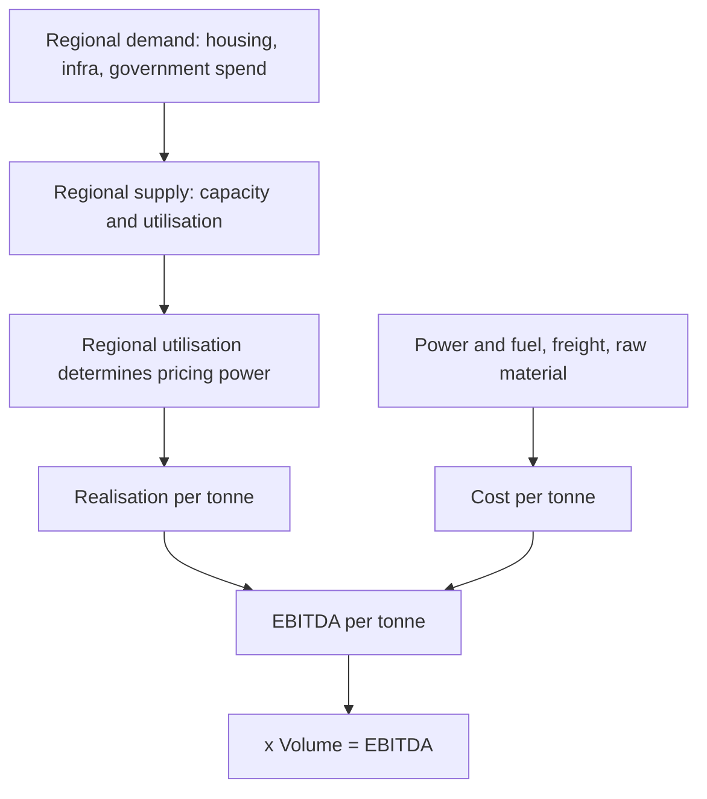

# Cement and Building Materials — A Full Analytical Deep Dive

## The Problem / Why this matters
Cement is the cleanest available example of a regional commodity with meaningful pricing dynamics — a homogeneous product where transport economics create genuinely separate regional markets, each with its own supply-demand balance and pricing behaviour. It is also a sector where the analytical framework is unusually explicit: virtually everything reduces to volume, realisation and cost per tonne, all of which companies disclose. Getting cement right is a good test of whether an analyst can handle commodity economics properly.

## Core Idea
Cement analysis reduces to **EBITDA per tonne** — realisation per tonne minus cost per tonne — multiplied by volume. Because the product is undifferentiated, the entire analysis concerns regional supply-demand balance (which drives realisation) and cost position (which drives the spread).

## Why it works this way
Cement is heavy relative to its value, so transporting it far destroys the economics. Practical delivery radius is limited, which means the relevant market is **regional, not national** — and a national supply-demand balance can look comfortable while one region is in severe overcapacity and another is tight. Regional analysis is therefore mandatory.

## Full technical content

### The per-tonne framework

Every cement company is analysed on the same three numbers, all disclosed or derivable:

| Metric | Typical drivers |
|---|---|
| **Realisation per tonne** | Regional utilisation, competitive discipline, trade vs non-trade mix, premium-product share |
| **Cost per tonne** | Power & fuel (pet coke, coal), freight, raw material, employee, other |
| **EBITDA per tonne** | The spread — the sector's single headline metric |

Companies report volumes and revenue, so realisation is directly derivable, and most disclose the cost breakdown per tonne. Comparison across companies and over time is therefore unusually clean.

### The demand side

- **Housing** — typically the largest demand segment, split between individual home builders (IHB, the largest and most stable) and organised real estate.
- **Infrastructure** — roads, metros, ports, irrigation. Driven by government capital expenditure, so budget allocations and execution rates matter directly.
- **Commercial and industrial construction.**
- **Seasonality** is pronounced: the monsoon quarter is seasonally weak (construction slows), and Q4 (Jan–Mar) is typically the strongest. Comparing sequential quarters without adjusting for this is a common error.

Demand is closely tied to **government capex execution** and to **rural incomes** for the IHB segment, making budget announcements and monsoon outcomes genuine sector catalysts.

### The supply side — where the analysis actually lives

- **Regional capacity and utilisation.** Utilisation above roughly 80–85% in a region supports pricing; below 70% invites price competition. This single variable explains most of the variation in regional realisation.
- **The capacity pipeline** — announced expansions with commissioning dates, by region. As with all commodities, this is publicly knowable and is the most forecastable part of the analysis. A region with 20% capacity addition arriving over two years will see pricing pressure regardless of demand growth.
- **Consolidation** — the sector has consolidated substantially, and higher concentration in a region generally supports more disciplined pricing behaviour.
- **Clinker versus grinding capacity** — grinding units can be built faster and cheaper near markets; clinker capacity is the real constraint.

### The cost side

**Power and fuel** is the largest and most volatile cost element, typically 25–35% of total cost:
- **Pet coke and imported coal** prices are the swing factor. Track them directly.
- **Captive power** — companies with captive thermal or waste-heat-recovery (WHR) power have structurally lower and more stable power costs. WHR capacity is a genuine, growing cost advantage and increasingly a disclosed metric.
- **Renewable share** — rising, and a durable cost benefit.

**Freight** is the second major cost, typically 20–25%:
- **Lead distance** (average distance from plant to market) is the key metric — shorter is better, and it is disclosed by most companies. A company with plants close to its markets has a structural advantage that competitors cannot replicate without building plants.
- Road versus rail mix, and diesel prices.

**Raw material** — limestone (usually captive mines, so the quality and life of reserves matter), fly ash and slag for blended cements.

**Blended cement share** (PPC/PSC versus OPC) is a cost lever: blending fly ash or slag with clinker reduces the clinker factor and therefore cost per tonne. A rising blended share is a genuine margin improvement, and the **clinker factor** is the metric.

### Trade versus non-trade

A sector-specific mix distinction that matters:
- **Trade** — sales through dealers to retail/IHB customers. Higher realisation, better margins, brand matters.
- **Non-trade** — direct bulk sales to institutional buyers, infrastructure projects and large builders. Lower realisation, volume-oriented.

A rising trade share improves realisation; a company chasing infrastructure volumes will show volume growth with weaker realisation. Both are disclosed and the mix shift explains realisation moves that volume alone does not.

### Premium products

Premiumisation is the sector's differentiation strategy — branded premium cement variants sold at a realisation premium. The disclosed premium-product share and its growth is a genuine quality metric, and it is the main route by which a commodity producer builds any brand-based defensibility.

### Valuation

**EV per tonne of capacity** is the sector's signature multiple — directly comparable across companies because capacity is homogeneous, and independent of where the cycle currently sits. Benchmark against:
- **Replacement cost** — the capital cost of building a new tonne of capacity. Buying capacity meaningfully below replacement cost is the classic value anchor, because no rational competitor builds new capacity when existing assets trade below the cost of building them.
- **Recent M&A transaction multiples** — the sector consolidates frequently, so transaction EV/tonne provides a market-tested benchmark.

Cross-check with **EV/EBITDA** on mid-cycle EBITDA per tonne, and use **P/E** cautiously given the cyclical inversion trap.

### Quality differentiators between cement companies

| Factor | Why it matters |
|---|---|
| **Regional mix** | Exposure to structurally tight versus oversupplied regions |
| **Lead distance** | Structural freight-cost advantage |
| **Captive power / WHR share** | Structural energy-cost advantage |
| **Limestone reserves** | Quality and remaining life; a genuine long-term asset |
| **Clinker factor / blended share** | Cost per tonne |
| **Trade share and premium mix** | Realisation |
| **Balance sheet** | Determines ability to expand counter-cyclically and survive downturns |
| **Capacity expansion discipline** | Timing relative to the cycle — the key management test |

### Red flags

- Volume growth achieved through **realisation decline** — buying share in an oversupplied region.
- Heavy exposure to a region with a **large incoming capacity pipeline**.
- **Capacity expansion announced at peak utilisation** — the classic cyclical value destroyer.
- Rising lead distance (selling further from plants, indicating weak local demand).
- Falling trade share.
- Rising leverage funding expansion into an oversupplied region.

## Common mistakes
- Analysing **national** supply-demand when the economics are regional.
- Ignoring the **announced capacity pipeline**, which is publicly knowable and determines future pricing.
- Comparing quarters without adjusting for pronounced **seasonality**.
- Reading realisation changes without checking the **trade/non-trade mix shift** behind them.
- Using **P/E on peak-cycle earnings**.
- Overlooking **structural cost advantages** — lead distance, captive power, clinker factor — that persist across cycles.
- Treating volume growth as unambiguously positive without checking what happened to realisation.

## Interview angle
"How would you analyse a cement company?" Anchor on EBITDA per tonne and decompose it: realisation per tonne, driven by *regional* utilisation (since transport economics make markets regional), the trade-versus-non-trade mix and premium share; cost per tonne, driven by power and fuel with captive/WHR share as a structural advantage, freight with lead distance as the key metric, and the clinker factor via blended cement. Then the supply side — the announced regional capacity pipeline with commissioning dates, which is the most forecastable part and determines future pricing. Value on EV per tonne benchmarked against replacement cost and recent transaction multiples. Emphasising that the relevant market is regional rather than national is what shows you understand the sector's actual economics.
