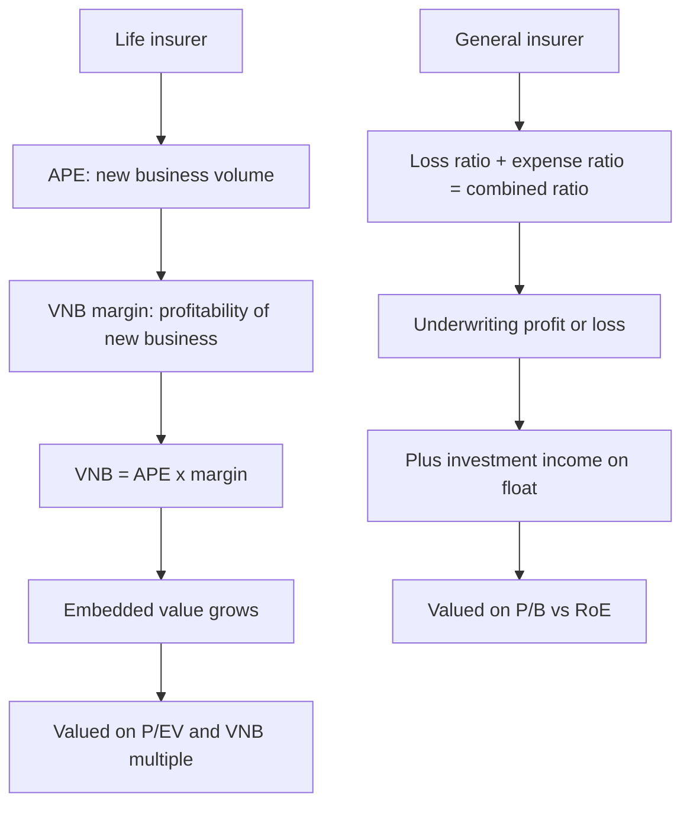

# Insurance — A Full Analytical Deep Dive

## The Problem / Why this matters
Insurance is the sector where standard equity analysis breaks down most completely — more so even than banking. Reported profit is largely an artefact of accounting conventions rather than a measure of value created, because premiums are collected today against claims paid over decades. The sector has its own vocabulary (VNB, EV, APE, combined ratio, float) that appears nowhere else, and an analyst who cannot use it fluently cannot cover the sector at all. With life and general insurers now a meaningful part of the Indian listed market, this is no longer optional knowledge.

## Core Idea
**Life insurance** is valued on embedded value and the value of new business written, not on reported profit. **General (non-life) insurance** is valued on underwriting profitability — the combined ratio — plus returns on the investment float.

## Why it works this way
A life insurer writing a profitable 25-year policy incurs the acquisition cost immediately and recognises profit over the policy's life. Reported first-year profit is therefore *negative* on precisely the business that creates the most value — meaning a fast-growing, high-quality life insurer looks worse on reported earnings than a stagnant one. The industry developed embedded-value reporting specifically to solve this measurement problem.

## Full technical content

### Life insurance — the metric set

| Metric | Definition | Why it matters |
|---|---|---|
| **APE** (Annualised Premium Equivalent) | Regular premium + 10% of single premium | Standardised measure of new business volume |
| **VNB** (Value of New Business) | Present value of future profits from policies written this period | **The core value-creation metric** |
| **VNB margin** | VNB ÷ APE | Profitability of new business — the key quality indicator |
| **EV** (Embedded Value) | Net asset value + present value of in-force business | The balance-sheet value of the insurer |
| **EVOP** | EV operating profit — EV growth from operations | Operating performance excluding market movements |
| **Persistency** | % of policies still in force after 13, 25, 37, 49, 61 months | **Critical** — lapsed policies destroy assumed value |
| **Solvency ratio** | Available solvency margin ÷ required | Regulatory capital; constrains growth |

**VNB is the number that matters.** It represents the present value of profits from business written in the period — the actual value created. A life insurer growing VNB is creating value regardless of what reported PAT does.

**Persistency deserves particular emphasis** because it is where embedded value is most often destroyed. EV calculations assume policies persist for their expected term; if customers lapse early, the assumed future profits never materialise. **13th-month persistency** (the proportion of policies renewed after the first year) is the most-watched, and a company showing strong APE growth alongside deteriorating persistency is writing business that will not deliver the value being booked. That combination is the sector's most important red flag.

### The product-mix driver of VNB margin

Margins vary enormously by product, so mix drives margin more than anything else:

| Product | VNB margin character | Notes |
|---|---|---|
| **Protection (term)** | Highest | Pure mortality risk; high margin, low ticket |
| **Non-par savings / guaranteed** | Moderate-high | Insurer bears investment risk |
| **Par (participating)** | Moderate | Profits shared with policyholders |
| **ULIP** (unit-linked) | Lowest | Investment risk sits with the customer; more a savings product than insurance |
| **Annuity** | Moderate | Longevity risk |
| **Group** | Variable, generally lower | Corporate, price-competitive |

A shift toward **protection** raises VNB margin materially; a shift toward **ULIPs** lowers it, and ULIP-heavy growth is also more correlated to equity-market sentiment, making it less stable. When VNB margin moves, mix is almost always the explanation — decompose it before concluding anything about underlying profitability.

### Distribution — the structural differentiator

- **Bancassurance** — selling through a bank partner. Efficient and low-cost, but creates dependence: an insurer whose parent or partner bank supplies most of its business has a concentration risk that a change in that relationship could impair severely.
- **Agency** — proprietary agent force. Expensive to build, but owned, controllable and defensible.
- **Direct and digital** — growing, lowest cost, but typically lower ticket sizes.
- **Brokers and corporate agents.**

Channel mix affects both cost and product mix (bancassurance tends toward savings products; agency sells more protection), so it feeds directly into VNB margin.

### Life insurance valuation

- **P/EV** — price to embedded value, the primary multiple. Above 1× implies the market expects future new business to add value beyond the existing book.
- **Appraisal value** = EV + (VNB × multiple), where the VNB multiple reflects expected growth in new business. This is the sector's standard framework: you are valuing the existing book plus the franchise's ability to keep writing profitable business.
- Assess the **EV assumptions** critically — the discount rate, mortality, expense and persistency assumptions. EV is a model output, and the assumptions are disclosed in the embedded-value report. **Sensitivity disclosures** (how EV moves with a 1% change in the discount rate, or a 10% deterioration in persistency) should be read every year.

### General (non-life) insurance — different economics entirely

**The combined ratio is the core metric:**

**Combined ratio = Loss ratio + Expense ratio**

- **Loss ratio** = claims incurred ÷ net earned premium
- **Expense ratio** = (commissions + operating expenses) ÷ net earned premium
- **Below 100%** = underwriting profit — the insurer is being paid to take risk
- **Above 100%** = underwriting loss, covered (or not) by investment income

Many general insurers run combined ratios above 100% and rely on **float** — premiums held between collection and claim payment, invested in the interim — to generate returns. This is legitimate, but it means the company is effectively an investment vehicle funded by insurance liabilities, and the quality of that model depends on how *cheaply* the float is obtained. A combined ratio of 102% means the float costs 2%; at 95%, the insurer is being paid to hold it.

**Segment economics vary sharply:**

| Line | Character |
|---|---|
| **Motor OD** (own damage) | Priced freely; competitive; loss ratio manageable |
| **Motor TP** (third party) | Tariffed by regulator; long-tail claims; historically loss-making |
| **Health** | Fast-growing; medical inflation risk; loss ratios can deteriorate quickly |
| **Fire / property** | Lumpy, catastrophe-exposed; reinsurance-dependent |
| **Crop** | Highly volatile, government-scheme dependent |
| **Marine, liability, others** | Specialist |

**Reserving adequacy** is the sector's equivalent of asset quality in banking — claims reserves are estimates, and under-reserving flatters current profit while deferring the problem. Watch prior-year reserve development: consistent adverse development (having to strengthen reserves for past years) indicates systematic under-reserving.

**Reinsurance** — the share of risk ceded to reinsurers reduces both premium and volatility. Check the retention ratio and the quality of reinsurance counterparties.

**Valuation:** P/B against RoE, as for other financials, with the combined ratio as the operating quality metric. Growth-adjusted, since a fast-growing insurer's expense ratio is inflated by acquisition costs on new business.

### Red flags across both

- Life: **APE growth with deteriorating persistency** — the most important single warning.
- Life: VNB margin expansion driven purely by a **one-off mix shift** that cannot repeat.
- Life: heavy **single-partner bancassurance dependence**.
- Life: EV growth driven by **assumption changes** rather than operating performance — check EVOP.
- General: **combined ratio consistently above 100%** with no improvement trajectory.
- General: **adverse prior-year reserve development**, indicating under-reserving.
- General: rapid growth in a line (often health or crop) whose loss ratios later deteriorate.
- Both: solvency ratio close to the regulatory minimum, implying a capital raise.

## Common mistakes
- Valuing a life insurer on **P/E** — reported profit is not the value metric.
- Reading APE growth without checking **persistency** and **VNB margin**.
- Not decomposing VNB margin changes into **product mix** versus genuine improvement.
- Taking **EV at face value** without reading the assumptions and sensitivities.
- Treating a general insurer's investment income as operating quality while ignoring an above-100% combined ratio.
- Ignoring **reserve development** as the non-life analogue of asset quality.
- Comparing life and general insurers on the same metrics.

## Interview angle
"How would you value a life insurance company?" Explain first why P/E fails — acquisition costs are expensed upfront while profits emerge over decades, so profitable growth *depresses* reported earnings. Then the correct framework: APE for new-business volume, VNB margin for its profitability, VNB as the value created, embedded value as the balance-sheet measure, and valuation via P/EV or appraisal value (EV plus a multiple of VNB). Emphasise persistency as the metric that validates whether booked value is real, and note that VNB margin moves are usually product-mix driven — protection up, ULIP down. For a general insurer, pivot to the combined ratio and float economics. Naming persistency as the key risk to embedded value is what signals genuine sector understanding.
