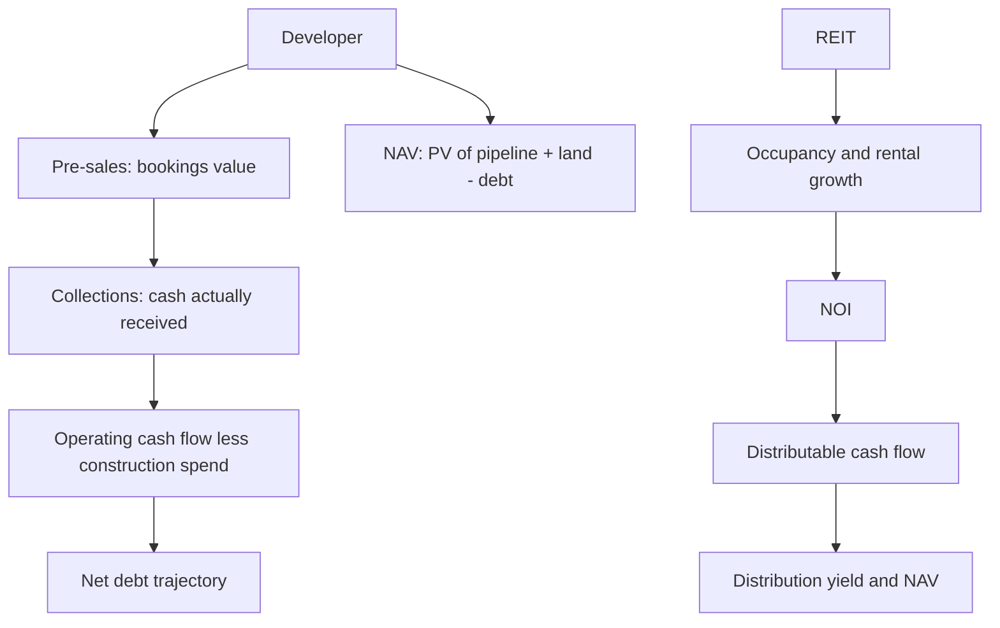

# Real Estate and REITs — A Full Analytical Deep Dive

## The Problem / Why this matters
Real estate developers are among the hardest companies in the listed market to analyse from reported financials. Revenue recognition depends on accounting conventions that may bear little relation to cash collection; the largest asset — land — sits on the balance sheet at historical cost that can be decades stale; and the business is cyclical, leveraged, and periodically prone to severe distress. REITs, by contrast, are structurally simple but require a different metric set entirely. Both are increasingly significant in Indian markets and both defeat generic analysis.

## Core Idea
Developers are valued on **NAV** — the present value of the development pipeline plus land, less debt — with pre-sales and collections as the real operating indicators rather than reported revenue. REITs are valued on **distribution yield and NAV**, with the key metrics being occupancy, rental growth and distributable cash flow.

## Why it works this way
A developer's reported revenue reflects accounting recognition on projects that may have been sold years earlier, while the money actually coming in the door is a different number entirely. Since real estate businesses fail from cash problems rather than accounting ones, the cash metrics — pre-sales, collections, and net debt — are what matter. For REITs, the asset is a stabilised income stream, so the analysis is about the durability and growth of that income.



## Full technical content

### Developers — the operating metrics that matter

Reported revenue is the least useful number. The genuine indicators:

| Metric | Definition | Why it matters |
|---|---|---|
| **Pre-sales / bookings** | Value of units sold in the period | The real demand indicator — leads revenue by years |
| **Volume (msf) and realisation (₹/sf)** | Decomposition of pre-sales | Distinguishes volume growth from price growth |
| **Collections** | Cash actually received | **The critical metric** — sales without collections are not cash |
| **Launches** | New inventory brought to market | Forward pre-sales capacity |
| **Unsold inventory** | Completed and under-construction stock | Overhang and pricing pressure |
| **Net debt** | Absolute and versus operating cash flow | Survival metric — developers fail on leverage |
| **Land bank** | Area and location | Optionality, but only if developable and unencumbered |

**Collections versus pre-sales is the essential check.** A developer reporting strong bookings but weak collections has sold units to buyers who are not paying on schedule — a genuine warning that shows up long before revenue does. Track collections as a percentage of pre-sales over time.

**Net debt trajectory is the survival metric.** Real estate is the sector where balance sheets kill companies. The relevant question is whether operating cash flow (collections less construction and land spend) is sufficient to service and reduce debt, or whether the company is dependent on continuous refinancing.

### Developer valuation — NAV

The standard approach:

```
PV of cash flows from ongoing projects (project-by-project)
+ PV of cash flows from the pipeline / land bank (risk-adjusted)
+ Value of annuity/commercial assets (on cap rate)
+ Surplus land at market value
− Net debt
= NAV
÷ Diluted shares = NAV per share
```

Practical disciplines:
- **Project-by-project modelling** where disclosure allows: units, realisation, construction cost, timeline, margin.
- **Risk-adjust the pipeline** — land that is not yet approved, or where title is unclear, is worth far less than shovel-ready inventory. Apply explicit discounts by development stage.
- **Land at market, not book.** Historical-cost land is frequently the largest hidden value (or, occasionally, the largest overstatement) in a developer's balance sheet.
- Developers typically trade at a **discount to NAV**, reflecting execution risk, governance concerns and cyclicality. The historical discount range for the specific company is the relevant benchmark, exactly as with holding-company discounts.

### Sector cycle drivers

- **Interest rates** — directly affect affordability and buyer demand; the most important single macro variable.
- **Affordability** — price-to-income ratios and EMI-to-income.
- **Regulatory regime** — RERA improved transparency, escrow discipline and buyer confidence, and structurally favoured larger, compliant developers over smaller ones. The consolidation this drove is a genuine structural shift.
- **Inventory overhang** — months of unsold inventory at current absorption rates is the cleanest cycle indicator.
- **Segment** — affordable, mid-income, premium and luxury behave very differently; luxury is more resilient in some cycles and more volatile in others.
- **Commercial versus residential** — commercial is driven by office absorption, IT/GCC hiring and rental yields; residential by household formation and affordability.

### REITs and InvITs — a different instrument

A REIT holds stabilised, income-producing property and is required to distribute the large majority of its distributable cash flow to unitholders. That structure makes it closer to a bond with growth than to an equity.

**The metric set:**

| Metric | Meaning |
|---|---|
| **Occupancy** | Leased area ÷ leasable area |
| **NOI** (Net Operating Income) | Rental income less property operating expenses |
| **NDCF / distributable cash flow** | What can actually be paid out |
| **Distribution yield** | Distribution per unit ÷ price |
| **WALE** (weighted average lease expiry) | Lease duration — the income-visibility metric |
| **Mark-to-market potential** | Gap between in-place rents and current market rents |
| **NAV per unit** | Independent valuation of the portfolio less debt |
| **Loan-to-value** | Leverage, regulatorily capped |

**The two growth engines** to assess:
1. **Contractual escalations** — most Indian commercial leases carry periodic escalation clauses, giving mechanical, contracted rental growth independent of market conditions.
2. **Mark-to-market on renewal** — where in-place rents sit below current market rents, renewals capture the gap. A large positive MTM potential is embedded, near-certain future growth, and is disclosed.

**WALE matters in both directions:** a long WALE means stable, visible income but slower capture of rising market rents; a short WALE means faster MTM capture but more re-leasing risk. Which is preferable depends on whether market rents are rising.

**Tenant quality and concentration** — a REIT dependent on a few tenants, or on a single sector (typically IT/technology in Indian office REITs), carries concentration risk that occupancy alone does not reveal.

### REIT valuation

- **Distribution yield** versus the government bond yield — the spread is the primary valuation anchor, since a REIT is fundamentally a spread product. This is why REITs are **rate-sensitive**: rising bond yields compress the relative attractiveness of a given distribution yield and the units de-rate, independent of any change in the underlying properties.
- **Price to NAV** — REITs disclose independently-valued NAV semi-annually.
- **Cap rate** analysis — NOI ÷ property value, benchmarked against comparable transactions.
- Growth in **distribution per unit** as the total-return driver alongside the yield.

The analytical point that most often confuses newcomers: a REIT falling on a rate-hike day has not deteriorated operationally. It is a spread instrument repricing, and separating that from a change in occupancy or rental fundamentals is the core discipline.

### Red flags

- **Pre-sales strong, collections weak** — the buyer base is stressed.
- Rising **net debt** with flat or falling collections.
- Large **unsold completed inventory** — carrying cost with no cash.
- Land bank valued heavily but with **unclear title or approvals**.
- Related-party land transactions with promoter entities.
- REIT: falling **occupancy** with rising distributions (funded from reserves or debt rather than operations).
- REIT: high **tenant concentration** or a lease-expiry cliff in a single year.
- REIT: LTV near the regulatory cap, constraining acquisitions.

## Common mistakes
- Analysing a developer on **reported revenue** rather than pre-sales and collections.
- Ignoring **collections**, and so missing buyer-side stress.
- Valuing land at **book cost**.
- Not risk-adjusting the pipeline by **development stage and approval status**.
- Applying a conventional NAV discount rather than the company's own historical range.
- Valuing a REIT on **P/E** — distributable cash flow, not accounting profit, is the relevant measure.
- Reading a REIT's rate-driven de-rating as an operational problem.
- Ignoring **WALE and mark-to-market potential**, which together determine future rental growth.

## Interview angle
"How would you analyse a real estate developer?" Set aside reported revenue immediately and explain why — recognition timing bears little relation to cash. Go to pre-sales (decomposed into volume and realisation), then collections as a percentage of pre-sales, because sales that do not collect are not cash and this is where buyer stress appears first. Then net debt against operating cash flow, since developers fail on leverage. Value on NAV — project-by-project PV, land at market with explicit risk adjustment by approval stage, less net debt — and benchmark the resulting discount against the company's own history. For a REIT, pivot to occupancy, WALE, contractual escalations and mark-to-market potential, valuing on distribution yield spread over the government bond and price-to-NAV, and note that REITs reprice on rates without any operational change.
